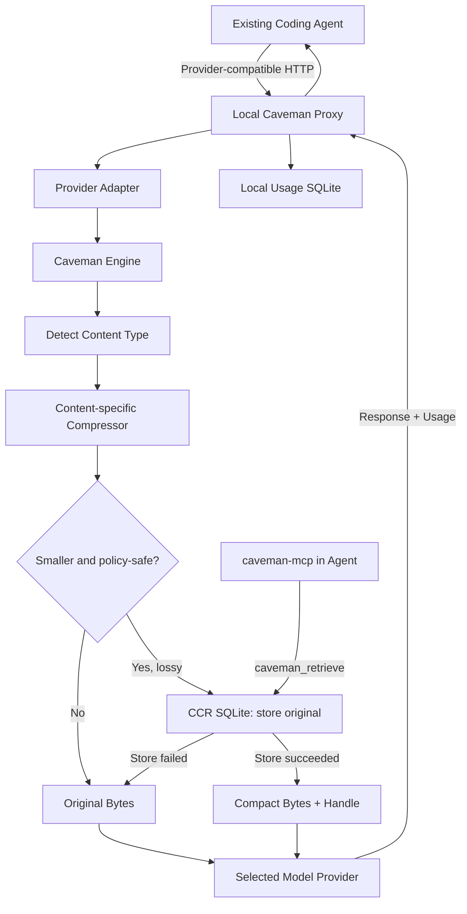

# Caveman 源码分析

> 研究版本：`main@99a9aa2f5a45097fc3563febea7d0baf64407441`
>
> 提交时间：2026-08-19
>
> 研究范围：响应 Skill、Hook、TypeScript CLI、Go Compression Engine、本地 Proxy、CCR、MCP、Memory、Agent Wrap、证据标签、安全与许可证边界。

## 1. 项目定位与核心结论

Caveman 不是一个新的 Coding Agent，而是叠加在现有 Agent 上的两套 token 优化机制：

1. **响应压缩**：通过 Skill、Hook 或插件要求模型用更短的“smart caveman”风格回答，减少模型输出。
2. **上下文压缩**：通过本地 Proxy 和 Go Engine 压缩 Agent 发给模型的工具结果、日志、JSON、代码和历史上下文，减少模型输入。

两条路径可以独立使用：

```text
Caveman 1: model response → shorter prose
Caveman 2: agent context → recoverable compact representation → model
```

产品边界在 [`docs/technical/product-model.md`](../../code/caveman/docs/technical/product-model.md) 中定义。最重要的判断是：Caveman 不接管 Agent Loop，而是尽量保留 Claude Code、Codex、Gemini CLI、Aider、OpenCode、Hermes 或 OpenClaw 的原有运行时，只改变其提示词、命令 Hook 或 provider endpoint。

相比单纯的文本摘要工具，项目的主要工程投入集中在三个问题：

- 如何判断不同内容应该怎样压缩；
- 如何在有损压缩后恢复 byte-exact 原文；
- 如何避免把本地估算、Provider 用量和真实质量验证混成同一种“节省”。

## 2. 仓库所有权与许可证边界

这个仓库是一个多语言 monorepo，但并非所有目录都是当前 source of truth。[`CLAUDE.md`](../../code/caveman/CLAUDE.md) 明确规定：

| 目录 | 当前定位 |
|---|---|
| [`skills`](../../code/caveman/skills) | Caveman 行为规则的 source of truth |
| [`engine`](../../code/caveman/engine)、[`proxy`](../../code/caveman/proxy) | 本地上下文压缩运行时的 source of truth |
| [`cacheengine`](../../code/caveman/cacheengine)、[`rewriter`](../../code/caveman/rewriter) | Prompt cache 规划与历史轨迹重写 |
| [`mcp`](../../code/caveman/mcp)、[`mem`](../../code/caveman/mem)、[`shrink`](../../code/caveman/shrink) | 恢复工具、持久记忆和工具目录压缩 |
| [`packages/cli`](../../code/caveman/packages/cli) | 当前 `@caveman-ai/cli` 源码 |
| [`extension`](../../code/caveman/extension) | MV3 浏览器指令扩展源码 |
| [`packages/agent`](../../code/caveman/packages/agent)、[`packages/create-caveman-agent`](../../code/caveman/packages/create-caveman-agent) | `caveman-agent-sdk` 的历史/消费副本，不是主开发位置 |
| [`browse`](../../code/caveman/browse) | `caveman-browse` 独立仓库的消费副本 |

`caveman-agent-sdk` 在当前版本仍是私有开发仓库，Caveman Cloud 也是私有商业代码。因此本地 checkout 能完整研究公开 Skill、Engine、Proxy 和工具链，但不能据此推断 Cloud 控制面的实现。

项目采用分区许可证，具体映射见 [`LICENSING.md`](../../code/caveman/LICENSING.md)：

- **MIT**：Skill、安装与接入层、CLI、Client SDK、Kit、Grader、公开协议和浏览器扩展外壳。
- **BSL-1.1**：Engine、Proxy、Cache Engine、rewriter、Browse、MCP Go Server、shrink、Memory Go Core 和共享 Go 平台代码。

BSL 部分允许为自己的 first-party traffic 自托管，包括生产使用；向第三方提供托管、managed 或 embedded 服务需要商业许可证。对应版本将在约定日期自动转为 Apache-2.0。因而整个仓库应称为“MIT + source-available BSL”，不能笼统称为完全 OSI Open Source。

## 3. 总体架构

### 3.1 输入压缩主链



对应架构说明见 [`docs/technical/architecture.md`](../../code/caveman/docs/technical/architecture.md)。本地运行时由多个小进程组成：

| 进程 | 作用 |
|---|---|
| `caveman` | 安装、配置、启动 Proxy、Wrap Agent 和查看统计 |
| `caveman-proxy` | 本地 provider-compatible HTTP Proxy |
| `caveman-engine` | 内容检测、压缩、恢复、TOON 和 Pixel CLI |
| `caveman-mcp` | 在 Agent 内暴露压缩、恢复和统计工具 |
| `cavemem` | 跨会话记忆与 BM25 recall |
| `caveman-browse` | Chrome/CDP 驱动与压缩后的可访问性树 |
| `caveman-shrink` | 工具 schema/catalog 的专用压缩入口 |

进程通过 loopback HTTP、stdio、MCP 和本地 SQLite 组合，没有引入一个必须在线的 Caveman 后端。使用本地模式时，请求最终仍会发送到用户选择的模型 Provider；“local”只表示 Caveman 的处理发生在本机。

### 3.2 输出压缩主链

```text
Agent session start
  → Hook 加载 caveman SKILL.md
  → 模式写入本地 flag
  → 每轮追加小型 reinforcement
  → 模型按 lite/full/ultra/wenyan 规则生成更短回答
```

输出压缩不经过 Go Engine，也不提供 CCR。它本质上是模型行为指令，因此会受到模型遵循度、其他 system prompt 和上下文压缩的影响。

## 4. Response Skill、Hook 与模式状态

### 4.1 Skill 行为

[`skills/caveman/SKILL.md`](../../code/caveman/skills/caveman/SKILL.md) 是响应行为的 source of truth。它不是简单要求“少说一点”，而是定义了较具体的压缩约束：

- 删除 filler、客套、hedging 和不必要的重复；
- 保留代码、命令、identifier、数字、单位和精确错误文本；
- 不删除 `not`、`never`、`no`、`only`、`except` 等会反转语义的词；
- 不为了模仿风格而发明缩写或故意破坏语法；
- 对安全警告、不可逆操作确认和容易误读的步骤自动恢复正常表达；
- 写入代码、文档、Commit、Issue 或第三方消息时默认使用正常 prose。

模式包括 `lite`、`full`、`ultra` 和三种文言文强度。`commit`、`review`、`compress` 则是独立 Skill，而不是普通强度等级。

### 4.2 Claude Code Hook

Claude Code 路径的核心文件是：

- [`src/hooks/caveman-activate.js`](../../code/caveman/src/hooks/caveman-activate.js)：在 `SessionStart` 时解析默认模式、写 flag 并注入完整规则。
- [`src/hooks/caveman-mode-tracker.js`](../../code/caveman/src/hooks/caveman-mode-tracker.js)：解析 `/caveman` 或自然语言启停请求，并在每轮补充 reinforcement。
- [`src/hooks/caveman-config.js`](../../code/caveman/src/hooks/caveman-config.js)：按环境变量、项目配置、用户配置、默认值解析模式。
- [`src/hooks/caveman-statusline.sh`](../../code/caveman/src/hooks/caveman-statusline.sh)：读取 flag 并显示状态。

模式 flag 默认位于 `$CLAUDE_CONFIG_DIR/.caveman-active`。写入使用临时文件加 rename、`0600` 权限和 `O_NOFOLLOW`；读取有 symlink 拒绝、64-byte 上限和模式白名单。这里的安全目标是防止攻击者把可预测 flag 路径替换成指向敏感文件的 symlink，再让 Hook 读取并注入模型上下文。

Hook 采取 fail-open：配置或文件操作异常不能阻断 Agent session。若主配置模块缺失，activation hook 还有最小 fallback 规则集，但会明确提示安装处于 degraded 状态。

### 4.3 多 Agent 分发

Skill 可通过 `npx skills` 分发到大量支持 Skill 的 Agent；更深的自动激活依赖宿主能力：

- Claude Code 使用生命周期 Hook；
- Gemini CLI 使用 extension context；
- OpenCode、Hermes、OpenClaw 使用各自插件；
- Cursor、Windsurf、Cline、Copilot 等使用 rules 或 instruction 文件；
- 浏览器扩展向 ChatGPT、Claude 和 Gemini 网页的 outgoing message 添加可见 directive。

[`extension/AGENTS.md`](../../code/caveman/extension/AGENTS.md) 明确指出，当前 MV3 扩展只是 directive injector：不读取回复、不拦截网络请求，也不再提供早期版本的 WASM prompt 压缩按钮。

## 5. CLI 与 Agent Wrap

[`packages/cli/src/index.ts`](../../code/caveman/packages/cli/src/index.ts) 是 TypeScript CLI 的集中式入口。它负责命令分派、安装 companion binaries、启动 Proxy、Agent Wrap、MCP 注册、Skill 转换、Learn、统计和可选 Cloud 命令。

CLI 自身不包含 Go 压缩逻辑。它按以下顺序寻找二进制：

```text
CAVEMAN_*_BIN override
  → PATH
  → ~/.caveman/bin
  → bare executable name
```

缺少 Engine 时，`compress` 应明确退化为 byte-identical passthrough；`toon decode` 则必须失败，因为把原始 TOON 假装成 JSON 会产生错误类型。`caveman setup` 用于集中检查必需和可选二进制。

### 5.1 Agent Profiles

[`agents/profiles`](../../code/caveman/agents/profiles) 目前为七个原生 Wrap 目标定义 JSON Profile：Claude Code、Codex、Gemini CLI、Aider、OpenCode、Hermes 和 OpenClaw。

Profile 描述：

- Agent binary 和默认参数；
- 它使用 Anthropic、OpenAI Chat、OpenAI Responses 还是 Gemini wire protocol；
- 如何通过环境变量、临时配置内容或临时配置文件注入 Proxy endpoint；
- 可用的 command hook、memory hook 和 skill 路径；
- 已测试 Agent 版本与 integration completeness。

[`agents/profiles/schema.json`](../../code/caveman/agents/profiles/schema.json) 将集成分为：

- `declarative`：Profile 数据本身足以完成路由；
- `builder-assisted`：数据提供基础，CLI 仍需额外组装；
- `code-only`：实际路由完全依赖专用代码。

因此 README 所说“新增 Agent 只是增加一个 JSON”只严格适用于 declarative profile。编译器会校验 wire protocol、注入方式、测试版本和 completeness，避免用数据声明并不存在的兼容能力。

### 5.2 Wrap 的含义

`caveman claude` 是 `caveman wrap claude` 的快捷形式。Wrap 通常通过子进程环境变量或临时 overlay 把 Agent 指向本地 Proxy，不应该覆盖用户原始 Agent 配置。Codex 和 OpenClaw 等需要专门 builder 的宿主会使用临时 `CODEX_HOME` 或合并后的临时配置。

Wrap 只有在 recovery path、Provider protocol 和 Proxy 能力同时满足要求时才启用有损上下文压缩。否则 Agent 仍可启动，但流量保持未压缩或只做 metering。

## 6. Caveman Engine

### 6.1 稳定 API

[`engine/engine.go`](../../code/caveman/engine/engine.go) 暴露四个稳定操作：

| 操作 | 作用 |
|---|---|
| `Compress` | 检测、选择 Compressor、压缩、计数并建立恢复记录 |
| `Retrieve` | 根据 handle 返回精确原始字节 |
| `Detect` | 只分类，不修改输入 |
| `Stats` | 从 CCR 读取压缩统计 |

`Simulate` 是额外的无副作用 dry run：执行相同 detection 和 compressor，但不写 CCR，只报告如果真的执行会发生什么。模拟结果不能授权线上启用有损 transform。

### 6.2 压缩管线

`Engine.Compress()` 的真实顺序是：

```text
unwrap line-numbered listing
  → Detect content type，或使用显式 Type
  → Count original tokens
  → record mode? 直接返回原文
  → Registry 查找 compressor
  → 校验 safety class
  → 有损且没有 recovery store? 返回原文
  → compressor.Compress()
  → 恢复 listing gutter
  → 再次计数
  → 不更小或与原文相同? 返回原文
  → 写 CCR original
  → 写入成功后才发布 compact output 和 handle
```

这里的顺序非常关键：有损结果不是“先返回，异步保存原文”，而是只有 `CCR Put` 成功之后才对调用方可见。

### 6.3 内容检测与 Compressor

[`engine/detect.go`](../../code/caveman/engine/detect.go) 通过确定性规则识别：

- JSON；
- terminal output；
- diff；
- HTML；
- tabular data；
- source code；
- log；
- search result；
- configuration；
- general text。

低置信度回退到 `text`。TOON、accessibility tree、tool schema 和 repetition 等路径需要显式选择，不参与通用自动检测，因为误判成本过高。

Compressor registry 位于 [`engine/compressors`](../../code/caveman/engine/compressors)。Compressor 被刻意限制为纯 byte transform：不负责 token 计数、不访问 CCR，也不发网络请求。Engine 在外层统一执行安全检查、计数和持久化。

所有当前自动或显式 Compressor 都应按有损 S4 对待，即便某个输入恰好能结构化 round-trip。源码通过去重、保留错误、保留开头/结尾、字段不变量和 query relevance 等策略缩小内容，但 CCR 只证明原文可取回，不证明模型一定会主动取回，也不证明任务质量等价。

### 6.4 Token 计数

[`engine/tokens`](../../code/caveman/engine/tokens) 默认使用内嵌词表的离线 `o200k_base` tokenizer，无法使用时才回退到字符估算。本地 before/after/ratio 始终标为 `inferred`，不能伪装成 Provider billing token。

完整代码压缩依赖 cgo 和 tree-sitter，支持 Python、JavaScript、TypeScript 等语言；无 cgo 构建只保留 Go 代码压缩。这意味着不同发布构建的能力不能只根据命令名推断。

## 7. CCR：Context Recovery

[`engine/ccr`](../../code/caveman/engine/ccr) 保存每个有损 transform 的精确原始字节。普通 handle 格式为：

```text
ccr_<SHA-256 前 16 字节的 hex>
```

内容寻址使相同原文得到相同 handle，并避免重复保存。Native 环境使用 SQLite，WASM 使用内存实现；默认文件是 `~/.caveman/ccr.db`。

除了普通 byte blob，当前 CCR 还支持带 `ObjectType`、session、repository state、依赖、currentness 和 Hot/Warm/Cold 生命周期的 typed object，引用形式可表现为 `ccr://...`。这些对象用于 native runtime 将大型工具结果移出当前上下文。

安全和容量边界：

- 默认 recovery payload budget 为 512 MiB；
- 空间不足时拒绝新写入，不驱逐旧 handle；
- Engine 随即回退原始输入，避免产生 dangling handle；
- SQLite 文件使用用户级权限和 symlink/路径检查；
- CCR 不提供 encryption、远程鉴权、secret redaction 或永久归档。

因此 `ccr.db` 应与 Agent transcript 一样视为敏感数据。handle 是标识符，不是安全 token。

## 8. Local Proxy 与 Provider Adapter

[`proxy/internal/gateway`](../../code/caveman/proxy/internal/gateway) 负责请求生命周期，[`proxy/providers`](../../code/caveman/proxy/providers) 负责各 Provider wire format。

主流程是：

```text
HTTP request
  → Match provider route
  → Resolve/preserve credential
  → Parse provider request body
  → Apply enabled transform
  → Forward upstream
  → Preserve streaming response
  → Parse provider usage
  → Write local usage row
```

Provider Adapter 覆盖 Anthropic、OpenAI、Gemini、Azure OpenAI、Bedrock、Vertex 和 OpenAI-compatible route。Proxy 不做通用跨协议翻译，而是按实际 wire protocol 操作对应 JSON shape。

### 8.1 运行模式

| Mode | 行为 |
|---|---|
| `record` | 不改变 model-visible bytes，只计量 |
| `compress` | 对满足条件的上下文执行 Engine transform |
| `pixel` | 对允许的 vision model 使用 text-to-PNG transport |
| `recommend`、`shadow` | 只建议或评估，不直接应用 |
| `canary`、`active` | 受控启用实验或 optimizer 行为 |

未知 mode 回退到 `record`。普通本地用户主要接触 record、compress 和 pixel。

### 8.2 Prefix 稳定与恢复

Agent 会在后续请求中重复发送先前消息。如果同一个 block 每轮生成不同 compact bytes，会破坏 Provider prompt cache。Proxy 因此把 original-to-replacement 映射写入 durable prefix cache，确保同一个原文在后续回合产生 byte-identical replacement。

Streaming 和 subscription/OAuth Agent session 不能依靠 Proxy 在响应中随意插入恢复交互，因此 live-zone compression 还要求 Agent 自己已安装 `caveman_retrieve` MCP tool。缺少 MCP、durable cache 或 Provider schema 支持时，相应路径保持原文。

### 8.3 安全处理

- Proxy 只允许 loopback listen，设计目标是单个可信 OS 用户，不提供多用户认证。
- 出站请求默认启用 SSRF 防护，阻止 loopback、private、link-local 和 metadata 地址；自托管模型需要精确 allowlist。
- Authorization scheme 会被保留，避免把 OAuth bearer 错映射为 API key。
- Provider 4xx/5xx 仍作为 Provider 错误返回，transform 失败不会伪造成功。
- 恢复工具的返回值被明确排除出再次压缩，避免“取回原文后立刻再次被压缩”的循环。
- `x-cave-transforms: caveman.pass-through.v1` 可对整个请求关闭所有 transform。

本地 usage、prefix cache、trial 和 Learn 数据通常写入 `~/.caveman/caveman.db`，与 `ccr.db` 分离。

## 9. MCP、Memory、Shrink 与其他优化器

### 9.1 MCP Server

[`mcp/server.go`](../../code/caveman/mcp/server.go) 是可复用的 stdio JSON-RPC/MCP Server，Caveman 默认暴露：

- `caveman_compress`
- `caveman_retrieve`
- `caveman_stats`
- `caveman_toon_encode`
- `caveman_toon_decode`

MCP 层只负责协议 framing，压缩仍在进程内调用 Engine。它限制单条请求和普通结果大小，捕获 handler panic，并在 malformed line 后重新同步；`caveman_retrieve` 不受普通结果上限约束，因为截断恢复结果会破坏恢复契约。stdout 专用于协议，日志只能写 stderr。

### 9.2 Cavemem

[`mem/store.go`](../../code/caveman/mem/store.go) 提供 `remember`、`recall`、`supersede`、`history` 和 `forget`。原始记忆先写入 SQLite，recall 时再通过 BM25 排序、阈值过滤和 Engine 压缩。

关键语义：

- 相同当前记忆内容寻址、幂等保存；
- supersede 保留旧版本供 history 审计，但普通 recall 只返回当前版本；
- 低于相关性阈值时返回空，不猜测相关记忆；
- 默认 recall 总预算是 2,000 个推断 token；
- 单条 memory 最大 256 KiB；
- 压缩发生在 recall 阶段，不改变 durable raw memory。

### 9.3 Tool Schema Shrink

[`shrink/shrink.go`](../../code/caveman/shrink/shrink.go) 是 Engine `toolschema` Compressor 的专用产品入口。它保留 tool/parameter 名称、类型、enum、required、default、const 和 `$ref` 等选择及参数构造表面，删除 annotation metadata 并缩短长 description。

`SelectionProfile(input) == SelectionProfile(output)` 只证明结构化选择面不变，不证明模型仍会选择同一个工具，因为 description 本身也是模型决策输入。所以 Shrink 仍被标记为 S4、`inferred` 和 recoverable，而不是 lossless。

### 9.4 Cache Engine 与 Rewriter

[`cacheengine/engine.go`](../../code/caveman/cacheengine/engine.go) 规划 Provider-native prompt cache 提示，目标是找到稳定 prefix，而不是缓存模型 response。未知 Provider、重复 JSON key、volatile boundary、缺失计费证据等情况保持原请求。

[`rewriter/rewriter.go`](../../code/caveman/rewriter/rewriter.go) 调用配置的 Anthropic 或 OpenAI 模型压缩较旧 Agent trajectory。它有两道 token threshold 和结构接受检查，要求保留 failure signal、count、exit code 和 reference；被拒绝的 rewrite 不进入上下文，但其 Provider 调用成本仍要记录。

Rewriter 的检查主要证明原文中的关键元素仍存活，不能阻止模型额外编造内容。因此它比确定性的 Compressor 风险更高，需要 CCR、任务 eval 和运行时 harm tripwire，不能只凭更短就启用。

### 9.5 TOON、Pixel 与 Browser

- TOON 把适合的均匀 JSON 重编码成更紧凑表示；编码失败或不更小时透传。
- Pixel 把稠密长行文本渲染为 PNG，只有 allowlist 中的 vision model 且 image token 估算更小时才启用。
- Browser 使用 Chrome DevTools Protocol 和压缩后的 accessibility tree；动作型接口仍可能点击、提交表单或执行脚本，必须单独处理权限。

Pixel 和 Browser 的 benchmark 只适用于固定模型、页面和密度条件。稀疏代码或小页面可能比原文更贵，项目源码也明确保留这种负结果。

## 10. 统计、Learn 与证据标签

Caveman 把数字的来源当成一等类型，定义见 [`docs/technical/accounting-and-evidence.md`](../../code/caveman/docs/technical/accounting-and-evidence.md)：

| Basis | 含义 |
|---|---|
| `inferred` | 离线 tokenizer、模型或假设得出的本地估算 |
| `provider_reported` | Provider usage 字段返回的计数 |
| `benchmark_counterfactual` | 固定 benchmark 中 baseline 与 treatment 的配对差值 |
| `observed` | 线上前后相关性，不表示因果 |
| `verified` | 满足命名验证方法的证据状态；本地工具不能自行生成 |
| `unpriced` | 没有可信公开价格，不等于真实成本为零 |

`caveman learn` 读取本地 Claude Code、Codex、Gemini CLI、OpenCode 等历史，识别重复读取、过大规则文件、过长 session、MCP tax 等 token sink。Analyzer 本身只读；`learn implement` 再启动用户自己的 Agent，要求逐项展示 diff、获得同意、重新测量并在无改善时回退。

Local Proxy 的 list-price 计算不是账单：订阅、区域价格、缓存、折扣、credit 和税费都可能使实际成本不同。未知模型价格应显示 `unpriced`，而不是猜测。

## 11. Benchmark 解读

### 11.1 Wrap Benchmark

[`docs/WRAP-BENCHMARK.md`](../../code/caveman/docs/WRAP-BENCHMARK.md) 报告：在六类固定大型工具输出、18 个 direct/Caveman 配对中，Caveman Wrap 的 Provider-reported input token 总量低 33.2%，且 exact-answer gate 为 18/18。

这个结果只能标为 `benchmark_counterfactual`，原因包括：

- 工作负载是 60–95 KiB 的确定性 fixture，不是开放式真实编码任务；
- HTML case 实际回归 9.9%，负结果被保留；
- 报告包含 corpus、binary 和 harness hash，但当前仓库没有 raw run artifacts；
- 文档明确说明不能从 checkout 独立复现该结果。

因此它是一份边界清楚的 pinned report，不是对所有 Agent、模型和任务都能节省 33.2% 的承诺。

### 11.2 Response Skill 数字冲突

当前 [`README.md`](../../code/caveman/README.md) 和 [`skills/caveman/SKILL.md`](../../code/caveman/skills/caveman/SKILL.md) 仍展示或声明平均 65% output reduction；但 [`docs/HONEST-NUMBERS.md`](../../code/caveman/docs/HONEST-NUMBERS.md) 明确写着：仓库没有 committed、reviewed raw result，因此暂不发布总输出降幅。

这两处信息相互冲突。按照项目自己的 evidence 规则，当前笔记不把 65% 当作已验证或可复现结论。能确认的是：Skill 本身每轮会增加约 1–1.5k input tokens；在原本已经简短、按 request 计费或频繁重试的工作流中，总 token 和耗时可能净增长。应使用相同任务的 Provider-billed A/B 判断是否值得启用。

## 12. 扩展机制

### 12.1 新增 Compressor

在 [`engine/compressors`](../../code/caveman/engine/compressors) 实现纯 byte transform，并声明 safety class。测试至少需要覆盖：

- 正常输入；
- malformed input；
- 输出不更小；
- recovery store 失败或满；
- 确定性和边界大小；
- 需要保留的业务不变量。

只有能够可靠自动识别的类型才应进入 default detection；tool schema、TOON 等歧义路径继续显式调用。

### 12.2 新增 Provider

在 [`proxy/providers`](../../code/caveman/proxy/providers) 实现 Adapter，处理 route、credential、请求 shape、streaming 和 usage parsing。不能把 Provider 兼容理解成仅替换 base URL；不同协议的缓存、工具结果和 usage 字段都需要独立建模。

### 12.3 新增 Agent Wrap Profile

在 [`agents/profiles`](../../code/caveman/agents/profiles) 增加 JSON，通过 schema 和 compiler 生成 CLI registry。若宿主需要专用临时配置、OAuth 或 Hook builder，就应诚实标记为 builder-assisted/code-only，并增加运行时 conformance test，而不是声称 data-only。

### 12.4 新增 Skill 或宿主集成

LLM-facing 行为放在 `skills/<name>/SKILL.md`，human-facing 文档放在旁边的 README。Claude 插件目录是 CI 同步镜像，不能作为 source of truth。新增宿主还需要明确自动激活、指令级 soft integration 和真实 pre-tool hook 的差异。

## 13. 安全、隐私和失效策略

项目在数据路径上广泛采用“失败时保留原文”，但需要区分 fail-open 与 fail-closed 的对象：

| 异常 | 处理 |
|---|---|
| 未知 Runtime mode | 回到 `record` |
| 未知 Content type | 保守按 `text` 处理 |
| Compressor parse 失败 | 原文透传 |
| Compact output 不更小 | 原文透传，不声明节省 |
| CCR 写入失败或容量不足 | 原文透传，不发布 handle |
| 未知 Safety class | 不执行 transform |
| 未知 Provider route | 返回 404 |
| 缺少价格 | 标为 `unpriced`，不猜测 |
| 缺少所需 MCP recovery | 相应路径不压缩 |
| Hook 状态写入失败 | 不阻断 Agent session |

隐私方面需要特别注意 [`SECURITY.md`](../../code/caveman/SECURITY.md)：

- `~/.caveman/ccr.db` 可能包含完整 prompt、工具结果，甚至内容中嵌入的 credential；没有静态加密。
- `~/.caveman/caveman.db` 包含 usage、prefix replacement、trial 和本地 evidence；显式 trial 还会保存 raw payload。
- 本地卸载不会自动保证删除数据库、备份或 credential。
- CLI anonymous telemetry 当前是**默认开启、首次交互披露后 opt-out**，可通过 `caveman telemetry off` 或 `DO_NOT_TRACK=1` 禁用；这与“默认关闭”不是同一隐私策略。
- Managed Gateway 模式下，请求和响应会经过 Caveman Cloud；不能把 Cloud 模式描述为 local-only。
- Browser tool 能读取页面并执行点击、脚本或表单动作，其权限风险独立于文本压缩。

## 14. 限制、风险与成熟度

1. **有损且可恢复，不等于质量等价。** CCR 保证原文存在，不保证模型知道何时需要恢复。
2. **固定开销可能导致净负收益。** Response Skill 的规则会反复进入上下文，短任务尤其容易得不偿失。
3. **Prefix cache 增加正确性约束。** 非确定替换不仅影响压缩，还会破坏 Provider cache 命中。
4. **宿主协议差异很大。** 七个 Profile 的 routing、OAuth、Hook 和 MCP 支持并不对称。
5. **构建能力存在差异。** cgo 与纯 Go Engine 的代码压缩语言覆盖不同，Pixel 还有 model allowlist。
6. **部分优化器仍是 default-off 或实验性。** Automatic cache marker、breakpoint planner、trajectory rewrite 和若干 provider-native 路径不能按已普遍启用理解。
7. **仓库所有权跨多个项目。** Browse 与 Agent SDK 的本地副本可能落后于各自主仓库，研究和修复前必须先判断 ownership。
8. **许可证不是统一 MIT。** Engine-linked BSL 代码的第三方托管和嵌入使用有商业限制。
9. **文档存在可见不一致。** Response Skill 的 headline 数字与 Honest Numbers 页面冲突，版本和功能结论必须绑定具体 commit。
10. **中心文件体积较大。** `packages/cli/src/index.ts` 集中了大量命令、安装、Wrap 与配置逻辑，虽然 registry 和 handler table 降低了部分耦合，长期维护成本仍高。
11. **依赖较新的工具链。** 当前 `go.mod` 声明 Go 1.26.5，CLI package 声明 Node.js 22.13+；环境不匹配时不能假定本地可构建。

本地静态统计显示，本次 `wc -l` 对 Go、JavaScript、TypeScript 和 Python 文件得到约 23.7 万行；其中有 498 个 Go 文件、249 个 Go test 文件和 1,600 余个 `Test*` 函数。数字只描述 checkout 规模，不代表本次已执行全部测试或验证所有平台。

## 15. 推荐阅读顺序

1. [`README.md`](../../code/caveman/README.md)：了解 Skill、Proxy、Wrap 和产品口径。
2. [`docs/technical/product-model.md`](../../code/caveman/docs/technical/product-model.md)：区分响应压缩、上下文压缩与 Cloud。
3. [`CLAUDE.md`](../../code/caveman/CLAUDE.md)：确认 source of truth、历史副本和仓库 ownership。
4. [`docs/technical/architecture.md`](../../code/caveman/docs/technical/architecture.md)：建立进程与数据流全景。
5. [`engine/engine.go`](../../code/caveman/engine/engine.go)：掌握压缩、计数和 CCR 的真正顺序。
6. [`engine/detect.go`](../../code/caveman/engine/detect.go) 与 [`engine/compressors`](../../code/caveman/engine/compressors)：理解分类和内容专用压缩。
7. [`engine/ccr/store.go`](../../code/caveman/engine/ccr/store.go)：理解 blob handle 与 typed object。
8. [`proxy/internal/gateway/proxy.go`](../../code/caveman/proxy/internal/gateway/proxy.go)：跟踪请求 transform、Provider forwarding 和统计。
9. [`proxy/providers/adapter.go`](../../code/caveman/proxy/providers/adapter.go)：理解 Provider seam。
10. [`packages/cli/src/index.ts`](../../code/caveman/packages/cli/src/index.ts) 与 [`agents/profiles`](../../code/caveman/agents/profiles)：理解 Wrap 如何组装。
11. [`mcp/server.go`](../../code/caveman/mcp/server.go)、[`mem/store.go`](../../code/caveman/mem/store.go)、[`shrink/shrink.go`](../../code/caveman/shrink/shrink.go)：阅读恢复和专用工具。
12. [`skills/caveman/SKILL.md`](../../code/caveman/skills/caveman/SKILL.md) 与 [`src/hooks`](../../code/caveman/src/hooks)：最后看响应压缩如何落到具体宿主。
13. [`docs/HONEST-NUMBERS.md`](../../code/caveman/docs/HONEST-NUMBERS.md)、[`docs/WRAP-BENCHMARK.md`](../../code/caveman/docs/WRAP-BENCHMARK.md) 和 [`SECURITY.md`](../../code/caveman/SECURITY.md)：用证据与风险边界校正产品表述。

## 16. 总体评价

Caveman 最初是一个极简回答风格 Skill，现在已经演化为围绕 Coding Agent token 流量的本地基础设施：从响应风格、请求上下文、命令输出、工具 schema、记忆、浏览器上下文，到 Provider cache 和历史 trajectory 都提供了不同的压缩或搬移策略。

它最值得研究的不是某个具体压缩率，而是“有损上下文优化如何做可恢复和可审计”：Compressor 保持纯函数，Engine 统一安全门，CCR 在发布 compact bytes 前提交原文，Proxy 保持 Provider 协议，MCP 给 Agent 恢复通道，证据标签阻止本地估算升级成商业事实。

同时，这种完整性也带来明显复杂度：多进程、多协议、多宿主、分区许可证和快速增长的 CLI 中心文件。实际采用时应从最小路径开始，先用 record mode 或 A/B 观察自己的工作负载，再决定是否启用 Skill、compress、Pixel、Memory 或更实验性的优化器。
