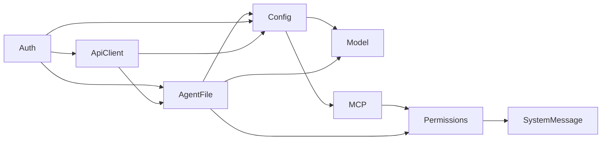

# Continue CLI 架构与 Coding Agent 主循环

相关专题：[Windows、Linux 与 macOS 跨平台适配](./cross-platform-adaptation.md)

## 1. 研究范围和版本

- 上游仓库：`https://github.com/continuedev/continue`
- 本地源码：[code/continue](../../code/continue/)
- 分支：`main`
- 源码提交：`5522c6f44ca0ac3528b37244818fbfa39b5af470`
- 提交日期：2026-07-20
- 研究重点：Continue CLI、服务容器、模型—工具循环、权限、会话压缩、MCP

Continue 是一个包含 CLI、VS Code、JetBrains、共享 Core、GUI、SDK 和构建产物的
TypeScript Monorepo。本文聚焦最终 `2.0.0` 版本的 CLI Agent 主链，并在需要时引用共享
`core/`。IDE 扩展、Autocomplete 和 Next Edit 留待后续专题。

项目 [`README.md`](../../code/continue/README.md) 明确声明该仓库已经停止积极维护并转为
只读。本文分析的是一份完整的成熟实现，不代表仍在演进的产品路线。

## 2. 一句话认识 Continue CLI

Continue CLI 是一个把配置、模型、MCP、权限、会话和 TUI 拆成响应式 Service 的
Coding Agent。它每轮重新计算 system prompt 和可见工具，流式收集模型 tool calls，
先按顺序完成权限决策，再并发执行获批工具，把结果写回统一 ChatHistory，直到模型不再
调用工具。

```text
cn [prompt]
  → Commander 解析参数
  → initializeServices()
  → TUI 或 headless
  → ChatHistory 追加 user message
  → streamChatResponse()
      → system prompt + tools
      → LLM streaming
      → tool calls
      → permission
      → parallel execution
      → tool results
      → 下一轮
  → 保存 JSON session
```

## 3. Monorepo 中与 CLI 相关的边界

| 目录 | 职责 |
| --- | --- |
| [`extensions/cli`](../../code/continue/extensions/cli/) | `cn` 命令、TUI、会话循环、权限和 CLI 工具 |
| [`core`](../../code/continue/core/) | 跨 IDE/CLI 共享的类型、消息转换、模型工具定义、索引和编辑能力 |
| [`packages/config-yaml`](../../code/continue/packages/config-yaml/) | YAML 配置、包标识符和模板变量 |
| [`packages/openai-adapters`](../../code/continue/packages/openai-adapters/) | OpenAI 兼容模型 API 适配 |
| [`packages/terminal-security`](../../code/continue/packages/terminal-security/) | 终端命令安全策略类型和评估 |
| [`extensions/vscode`](../../code/continue/extensions/vscode/) | VS Code 宿主与协议适配 |
| [`extensions/intellij`](../../code/continue/extensions/intellij/) | JetBrains 插件 |
| [`gui`](../../code/continue/gui/) | IDE Webview UI |

CLI 并不是简单包裹旧 IDE Core。模型—工具循环、权限 UI、TUI 和 Session Service 主要位于
`extensions/cli/src`，但消息类型、部分工具 schema、成本计算和历史管理复用 `core/`。

## 4. CLI 启动和模式分流

[`extensions/cli/src/index.ts`](../../code/continue/extensions/cli/src/index.ts) 使用 Commander
注册根命令和 `ls / serve / checks / review` 子命令。默认根命令进入聊天模式。

`init.ts` 必须是首个导入模块，它在其他依赖加载前接管 console、stdout 和 stderr，避免
headless 模式的机器可读输出被依赖日志污染。

根命令处理完 stdin、参数校验和日志设置后调用
[`chat()`](../../code/continue/extensions/cli/src/commands/chat.ts)，再明确分成两条链：

```text
interactive
  → initializeServices(headless=false)
  → startTUIChat()
  → Ink / React hooks 驱动 streamChatResponse()

headless (`cn -p`)
  → initializeServices(headless=true)
  → 初始化/恢复 ChatHistory
  → processMessage()
  → streamChatResponse()
  → 输出最终文本或 JSON
  → gracefulExit()
```

headless 路径不加载 Ink，适合管道和 CI。`serve` 则把相同流式循环包装成带 `/state` 和
`/message` 的 HTTP 服务。

## 5. Service Container：运行时对象图

[`ServiceContainer`](../../code/continue/extensions/cli/src/services/ServiceContainer.ts)
基于 `EventEmitter` 管理 Service：

- Service 注册 factory 和依赖名称；
- `get()` 在需要时加载；
- 同一 Service 正在加载时，后续调用等待 ready/error 事件；
- `reload()` 会递归找出依赖者并重载；
- UI 可以订阅状态更新。

[`services/index.ts`](../../code/continue/extensions/cli/src/services/index.ts) 组装的主要依赖图是：



另外还有 ChatHistory、FileIndex、ResourceMonitoring、StorageSync、Git AI、Hook 和
BackgroundJob 等相对独立的 Service。

所有 Service 在启动时调用 `initializeAll()` 预热，而不是等第一次 UI 读取时才加载。
这使 TUI 与 headless 使用相同状态来源，也允许配置变化后重载 Model 和 MCP。

## 6. 一轮请求的完整调用链

headless 的 [`processMessage()`](../../code/continue/extensions/cli/src/commands/chat.ts)
清楚展示了核心步骤：

```text
检查 /compact
  → 需要时自动压缩旧历史
  → ChatHistoryService.addUserMessage()
  → getStreamingResponse()
  → streamChatResponse()
  → 生成首轮 session title
  → 输出响应
  → updateSessionHistory()
```

TUI 最终也调用同一个 `streamChatResponse()`，区别主要是通过 callbacks 更新 React 状态、
处理权限对话框和中断。

### 6.1 每轮重新计算 Prompt 和工具

[`streamChatResponse()`](../../code/continue/extensions/cli/src/stream/streamChatResponse.ts)
包含真正的 Agent Loop：

```text
while true
  → 从 ChatHistoryService 刷新历史
  → SystemMessageService.getSystemMessage(currentMode)
  → getRequestTools(isHeadless)
  → 应用模型级 toolOverrides
  → 调用前上下文检查/压缩
  → processStreamingResponse()
  → handleToolCalls()
  → 工具后上下文检查/压缩
  → shouldContinue ? 下一轮 : 返回
```

Prompt 和工具不是会话启动时固定一次。权限模式或配置在一轮工具执行后改变时，下一次模型
请求会使用新的 system prompt 和工具目录。

### 6.2 模型流式响应

`processStreamingResponse()` 先计算 system prompt、工具 schema、历史和模型输出预算的总
token。超限时从历史尾部按消息组裁剪，仍无法满足时才报错。

随后它：

1. 把内部 `ChatHistoryItem` 转换为 OpenAI Chat Completion 消息；
2. 使用指数退避建立 streaming 请求；
3. 逐块拼接文本；
4. 用 tool call ID 和 index 对照表重组增量 arguments；
5. 记录首 token、输入输出 token、缓存 token、耗时和估算成本；
6. 返回完整文本、有效 tool calls 和 `shouldContinue`。

Tool arguments 在流式阶段持续拼接字符串，直到可以解析为 JSON。最终只检查 tool name
是否存在；缺失参数在后续 preprocessing 阶段按顶层 `required` 校验。

## 7. 工具目录和执行

[`tools/index.tsx`](../../code/continue/extensions/cli/src/tools/index.tsx) 动态构造工具目录。
基础工具包括：

- `Read`、`Write`、`List`、`Bash`、`Fetch`；
- Checklist、后台任务检查和 AskQuestion；
- 可选的 Search（检测到 `rg` 才加入）；
- 根据模型能力二选一的 Edit/MultiEdit；
- Skills；
- MCP 工具；
- headless 专用 Exit；
- beta Subagent、UploadArtifact 和后台 Agent 工具。

模型能力较强时使用 MultiEdit，否则使用 Edit。工具是否进入最终请求还会经过：

1. 运行环境和 beta flag；
2. MCP 当前连接状态；
3. 权限策略的 `exclude` 过滤；
4. 模型配置中的 tool override。

### 7.1 Tool call preprocessing

[`preprocessStreamedToolCalls()`](../../code/continue/extensions/cli/src/stream/streamChatResponse.helpers.ts)
逐个处理模型调用：

- 再次读取当前工具目录；
- 按名称定位 Tool；
- 校验顶层必填参数；
- 调用 Tool 自己的 `preprocess()`，解析路径、生成 diff preview 或重写参数；
- 错误转换成 tool result，并保持 `tool_call_id`。

### 7.2 权限顺序、执行并发

[`executeStreamedToolCalls()`](../../code/continue/extensions/cli/src/stream/streamChatResponse.helpers.ts)
对同一批工具执行两阶段处理：

```text
按模型顺序逐个检查权限
  → allow：启动执行 Promise
  → ask：等待 TUI 用户选择
  → exclude：记录 canceled

权限循环完成
  → Promise.all(已批准工具)
  → 按原始 tool call 顺序组装结果
```

获批工具的 Promise 会在权限循环中立即启动，因此先获批工具可能与后续权限询问并行。
最终统一 `Promise.all` 等待。`parallelToolCallCount` 传给工具，让 Read/Bash 等工具按并行
数量缩减输出预算，降低一次返回过多内容导致的上下文溢出。

工具结果不作为独立顶层历史项重复保存，而是更新原 assistant message 中对应的
`toolCallStates`。消息转换层在发给 Provider 时再生成合法的 assistant/tool 消息序列。

## 8. 权限模型

权限值有三种：

| 值 | 模型是否看见工具 | 执行行为 |
| --- | --- | --- |
| `allow` | 是 | 自动执行 |
| `ask` | TUI 是；headless 默认会过滤 | 请求用户批准 |
| `exclude` | 否 | 不发给模型 |

[`permissionChecker.ts`](../../code/continue/extensions/cli/src/permissions/permissionChecker.ts)
按“第一个匹配策略”决定结果，支持：

- 精确工具名；
- `*`、`?` 通配符；
- `Bash(git status*)` 形式的命令匹配；
- 参数字段的精确或 glob 匹配；
- 工具自身的动态安全策略。

优先级由
[`precedenceResolver.ts`](../../code/continue/extensions/cli/src/permissions/precedenceResolver.ts)
定义：

```text
CLI --allow/--ask/--exclude
  → ~/.continue/permissions.yaml
  → 默认策略
```

注释中提到的 config.yaml 权限层并未在该解析函数中落地。

默认 TUI 允许只读工具，写文件和 Bash 需要确认；headless 默认最终以 `* = allow` 收尾，
因此 Bash、MCP 和未匹配工具都会自动执行。Plan Mode 排除了 Edit/MultiEdit/Write，
但源码仍允许 Bash，并留下 TODO；system prompt 要求模型不要用 Bash 绕过只读限制。
因此 Plan Mode 的文件只读约束并不是完整的执行级 Sandbox。

## 9. System Prompt 和规则注入

[`constructSystemMessage()`](../../code/continue/extensions/cli/src/systemMessage.ts) 组合：

- 工作目录、平台、日期和启动时的 `git status` 快照；
- 当前目录第一个匹配的 `AGENTS.md / AGENT.md / CLAUDE.md / CODEX.md`；
- `--rule` 指定内容；
- config.yaml 中的 rules；
- 项目和用户 `.continue/rules/**/*.md` 中满足 `alwaysApply` 的规则；
- Plan Mode、headless 和 JSON 输出附加说明。

这里有两个重要边界：

1. Agent 指令文件只检查当前目录，不递归查找父目录或更深目录；
2. `git status` 只在模块加载时形成快照，后续工具修改不会更新该段 Prompt。

SystemMessageService 每轮重建字符串，但基础常量中的环境和 Git 快照仍来自进程启动阶段。

## 10. ChatHistory、Session 和压缩

### 10.1 ChatHistory 是运行时事实来源

[`ChatHistoryService`](../../code/continue/extensions/cli/src/services/ChatHistoryService.ts)
使用不可变数组更新，负责：

- 添加 user/assistant/system message；
- 保存和更新 `toolCallStates`；
- 记录 tool result 状态；
- compaction index；
- undo/redo 快照；
- 自动同步本地 Session。

它是 TUI 和 headless 共享的运行时事实来源。旧代码路径仍保留在 Service 未 ready 时直接修改
数组的 fallback，但正常初始化会使用 Service。

### 10.2 Session 持久化

[`session.ts`](../../code/continue/extensions/cli/src/session.ts) 使用单例 `SessionManager`，
每个会话分配 UUID，并把 JSON 保存到 `~/.continue/sessions/<sessionId>.json`：

- 每次历史、标题或 token/cost 更新都会保存；
- 持久化前过滤 system message；
- user message 内容同时写入 `editorState`；
- `--resume` 读取最近修改的 session；
- `--fork` 复制历史但创建新 session ID。

保存异常只记录日志，不向上抛出，因此磁盘失败不会中断 Agent，但可能导致用户误以为会话
已经持久化。

### 10.3 上下文压缩

[`compaction.ts`](../../code/continue/extensions/cli/src/compaction.ts) 用同一模型生成会话摘要：

```text
原历史 + compaction prompt
  → 超限时成组裁剪
  → streamChatResponse(isCompacting=true)
  → assistant summary
  → 标记 conversationSummary
  → 后续只发送 system + summary 之后的消息
```

自动压缩阈值以 context window 的 80% 和最多 15000 token buffer 计算，同时计入 system
prompt、工具 schema 和模型输出预算。工具执行后也会再次检查，防止大 observation 把下一轮
推过上限。

如果本轮发生压缩且模型恰好准备结束，循环会自动追加一条 `"continue"` user message，
让 Agent 在摘要上下文上继续一次，避免压缩响应被误当成最终任务回复。

## 11. MCP

[`MCPService`](../../code/continue/extensions/cli/src/services/MCPService.ts) 支持：

- stdio；
- SSE；
- Streamable HTTP；
- 未指定类型时先试 HTTP，再回退 SSE；
-交互模式下遇到部分 OAuth 场景时，通过 `npx mcp-remote` 回退。

连接成功后读取 Server capabilities，再分别加载 prompts 和 tools。MCP Tool 被转换成普通
Continue Tool，执行时通过 `MCPService.runTool()` 找到所属连接并调用 `client.callTool()`。

headless 或显式 Agent File 模式会等待 MCP 初始化；headless 中任何 Server 连接失败都会让
初始化整体报错。普通 TUI 可以先启动，连接状态和 warning 通过 Service 更新到 UI。

当前 `withTokenRefresh()` 的注释描述 token refresh，但实现只直接执行 operation；源码也写明
“No auth/token refresh available”。不要把这层包装器理解成已完成的自动刷新机制。

## 12. 测试和工程成熟度

CLI 带有数量较多的单元、集成、E2E 和 smoke tests，尤其覆盖：

- `streamChatResponse`、tool call 增量解析和自动压缩；
- TUI 输入、中断、权限、Plan Mode 和消息展示；
- ToolPermissionService、策略优先级和 YAML；
- Session 保存、恢复和 fork；
- MCP Service；
- Edit/MultiEdit/Bash/Search 等工具；
- headless 无 TTY 场景。

这与 OpenManus 主要测试 Sandbox 的情况不同：Continue 对 Agent 控制面本身有较完整的回归
保护。不过本轮没有安装其大型 Monorepo 依赖，也没有运行上游测试。

## 13. 限制和风险

1. **项目已停止维护**：README 声明仓库只读，已完成最终 `2.0.0`。
2. **headless 权限宽松**：默认 `* = allow`，在 CI 或自动化环境运行不可信 Prompt 时风险高。
3. **Plan Mode 不是强 Sandbox**：Bash 仍允许，禁止写入主要依赖 system prompt。
4. **并发工具可能互相影响**：同一模型响应中的多个获批工具并发执行，没有统一副作用屏障。
5. **Session 保存失败不阻断**：只记录日志，调用方无法从返回值知道持久化失败。
6. **MCP token refresh 未真正实现**：包装器存在，但当前直接执行原操作。
7. **实验工具需显式看待**：Subagent 和 UploadArtifact 仍由 beta flag 控制。
8. **旧新路径并存**：Service 驱动历史已是主路径，但部分函数仍保留直接数组 fallback，
   阅读时需区分正常路径和兼容路径。

## 14. 推荐阅读顺序

1. [`extensions/cli/src/index.ts`](../../code/continue/extensions/cli/src/index.ts)
2. [`extensions/cli/src/commands/chat.ts`](../../code/continue/extensions/cli/src/commands/chat.ts)
3. [`extensions/cli/src/services/index.ts`](../../code/continue/extensions/cli/src/services/index.ts)
4. [`extensions/cli/src/stream/streamChatResponse.ts`](../../code/continue/extensions/cli/src/stream/streamChatResponse.ts)
5. [`extensions/cli/src/stream/handleToolCalls.ts`](../../code/continue/extensions/cli/src/stream/handleToolCalls.ts)
6. [`extensions/cli/src/stream/streamChatResponse.helpers.ts`](../../code/continue/extensions/cli/src/stream/streamChatResponse.helpers.ts)
7. [`extensions/cli/src/tools/index.tsx`](../../code/continue/extensions/cli/src/tools/index.tsx)
8. [`extensions/cli/src/permissions`](../../code/continue/extensions/cli/src/permissions/)
9. [`extensions/cli/src/services/ChatHistoryService.ts`](../../code/continue/extensions/cli/src/services/ChatHistoryService.ts)
10. [`extensions/cli/src/compaction.ts`](../../code/continue/extensions/cli/src/compaction.ts)
11. [`extensions/cli/src/services/MCPService.ts`](../../code/continue/extensions/cli/src/services/MCPService.ts)
