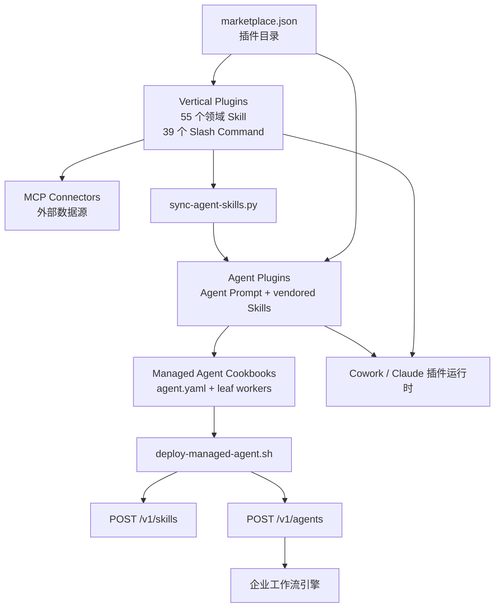

# Anthropic Financial Services 插件体系与托管 Agent 架构

## 1. 研究范围和版本

- 上游仓库：`https://github.com/anthropics/financial-services`
- 本地源码：[`code/financial-services`](../../code/financial-services/)
- 分支：`main`
- 源码提交：`eb0c1ea962d4c6cee07f4920e36b1aa7a025d320`
- 提交日期：2026-07-22
- 2026-08-24 增量复核提交：`33a3d8a9d6e5c3d4861731933a8857cc5e03315d`
- 研究重点：Claude 插件分层、Skill/Command 复用、Managed Agent Cookbook、GL Reconciler、信任边界和部署脚本

这不是一个包含 Agent 调度器、模型客户端和业务数据库的完整应用。仓库主要用 Markdown、JSON、YAML
和少量 Python/Shell 脚本描述金融工作流，再由 Claude 插件系统或 Managed Agents API 提供运行时。
因此，本文分析的是“工作流如何被声明、装配和部署”，不能把 Prompt 中描述的能力视为已经由本仓库代码
强制保证。

本轮上游只修订 `claude-for-msft-365-install` 的 Microsoft Foundry 安装说明和脚本，共 1 个提交、5 个文件；Plugin、Managed Agent 和部署主链没有变化。因此保留原架构结论，仅更新复核边界。

## 2. 一句话认识项目

Financial Services 把金融领域能力拆成三层：

1. **Vertical Plugin** 保存可复用的领域 Skill、Slash Command 和数据连接器；
2. **Agent Plugin** 把若干 Skill 组装成端到端岗位型 Agent；
3. **Managed Agent Cookbook** 把同一套 Agent Prompt 和 Skill 转换成可部署的
   orchestrator/worker 拓扑。

同一份工作流既可以作为 Cowork 插件由分析师交互使用，也可以通过托管 Agent 清单部署到企业自己的
流程引擎之后。仓库根 [`README.md`](../../code/financial-services/README.md) 将这种关系概括为
“same agent, same skills, pick your surface”。

## 3. 仓库分层

当前源码快照包含 7 个 Vertical Plugin、10 个 Agent Plugin、2 个合作伙伴插件和 10 组
Managed Agent Cookbook。Marketplace 还额外收录 Microsoft 365 安装插件，共 20 个条目。



关键抽象如下。

| 抽象 | 代表源码 | 职责 |
| --- | --- | --- |
| Marketplace | [`.claude-plugin/marketplace.json`](../../code/financial-services/.claude-plugin/marketplace.json) | 汇总可安装插件及其本地 source |
| Plugin Manifest | [`gl-reconciler/plugin.json`](../../code/financial-services/plugins/agent-plugins/gl-reconciler/.claude-plugin/plugin.json) | 声明插件名称、版本、描述和作者 |
| Agent Prompt | [`gl-reconciler.md`](../../code/financial-services/plugins/agent-plugins/gl-reconciler/agents/gl-reconciler.md) | 定义角色、工具、执行步骤和业务护栏 |
| Skill | [`gl-recon/SKILL.md`](../../code/financial-services/plugins/vertical-plugins/fund-admin/skills/gl-recon/SKILL.md) | 封装可复用的专业方法和产物要求 |
| Slash Command | [`dcf.md`](../../code/financial-services/plugins/vertical-plugins/financial-analysis/commands/dcf.md) | 提供显式用户入口并串联多个 Skill |
| MCP 配置 | [`.mcp.json`](../../code/financial-services/plugins/vertical-plugins/financial-analysis/.mcp.json) | 声明金融数据和文档系统的远程 MCP Server |
| Cookbook | [`gl-reconciler/agent.yaml`](../../code/financial-services/managed-agent-cookbooks/gl-reconciler/agent.yaml) | 把 Agent 映射为托管 orchestrator 和 leaf worker |

## 4. Vertical Plugin：领域能力的源头

[`plugins/vertical-plugins`](../../code/financial-services/plugins/vertical-plugins/) 按业务领域组织能力：

- `financial-analysis`：DCF、LBO、三表模型、Comps、Excel 审计及公共连接器；
- `investment-banking`：Pitch Book、交易材料和银行工作流；
- `equity-research`：公司研究、财报和行业分析；
- `private-equity`：投资筛选、估值和投后工作流；
- `wealth-management`：客户会议、组合与财富管理；
- `fund-admin`：基金会计、GL 对账和 NAV 相关能力；
- `operations`：KYC、合规和运营流程。

### 4.1 Skill 是方法说明，不是可执行函数

以 [`gl-recon/SKILL.md`](../../code/financial-services/plugins/vertical-plugins/fund-admin/skills/gl-recon/SKILL.md)
为例，它规定：

- 先统一日期、金额和标识符类型，保证精确匹配；
- 按组合键进行 GL 与 subledger 对照；
- 将差异分为金额、数量、时点和单边记录等类型；
- `suspected_cause` 只能作为待 resolver 验证的假设，不能写成确定结论；
- 输出逐条 Break Report 和汇总，再交给 `break-trace` 深挖重要差异。

这些规则为模型提供专业作业方法，但仓库中没有实现一套确定性的 reconciliation engine。金额计算、
匹配正确性和 Excel 产物仍依赖模型、工具实现、输入质量以及人工复核。

### 4.2 Command 负责组合 Skill

[`commands/dcf.md`](../../code/financial-services/plugins/vertical-plugins/financial-analysis/commands/dcf.md)
先要求调用 `comps-analysis`，再调用 `dcf-model`，最后用同行倍数、增长率和利润率交叉检查 DCF。
因此 Command 更像面向用户的编排模板，Skill 则是可被 Command 或 Agent 复用的方法模块。

### 4.3 Agent Plugin 内的 Skill 是生成副本

Agent Plugin 会把依赖的 Skill 复制到自己的 `skills/` 中，以便独立安装。
[`sync-agent-skills.py`](../../code/financial-services/scripts/sync-agent-skills.py) 执行的同步过程是：

```text
vertical-plugins/*/skills/<name>     领域源文件
                 │
                 ├─ 按目录 basename 建立索引
                 │
                 └─ 删除并重建
                    agent-plugins/*/skills/<name>
```

当前 55 个 Vertical Skill 的目录名没有重复，所以这个索引在当前快照中没有歧义。不过脚本只用
Skill 的 basename 作为键；如果未来两个 Vertical 新增同名 Skill，后扫描到的目录会覆盖索引中的
前一个，这是维护上的潜在冲突点。

## 5. Agent Plugin：端到端岗位工作流

[`plugins/agent-plugins`](../../code/financial-services/plugins/agent-plugins/) 中的 10 个 Agent
覆盖财报复核、总账对账、KYC、市场研究、会前准备、模型构建、月结、Pitch Book、报表审计和估值复核。

Agent Plugin 本身很轻：

```text
<agent>/
├─ .claude-plugin/plugin.json
├─ agents/<agent>.md
└─ skills/                  # 从 Vertical Plugin 同步的依赖副本
```

`plugin.json` 只保存元数据，真正的工作流、工具白名单和护栏都在 Agent Markdown 的 YAML
frontmatter 与正文中。它没有自己的调度代码；“dispatch reader”“交给 critic”等动作要由宿主
Agent 运行时理解并执行。

## 6. GL Reconciler 调用链

GL Reconciler 是理解本仓库安全设计最完整的样例。

### 6.1 交互式插件路径

[`agents/gl-reconciler.md`](../../code/financial-services/plugins/agent-plugins/gl-reconciler/agents/gl-reconciler.md)
为 orchestrator 开放 `Read`、`Grep`、`Glob` 以及只读的内部 GL/subledger MCP 工具，并声明以下流程：

```text
拉取 GL 和 subledger 余额
  → 按资产类别派发 reader
  → 隔离超过阈值的 break
  → 使用 break-trace 追查原因
  → critic 回到可信内部源复核
  → resolver 生成 exception report
  → controller 人工签核
```

Prompt 明确要求：

- counterparty/custodian 文件是不可信输入；
- 读取这些文件的 reader 不拥有 MCP、Bash 或写工具；
- orchestrator 不写文件；
- 只有 resolver 可以写产物，而且 resolver 不读取原始外部文件；
- Agent 不向总账过账，调整动作必须由人审批。

### 6.2 托管 Agent 路径

[`managed-agent-cookbooks/gl-reconciler/agent.yaml`](../../code/financial-services/managed-agent-cookbooks/gl-reconciler/agent.yaml)
把上述 Prompt 作为 `system.file` 引入，并注册三个一层 worker：

| Worker | 不可信文件 | 内部系统 | 写权限 | 角色 |
| --- | --- | --- | --- | --- |
| [`reader`](../../code/financial-services/managed-agent-cookbooks/gl-reconciler/subagents/reader.yaml) | 读取 | 无 MCP | 无 | 从外部材料提取候选 break |
| [`critic`](../../code/financial-services/managed-agent-cookbooks/gl-reconciler/subagents/critic.yaml) | 禁止读取 | 只读 GL/subledger MCP | 无 | 对候选 break 独立复核 |
| [`resolver`](../../code/financial-services/managed-agent-cookbooks/gl-reconciler/subagents/resolver.yaml) | 禁止读取 | 无 MCP | `read/write/edit` | 把已验证数据写成报告 |

它体现的是一种按数据可信度和副作用拆分能力的架构：

```text
不可信文档 ──reader/read-only──> 结构化候选
                                  │
可信内部系统 ──critic/read-only──> 已复核差异
                                  │
                                  └──resolver/write-only boundary──> ./out/ 报告
```

“write-only boundary”在这里表示只有最后一层持有写能力，并非 resolver 只有 Write 而没有 Read。
它仍可读取经过筛选的上下文，但 Prompt 禁止其打开外部原始材料。

## 7. Managed Agent 清单如何变成 API 请求

[`deploy-managed-agent.sh`](../../code/financial-services/scripts/deploy-managed-agent.sh) 提供一层清单转换：

1. 读取 `agent.yaml`，对 `${ENV_NAME}` 做受限字符替换；
2. 将 `system.file` 读入并与 `system.append` 合并；
3. 把 `skills.from_plugin` 展开为插件下的每个 Skill；
4. 压缩并上传 Skill 到 `POST /v1/skills`；
5. 递归创建 leaf worker；
6. 将 `callable_agents[].manifest` 替换成已创建 Agent 的 ID 和版本；
7. 创建最外层 orchestrator，并写入 `anthropic_cookbook` metadata。

`--dry-run` 会输出按“worker 在前、orchestrator 在后”排列的最终请求体。
[`test-cookbooks.sh`](../../code/financial-services/scripts/test-cookbooks.sh) 依赖这个模式检查 10 个
Cookbook 是否产生合法 JSON、非空 system prompt、单层委派关系，以及是否已从 API Body 移除
`output_schema`。

托管方案目前带有明确的 Research Preview 属性：

- `callable_agents` 只设计一层委派，worker 不能再嵌套 worker；
- 脚本使用 `anthropic-beta: managed-agents-2026-04-01`；
- [`orchestrate.py`](../../code/financial-services/scripts/orchestrate.py) 中的 SDK 调用仍用
  `type: ignore` 绕过缺失的类型定义。

## 8. 跨 Agent Handoff

Cookbook 不允许一个命名 Agent 直接调用另一个命名 Agent。源 Agent 在文本输出中产生
`handoff_request`，外部工作流引擎再把它变成目标 Agent 的 steering event。

参考实现 [`orchestrate.py`](../../code/financial-services/scripts/orchestrate.py) 做了两层限制：

- `target_agent` 必须命中硬编码 allowlist；
- `payload` 必须通过 JSON Schema，限制字段、长度和字符范围。

但它用正则从模型文本中寻找 JSON。源码注释已经明确指出：如果上游处理了攻击者控制的文档，
文档中的字面量 `handoff_request` 可能被模型复述并触发解析。生产环境应使用专用 Tool Call
或模型不能通过引用文本伪造的类型化事件，而不是把自由文本当控制通道。

## 9. 安全模型和人工审批边界

项目的核心防线不是单一权限开关，而是四层组合：

1. Agent/worker 工具白名单限制可执行动作；
2. 不可信输入、可信数据源和写入者分离；
3. Prompt 约束数据用途、输出范围和禁止动作；
4. 所有高影响结果都只生成草稿或待签核产物。

根 [`README.md`](../../code/financial-services/README.md) 明确声明 Agent 不提供投资建议、不执行交易、
不绑定风险、不向总账过账，也不批准客户准入。这既是产品边界，也是理解源码时的重要前提：
仓库展示的是 analyst work product 的自动化起点，不是无人监管的金融决策系统。

## 10. 源码中的限制、缺口和注意事项

### 10.1 Reader 的 `output_schema` 没有接入当前部署链

[`reader.yaml`](../../code/financial-services/managed-agent-cookbooks/gl-reconciler/subagents/reader.yaml)
和 Cookbook README 都说 reader 输出会在交给 orchestrator 前经过 Schema 校验；
[`validate.py`](../../code/financial-services/scripts/validate.py) 也提供了独立 JSON Schema 校验器。

但是当前 [`deploy-managed-agent.sh`](../../code/financial-services/scripts/deploy-managed-agent.sh)
只在生成 API Body 时执行 `del(.output_schema)`，没有提取 Schema、创建验证 wrapper 或调用
`validate.py`。`validate.py` 本身也要求调用者传入单独的 Schema 文件，不会自动从整个 worker
manifest 的 `output_schema` 字段取值。

所以，就本次研究的提交而言：

- 长度、字符集和字段白名单已经被声明；
- 部署 API Body 不会泄漏非 API 字段；
- 但仓库提供的部署脚本没有把这些约束接到 reader → orchestrator 的实际数据通路上。

生产接入方需要在调用 harness 中显式提取并校验，不能仅凭 YAML 中存在 `output_schema` 就认为隔离
已经生效。

### 10.2 核心 MCP 配置当前不是合法 JSON

[`financial-analysis/.mcp.json`](../../code/financial-services/plugins/vertical-plugins/financial-analysis/.mcp.json)
在 `egnyte` 与 `box` 之间缺少逗号，文件末尾也缺少 `box` 对象和外层对象所需的闭合括号。
对本地全部 41 个 JSON 文件进行解析检查时，这是唯一一个解析失败的文件。

根 README 还写着“11 个数据连接器”，而该文件按键名意图列出 12 个。二者已经发生漂移。
更值得注意的是，[`check.py`](../../code/financial-services/scripts/check.py) 的 JSON 检查范围只包含
Marketplace、Plugin Manifest 和 steering example，没有覆盖 `.mcp.json`，所以现有仓库检查无法发现
这个错误。

### 10.3 自动检查不等于业务正确性验证

`check.py` 主要验证 YAML/JSON 语法、frontmatter、引用路径、Skill 副本漂移和 PowerShell 编码；
`test-cookbooks.sh` 验证部署请求体的形状。仓库没有针对估值、对账、KYC 或报表结论的确定性单元测试。
此外，运行 `check.py` 会尝试修改当前 clone 的 `core.hooksPath`，它并不是纯只读检查。

### 10.4 外部依赖和运行时仍在仓库之外

- MCP Server 可能要求商业订阅、API Key 和企业授权；
- Plugin/Managed Agent 平台决定 Markdown/YAML 的实际解释方式；
- Prompt 护栏仍需配合宿主权限、凭据隔离、审计和审批系统；
- `/v1/agents`、多 Agent 委派和示例 SDK 接口都带预览性质；
- 上传 Skill 的缓存键也是目录 basename；当前 Skill 名唯一，但未来重名会造成复用歧义。

## 11. 推荐阅读顺序

1. 先读根 [`README.md`](../../code/financial-services/README.md)，理解两种交付形态和责任边界；
2. 看 [Marketplace](../../code/financial-services/.claude-plugin/marketplace.json)，建立插件全景；
3. 用 [`dcf.md`](../../code/financial-services/plugins/vertical-plugins/financial-analysis/commands/dcf.md)
   和 [`gl-recon/SKILL.md`](../../code/financial-services/plugins/vertical-plugins/fund-admin/skills/gl-recon/SKILL.md)
   区分 Command 与 Skill；
4. 阅读 [`gl-reconciler.md`](../../code/financial-services/plugins/agent-plugins/gl-reconciler/agents/gl-reconciler.md)，
   理解交互式 Agent 的流程和护栏；
5. 对照 [`agent.yaml`](../../code/financial-services/managed-agent-cookbooks/gl-reconciler/agent.yaml)
   及三个 subagent，理解能力隔离；
6. 最后读 [`deploy-managed-agent.sh`](../../code/financial-services/scripts/deploy-managed-agent.sh)、
   [`validate.py`](../../code/financial-services/scripts/validate.py) 和
   [`orchestrate.py`](../../code/financial-services/scripts/orchestrate.py)，确认声明如何落到部署和控制通道，
   以及哪些安全保证仍需接入方补齐。
