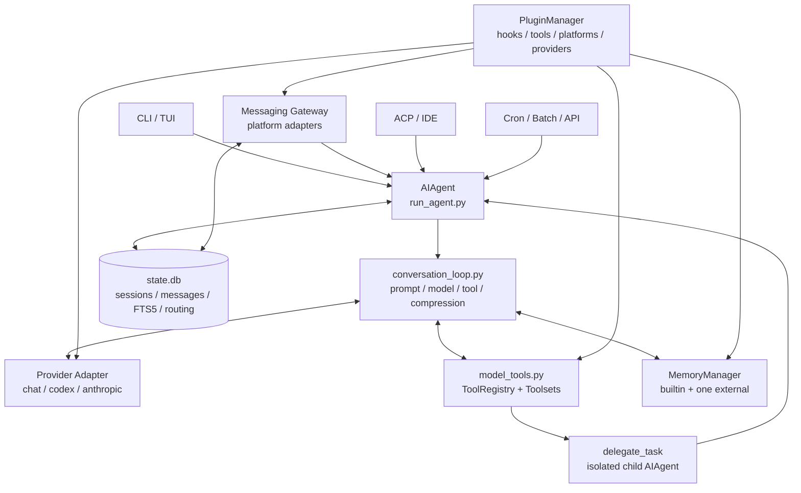

# Hermes Agent 源码解析

## 研究范围

- 上游仓库：<https://github.com/NousResearch/hermes-agent>
- 本地源码：[code/hermes-agent](../../code/hermes-agent/)
- 源码版本：`07e97d2f5dc3d2092cfe693ef07b2527a36cd2d8`
- `pyproject.toml` 版本：`0.19.0`
- 研究重点：多入口 Agent 内核、对话循环、工具注册、Provider 适配、Gateway、SQLite 会话、Memory、Skill 与子 Agent 委托

本文结论以当前本地源码为准。Hermes 的核心文件较大并且仍在快速演进，注释中的历史问题编号、兼容逻辑和实验功能不等于稳定接口承诺。

## 一句话结论

Hermes Agent 采用“**多入口、单内核、注册表扩展**”的架构：CLI、消息 Gateway、TUI、ACP、Cron 和 Python 调用最终复用 `AIAgent` 与同一套 conversation loop；Provider、Tool、Memory 和 Plugin 在外围通过注册表或适配器接入，SQLite 则把会话历史、全文检索、路由和异步委托状态连成一个持久化底座。

## 整体架构



仓库自己的 [Architecture 文档](../../code/hermes-agent/website/docs/developer-guide/architecture.md) 也把 `AIAgent` 画成统一窄腰。阅读源码时应把 `gateway/run.py`、`cli.py` 等看作入口和交互层，而不是彼此独立的 Agent 实现。

## 核心模块

| 模块 | 职责 | 关键源码 |
| --- | --- | --- |
| `AIAgent` | 组装 Provider、工具、回调、会话、预算和 Memory | [run_agent.py](../../code/hermes-agent/run_agent.py) |
| Conversation Loop | prompt、模型请求、工具回填、重试、压缩和持久化 | [agent/conversation_loop.py](../../code/hermes-agent/agent/conversation_loop.py) |
| Provider | 将 provider/model 解析为 API mode、凭据和请求适配 | [providers/__init__.py](../../code/hermes-agent/providers/__init__.py)、[hermes_cli/runtime_provider.py](../../code/hermes-agent/hermes_cli/runtime_provider.py) |
| Tool Registry | 自动发现、schema、可用性检查、dispatch 和错误归一化 | [tools/registry.py](../../code/hermes-agent/tools/registry.py)、[model_tools.py](../../code/hermes-agent/model_tools.py) |
| Toolsets | 按平台或任务裁剪工具能力 | [toolsets.py](../../code/hermes-agent/toolsets.py) |
| SessionDB | SQLite、FTS5、会话血缘、用量、路由和异步委托 | [hermes_state.py](../../code/hermes-agent/hermes_state.py) |
| Gateway | 多平台接入、鉴权、会话串行、Agent 缓存和交付 | [gateway/run.py](../../code/hermes-agent/gateway/run.py)、[gateway/platforms/base.py](../../code/hermes-agent/gateway/platforms/base.py) |
| Memory | builtin memory 与一个外部 provider 的生命周期编排 | [agent/memory_manager.py](../../code/hermes-agent/agent/memory_manager.py) |
| Plugin | manifest 发现、hook/middleware/tool/platform 注册 | [hermes_cli/plugins.py](../../code/hermes-agent/hermes_cli/plugins.py) |
| Delegation | 隔离子 Agent、并行批量、后台完成回注 | [tools/delegate_tool.py](../../code/hermes-agent/tools/delegate_tool.py) |

## `AIAgent`：统一运行内核

[run_agent.py](../../code/hermes-agent/run_agent.py) 中的 `AIAgent` 构造函数接收：

- provider、model、API mode、base URL 和凭据；
- 最大迭代次数、共享预算和 fallback；
- enabled/disabled toolsets；
- session ID、SessionDB 和平台身份；
- 回调、流式显示、Memory 与 checkpoint 配置。

构造工作被继续委托给 [agent/agent_init.py](../../code/hermes-agent/agent/agent_init.py)，而公开的 `run_conversation()` 再转给 [agent/conversation_loop.py](../../code/hermes-agent/agent/conversation_loop.py)。这使 `run_agent.py` 保留兼容入口和对象状态，同时把不断膨胀的循环逻辑拆到 `agent/` 包。

统一内核带来的直接收益是：CLI、Gateway、ACP 和定时任务在 Provider、工具策略、压缩和持久化方面保持相同语义。平台差异主要通过构造参数、回调和 ephemeral context 注入，而不是复制一套循环。

## 主对话循环

### 总体状态流

```text
run_conversation(user_message)
  → build_turn_context
      → system prompt / skills / memory / plugin pre_llm
      → 恢复或追加会话消息
  → while iteration budget remains
      → 选择 API mode 和 Provider adapter
      → LLM request middleware
      → streaming / non-streaming request
      → 解析 assistant message
      → 有 tool calls？
          ├─ 否：持久化最终回复并结束
          └─ 是：修复与校验 tool calls
                  → 先持久化 assistant tool-call turn
                  → 执行工具批次
                  → 持久化 tool results
                  → 必要时压缩上下文
                  → 下一轮
```

[conversation_loop.py](../../code/hermes-agent/agent/conversation_loop.py) 的 `build_turn_context` 先组装本轮上下文，包括稳定 system prompt、Skill、Memory 预取和插件 `pre_llm` 结果。随后循环受 `max_iterations` 和共享 iteration budget 控制。

如果 `api_mode == codex_app_server`，源码会进入专门的 Codex App Server 路径；其他模式使用共享的中间件和 streaming/non-streaming 适配逻辑。Provider 差异被限制在 transport 和消息格式附近，工具处理仍回到统一循环。

### 工具调用阶段

工具阶段做了大量防御性处理：

- 修复或拒绝错误工具名和无效 JSON 参数；
- 保持 assistant `tool_calls` 与后续 `tool` result 一一配对；
- 限制、去重 `delegate_task`；
- 在执行可能产生副作用的工具之前，先持久化 assistant tool-call turn；
- 工具执行后根据真实 token 压力决定是否压缩；
- 中断、Provider 异常和上下文溢出都有独立恢复路径。

`AIAgent._execute_tool_calls()` 先把工具分成连续批次：声明为 parallel-safe 的工具可并发执行，具有顺序屏障的工具仍逐个运行。这样的分段比“所有工具一律并发”更适合包含文件修改、终端命令等副作用的 Agent。

### Prompt cache 与压缩

Hermes 把 prompt 前缀稳定性作为显式设计约束。正常轮次尽量不改变 system prompt 和既有消息字节；只有上下文压力触发压缩时才有意破坏缓存前缀。

压缩不是简单按消息条数触发，而是综合请求 token、工具 schema 和上下文上限。压缩锁竞争时会跳过并退还尝试预算，避免多个写入者同时改写同一会话。相关实现集中在 [conversation_loop.py](../../code/hermes-agent/agent/conversation_loop.py) 和 [agent/context_compressor.py](../../code/hermes-agent/agent/context_compressor.py)。

## Provider 适配

[providers/__init__.py](../../code/hermes-agent/providers/__init__.py) 提供延迟发现的 `ProviderProfile` 注册表：

1. 加载 `plugins/model-providers/<name>/` 中的 bundled provider；
2. 加载 `$HERMES_HOME/plugins/model-providers/<name>/` 中的用户 provider；
3. 为兼容旧扩展，再扫描 `providers/*.py`。

后加载的同名 Provider 覆盖先加载者，因此用户插件可以替换 bundled profile。新扩展推荐使用带 `plugin.yaml` 的目录布局。

运行时解析由 [hermes_cli/runtime_provider.py](../../code/hermes-agent/hermes_cli/runtime_provider.py) 把 provider/model 映射到 API mode、凭据和 base URL。核心循环主要面对三类协议：

- OpenAI 风格 Chat Completions；
- Codex Responses/App Server；
- Anthropic Messages。

格式转换和特殊 transport 分散在 [agent/chat_completion_helpers.py](../../code/hermes-agent/agent/chat_completion_helpers.py)、[agent/codex_runtime.py](../../code/hermes-agent/agent/codex_runtime.py) 和 [agent/anthropic_adapter.py](../../code/hermes-agent/agent/anthropic_adapter.py)。Provider profile 是“配置与能力描述”，adapter 才是实际协议转换，两者不应混为一层。

## 工具注册和能力裁剪

### 自动发现

[tools/registry.py](../../code/hermes-agent/tools/registry.py) 使用 AST 检查 `tools/*.py` 顶层是否包含 `registry.register(...)`，只导入真正自注册的模块，并排除 `registry.py`、`mcp_tool.py` 等特殊文件。

每个 `ToolEntry` 保存：

- 名称和 toolset；
- OpenAI 格式 schema；
- handler 及其同步/异步属性；
- `check_fn` 和环境要求；
- 结果大小上限与动态 schema override。

Registry 使用 `RLock` 保护动态刷新，并用单调递增 generation 让上层缓存失效。`check_fn` 结果有短 TTL 和“最近成功”宽限期，避免 Docker、Playwright 等外部探测偶发失败时，一整组工具在某一轮突然消失。

### Schema 生成与 dispatch

[model_tools.py](../../code/hermes-agent/model_tools.py) 在导入时触发 built-in tool 和通用插件发现，但 MCP 被刻意移出模块级副作用：不同入口需要在合适的线程或 executor 中显式发现，避免慢 MCP server 阻塞 Gateway 事件循环。

`get_tool_definitions()` 按 enabled/disabled toolsets、registry generation 和配置指纹缓存 schema。`handle_function_call()` 的路径是：

```text
参数类型修复
  → Tool Search bridge 解包和作用域复核
  → tool_request middleware
  → pre_tool_call / 人工审批
  → ACP 文件编辑审批
  → tool execution middleware
  → registry.dispatch
  → post_tool_call
  → transform_tool_result
```

Tool Search bridge 最终必须再次确认底层工具属于当前会话允许的目录，防止受限子 Agent 借延迟工具桥调用全局注册表中的其他能力。

### Toolsets

[toolsets.py](../../code/hermes-agent/toolsets.py) 把具体工具组合为 `web`、`terminal`、`file`、`browser`、`skills`、`delegation` 等能力组，并维护跨入口共用的 `_HERMES_CORE_TOOLS`。

这层设计让不同平台只选择能力集合，不需要手写几十个工具名。Webhook 默认工具集被刻意限制为搜索、提取、视觉和澄清等低风险能力，避免第三方事件内容通过 prompt injection 直接获得本地终端或文件写权限。

## Gateway：多平台入口与会话串行化

平台基类 [gateway/platforms/base.py](../../code/hermes-agent/gateway/platforms/base.py) 把原始平台事件转换为 `MessageEvent`。`handle_message()` 先生成确定性 session key，并使用 `_active_sessions` 防止同一会话并发启动两个 Agent：

- `/stop`、`/new`、审批和 clarify 回复有专用绕行路径；
- 普通新消息在当前轮执行时进入 pending queue；
- 首条消息同步安装 guard 后才创建后台任务，关闭竞争窗口。

[gateway/session.py](../../code/hermes-agent/gateway/session.py) 是 session key 的单一来源。DM、群组、thread、用户隔离和 profile namespace 都在这里编码。`SessionStore.get_or_create_session()` 对同一个 routing key 做 single-flight，而不同 key 仍可并发。

[GatewayRunner](../../code/hermes-agent/gateway/run.py) 的主路径可以概括为：

```text
Adapter.handle_message
  → GatewayRunner 的鉴权、命令和 hook
  → SessionStore.get_or_create_session
  → _handle_message_with_agent
  → _run_agent / _run_agent_inner
  → 复用或创建 AIAgent
  → AIAgent.run_conversation
  → 同步 session split / transcript
  → Adapter.send
```

Gateway 会按 session key 缓存 `AIAgent`，以保留 prompt cache 和运行资源；但发现配置签名变化、SessionDB message count 被其他进程修改，或缓存 Agent 指向已结束 session 时，会主动淘汰并重建。

## SQLite 会话与检索

[hermes_state.py](../../code/hermes-agent/hermes_state.py) 的 `SessionDB` 以 SQLite 为统一状态库，核心表包括：

| 表 | 用途 |
| --- | --- |
| `sessions` | 会话来源、路由、模型、父会话、token、成本、压缩和归档状态 |
| `messages` | role/content、tool calls/results、reasoning、平台消息 ID 和 active/compacted 状态 |
| `session_model_usage` | 按模型与计费来源聚合用量和成本 |
| `gateway_routing` | session key 到完整路由 entry 的持久化索引 |
| `compression_locks` | 防止多个写入者同时压缩会话 |
| `async_delegations` | 后台委托的状态、结果、交付和 owner 信息 |

`SessionDB` 采用 WAL、短 SQLite timeout 和带随机抖动的应用层写重试，以应对 Gateway、CLI、Cron 等多进程共享 `state.db` 的竞争。每次消息追加会同步更新计数，并在活跃 compression lock 与当前写入者不匹配时拒绝写入。

历史搜索优先使用 FTS5；源码还区分 CJK tokenizer、trigram 和短 CJK 的 LIKE fallback。被 context compression 归档的消息默认仍可搜索，而用户 rewind 后失效的消息默认排除。

## Memory 与 Skill

[MemoryManager](../../code/hermes-agent/agent/memory_manager.py) 始终允许 builtin provider，并且最多再启用一个外部 Memory Provider。它负责：

- 汇总 provider 的 system prompt block；
- 在本轮前预取 recall context；
- 将 provider 工具 schema 注入 Agent；
- 路由 Memory 工具调用；
- 在 turn、session switch、compression 和 delegation 生命周期通知 provider；
- 在后台串行同步已完成轮次。

外部预取有超时隔离，轮次结束后的写入使用单 worker FIFO，确保第 N 轮先于第 N+1 轮落库。慢或失效的外部 Memory 不会阻塞用户已经看到的最终回复。

Memory Provider 不能覆盖 `clarify`、`delegate_task` 等保留核心工具名。专用 provider 位于 [plugins/memory](../../code/hermes-agent/plugins/memory/)，由独立发现系统选择，而不是通用 PluginManager 同时加载多个。

Skill 不是另一套执行引擎，而是进入 prompt/context 的可复用说明与资源。工具侧通过 `skills_list`、`skill_view`、`skill_manage` 管理；MemoryManager 还会剥离 Skill 展开的脚手架，只把用户真实指令交给记忆系统，避免把整份 Skill 文本污染为“用户记忆”。

## 子 Agent 委托

[tools/delegate_tool.py](../../code/hermes-agent/tools/delegate_tool.py) 的 `delegate_task` 会创建新的 `AIAgent`：

- 子 Agent 使用全新对话，不继承父会话 transcript；
- 拥有独立 `task_id`、终端 session 和文件状态；
- 继承经过裁剪的父 toolsets；
- 父上下文只接收任务和汇总结果，不包含子 Agent 中间推理与工具轨迹。

支持单任务和批量任务。批量任务在 `max_concurrent_children` 范围内并行，默认并发数为 3。顶层模型发出的委托会被强制转为后台运行，完成后通过事件重新进入父会话；嵌套 orchestrator 则同步等待自己的 worker，以便汇总结果。

当前源码的默认 `max_spawn_depth` 是 1，即父 Agent 可以生成一层 child，但 child 默认不能继续生成 grandchild。只有显式提高配置并给 child `role="orchestrator"` 才允许嵌套；深度没有硬上限，但源码明确提醒每层都会放大 API 成本。

叶子子 Agent 默认移除：

- `delegate_task`；
- `clarify`；
- `memory`；
- `send_message`；
- `cronjob`。

子线程中的危险终端命令默认自动拒绝，只有配置 `delegation.subagent_auto_approve` 后才会无交互放行。后台委托还有统一并发上限，容量满时拒绝继续堆积，并回退同步执行。

## 插件体系

[PluginManager](../../code/hermes-agent/hermes_cli/plugins.py) 支持：

- bundled `plugins/`；
- 用户 `$HERMES_HOME/plugins/`；
- 可选项目级 `.hermes/plugins/`；
- Python entry point。

通用插件可注册 tool、hook、middleware、CLI/Slash command、Skill、辅助任务和平台。项目级插件默认关闭，需要显式开启；普通第三方插件也默认 opt-in。

以下类型有专用加载路径：

- Memory Provider；
- Context Engine；
- Model Provider；
- bundled 平台 adapter。

平台 adapter 采用延迟加载，避免 Telegram、Discord、Feishu 等重 SDK 让每次普通 CLI 启动都付出成本。插件试图覆盖 built-in tool 时，不仅需要 `override=True`，还需要 operator 在配置中允许 `allow_tool_override`，否则 registry 拒绝注册。

## 关键设计模式

### 1. Narrow Waist

入口层只负责身份、路由、显示与交付，所有入口复用 `AIAgent`。这让工具和 Provider 的行为一致，也减少多平台修复漂移。

### 2. Registry + Capability Gating

Tool、Provider、Memory、平台和插件都用注册表发现；`check_fn`、toolset、allowlist 和配置共同决定本轮真正暴露的能力。

### 3. 持久化先于副作用

工具执行前先保存 assistant tool-call turn，保证进程崩溃后仍能解释“为什么发生了这个副作用”，并可修复 tool-call/result 配对。

### 4. Per-session Serialization

平台 adapter guard、SessionStore single-flight、compression lock 和 SQLite 写重试分别处理事件层、路由层、上下文层和存储层的并发。

### 5. Fail-open 与 Fail-closed 分区

- 显示、观测 hook、Memory 外部同步等辅助能力通常 fail-open；
- 人工审批、文件编辑审批、越权 Tool Search、tool override 等安全边界 fail-closed。

## 限制、风险与注意事项

- `run_agent.py`、`conversation_loop.py`、`gateway/run.py` 和 `hermes_state.py` 都非常大，跨模块状态多；修复时容易只覆盖 CLI 或 Gateway 的一条路径。
- 工具发现和插件加载包含导入时副作用，新增入口必须明确安排 MCP/插件发现时机，不能随意在 asyncio loop 中导入重模块。
- 用户 Model Provider 可以覆盖 bundled 同名 profile，这是扩展能力，也是供应链与配置风险。
- Gateway 的 session key 配置会决定群组用户是否共享上下文；修改隔离规则需要同时考虑兼容迁移和历史路由。
- SQLite WAL 降低但不会消除多进程写竞争；源码仍需要抖动重试、checkpoint、FTS optimize 和损坏修复。
- 短 CJK 查询可能退化到 LIKE 扫描，搜索性能取决于 tokenizer/扩展可用性。
- 后台 Memory 同步不会阻塞当前回复，但进程在有界 drain 结束前退出时，仍可能放弃排队写入。
- 子 Agent 的并发和深度都直接放大 token 成本；提高上限是显式运维决策。
- `delegate_task` 中有一处注释仍写“default 2”，但实际常量 `MAX_DEPTH = 1`、读取函数和工具描述均以 1 为默认。本文采用可执行代码的值，并把该注释视为滞后说明。

## 推荐阅读顺序

1. [website/docs/developer-guide/architecture.md](../../code/hermes-agent/website/docs/developer-guide/architecture.md)：建立全局模块地图。
2. [run_agent.py](../../code/hermes-agent/run_agent.py)：定位 `AIAgent` 构造和公开入口。
3. [agent/agent_init.py](../../code/hermes-agent/agent/agent_init.py)：理解 Provider、工具、Memory 如何装配。
4. [agent/conversation_loop.py](../../code/hermes-agent/agent/conversation_loop.py)：跟踪一轮模型—工具循环。
5. [tools/registry.py](../../code/hermes-agent/tools/registry.py)：理解工具如何自注册。
6. [model_tools.py](../../code/hermes-agent/model_tools.py)：理解 schema 过滤、中间件和 dispatch。
7. [toolsets.py](../../code/hermes-agent/toolsets.py)：理解不同入口如何裁剪能力。
8. [hermes_state.py](../../code/hermes-agent/hermes_state.py)：理解 SQLite schema、消息与搜索。
9. [gateway/session.py](../../code/hermes-agent/gateway/session.py)：理解 session key 和 single-flight。
10. [gateway/run.py](../../code/hermes-agent/gateway/run.py)：再读完整消息入口、Agent 缓存和交付。
11. [agent/memory_manager.py](../../code/hermes-agent/agent/memory_manager.py)：理解长期记忆的隔离与异步同步。
12. [tools/delegate_tool.py](../../code/hermes-agent/tools/delegate_tool.py)：最后研究后台委托和嵌套 Agent。

## 可继续深入的主题

- 三种 API mode 的请求/响应转换和 Provider fallback。
- system prompt 的 stable/context/volatile 分层与缓存命中。
- Session compression、branch、resume、rewind 的血缘状态机。
- Gateway 的 DM pairing、allowlist 和多 profile multiplex。
- Terminal 六类 backend、危险命令审批与 sandbox。
- MCP 动态注册、刷新及与 Tool Search bridge 的关系。
- Cron、Kanban 与后台 delegation 的多 Agent 协调差异。
