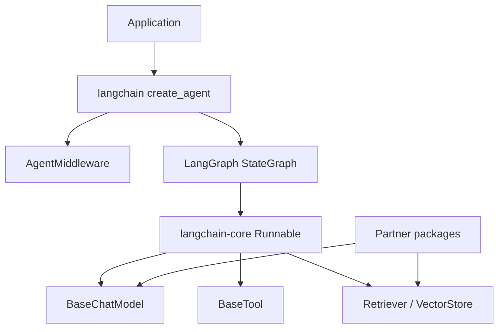

# LangChain 源码解析

## 研究范围

- 上游仓库：<https://github.com/langchain-ai/langchain>
- 本地源码：[code/langchain](../../code/langchain/)
- 原始研究版本：`fa7ce760a26437a904a4c93db75333f01d65ed83`
- 2026-08-19 增量复核版本：`2019bf5ebe50324c548f67c2666a804343f9b772`
- 2026-08-24 增量复核版本：`c4c57d35bfab39248ce6acd344915ceb1e291b24`
- 当前组件版本：`langchain 1.3.16`、`langchain-core 1.6.1`；各 partner 包独立发布
- 研究重点：`Runnable` 组合协议、模型/工具抽象、Agent 工厂、中间件和集成边界

本文基于上述提交。各包独立发布，不能只看仓库提交就假定所有已发布版本具有完全相同的行为。

## 一句话结论

当前 LangChain 的核心价值不是又实现了一套独立 Agent 循环，而是以 `langchain-core` 的 `Runnable`、消息、模型和工具协议作为“窄腰”，在活跃的 `langchain` 包中把模型、工具、结构化输出和中间件组装成 LangGraph `StateGraph`；真正的有状态调度、持久化和恢复由 LangGraph 承担。

增量复核中这个分层未变，但契约更严格：Tool schema 序列化时如果无法解析 Pydantic forward reference 会立即失败，避免把不完整 schema 发给模型；`ModelRetryMiddleware` 会重新抛出不可重试异常，而不把它们消耗在 retry loop 中。

2026-08-24 又把失败语义推进到公共协议：Core 增加标准 model exception 类型，`BaseChatModel` 会在错误路径传播 gateway metadata，`ContextEditingMiddleware` 可注入自定义 token counter，`StructuredTool` 也会解析 postponed annotations 后再识别 injected args。实现见 [`exceptions.py`](../../code/langchain/libs/core/langchain_core/exceptions.py)、[`chat_models.py`](../../code/langchain/libs/core/langchain_core/language_models/chat_models.py) 和 [`context_editing.py`](../../code/langchain/libs/langchain_v1/langchain/agents/middleware/context_editing.py)。

## 仓库分层

| 目录 | 发布物/职责 | 阅读提示 |
| --- | --- | --- |
| [`libs/core`](../../code/langchain/libs/core/) | `langchain-core`：消息、模型、工具、Retriever、VectorStore、Runnable 等公共协议 | 最稳定的抽象边界 |
| [`libs/langchain_v1`](../../code/langchain/libs/langchain_v1/) | 当前活跃的 `langchain`：Agent 工厂、中间件、模型初始化 | 新 Agent 功能的主要入口 |
| [`libs/langchain`](../../code/langchain/libs/langchain/) | `langchain-classic`：旧式 chains、agents 和兼容实现 | 不应与当前 `langchain` 混读 |
| [`libs/partners`](../../code/langchain/libs/partners/) | OpenAI、Anthropic 等供应商集成 | 各包独立版本化 |
| [`libs/text-splitters`](../../code/langchain/libs/text-splitters/) | 文本切分器 | 独立轻量组件 |
| [`libs/standard-tests`](../../code/langchain/libs/standard-tests/) | 集成实现的标准契约测试 | 理解供应商适配要求 |



## `Runnable`：统一执行与组合协议

[`Runnable`](../../code/langchain/libs/core/langchain_core/runnables/base.py) 统一了几组经常被框架分别实现的能力：

- `invoke` / `ainvoke`：单输入同步或异步执行；
- `batch` / `abatch`：批量执行；
- `stream` / `astream`：流式执行；
- `RunnableConfig`：传递 tags、metadata、callbacks、并发和运行时配置；
- 输入、输出和配置 schema；
- tracing 与生命周期回调。

`|` 运算符生成 `RunnableSequence`，序列中的字典会被转换成 `RunnableParallel`。因此 prompt、model、parser、retriever 等对象只要遵守同一协议，就能用 LCEL 组合。

要注意默认行为并不等于最佳实现：

- 默认 `batch` 使用线程池，适合阻塞 I/O，但供应商原生批处理应覆盖它；
- 一些默认异步方法会调用同步实现，只有底层重写后才是真正的异步 I/O；
- 一个环节不支持增量转换时，整个序列的首个流式输出会被推迟。

## 核心抽象

| 抽象 | 职责 | 关键源码 |
| --- | --- | --- |
| `BaseChatModel` | 标准聊天模型的 invoke、stream、batch、tool binding 和 structured output | [`chat_models.py`](../../code/langchain/libs/core/langchain_core/language_models/chat_models.py) |
| `BaseTool` | 将 schema、执行函数、错误处理和回调包装为 `RunnableSerializable` | [`tools/base.py`](../../code/langchain/libs/core/langchain_core/tools/base.py) |
| `BaseRetriever` | 将查询映射为 `Document` 列表，同时进入 Runnable 体系 | [`retrievers.py`](../../code/langchain/libs/core/langchain_core/retrievers.py) |
| `VectorStore` | 相似度检索、带分数检索及 Retriever 转换 | [`vectorstores/base.py`](../../code/langchain/libs/core/langchain_core/vectorstores/base.py) |
| `Embeddings` | 文档与查询向量化协议 | [`embeddings.py`](../../code/langchain/libs/core/langchain_core/embeddings/embeddings.py) |

这些接口只规定可互操作行为。速率限制、请求格式、流事件和供应商专有参数仍由 partner 包实现。

## 当前 Agent 的真实组装过程

高层入口是 [`create_agent`](../../code/langchain/libs/langchain_v1/langchain/agents/factory.py)，返回值是 `CompiledStateGraph`。主要过程如下：

```text
模型字符串或 BaseChatModel
  → init_chat_model / 保留动态模型函数
  → 规范化普通工具和供应商内置工具
  → 合并 AgentMiddleware 提供的工具与 State schema
  → 创建 model 节点、ToolNode 和 middleware 节点
  → 添加 model ↔ tools 条件边
  → StateGraph.compile(checkpointer, store, interrupts, cache)
  → CompiledStateGraph
```

### 模型节点

模型节点先根据静态或动态配置取得模型，把工具绑定到模型，再组合 system message 和当前消息。模型返回后，工厂会校验工具调用，并按策略处理结构化输出：

- `ProviderStrategy`：使用供应商原生结构化输出；
- `ToolStrategy`：把结构化结果表示为工具调用；
- `AutoStrategy`：依据模型能力在运行时选择。

### 工具节点与结束条件

普通工具进入 LangGraph 的 `ToolNode`。模型响应含工具调用时流向 tools 节点，工具结果作为 `ToolMessage` 回到 model；没有工具调用时结束。`return_direct` 工具和成功的结构化输出也可以提前结束。

供应商内置工具可能以字典形式直接绑定到模型，并不一定进入本地 `ToolNode`。因此“模型声明了工具”与“本地进程执行该工具”是两个不同概念。

### 中间件

[`AgentMiddleware`](../../code/langchain/libs/langchain_v1/langchain/agents/middleware/types.py) 提供四类节点钩子：

- `before_agent` / `after_agent`：整个图执行前后；
- `before_model` / `after_model`：每轮模型调用前后；
- `wrap_model_call`：包裹模型调用，可重试、改模型或改请求；
- `wrap_tool_call`：包裹工具执行，可做权限、缓存、错误映射或审计。

工厂会合并中间件的状态和上下文 schema，并把前后钩子变成图节点；wrap 钩子则组成调用链。中间件还能动态提供工具，所以权限检查必须针对每轮最终工具集，而不能只检查启动时配置。

## 模型初始化与集成边界

[`init_chat_model`](../../code/langchain/libs/langchain_v1/langchain/chat_models/base.py) 支持 `provider:model`、显式 `model_provider` 和部分模型名前缀推断。解析完成后再延迟导入对应 partner 包。

这种设计的收益是高层 API 不直接依赖所有 SDK；代价是：

- 使用某个供应商前仍要安装对应集成包；
- 模型名推断是便捷规则，不是稳定协议，生产配置宜显式指定 provider；
- provider 特有功能可能无法被公共接口完整表达；
- 核心包与集成包独立发布，排错时必须同时记录版本。

## 与 LangGraph 的职责分界

LangChain `create_agent` 负责提供常用 Agent 模板：

- 消息状态；
- model/tools 循环；
- tool binding；
- structured output；
- middleware；
- checkpointer/store 等参数的高层接线。

LangGraph 负责：

- 图和条件边；
- 并发 superstep；
- reducer/channel 状态合并；
- checkpoint、interrupt、resume 和 replay；
- 子图及低层调度。

当需求仍是“模型调用工具直到完成”，优先从 LangChain Agent 开始；当需要明确工作流、多分支、人工审批、可恢复长任务或自定义状态合并时，直接设计 LangGraph 更清晰。

## 限制与风险

- [`libs/langchain`](../../code/langchain/libs/langchain/) 是 `langchain-classic`，旧教程中的 import 和 Agent API 不能直接套到当前包。
- `create_agent` 的递归上限设置得很高，但这不是无限执行保障；业务仍应提供终止条件、预算和超时。
- 并行工具可能同时产生外部副作用，Runnable/Graph 的并发能力不自动提供幂等性。
- 动态模型、动态工具和 middleware 很灵活，也扩大了授权与可观测边界。
- 公共抽象提高可移植性，却不能消除供应商在 token、tool schema、stream event 和 structured output 上的差异。

## 推荐阅读顺序

1. [`Runnable`](../../code/langchain/libs/core/langchain_core/runnables/base.py)：理解统一调用协议。
2. [`BaseChatModel`](../../code/langchain/libs/core/langchain_core/language_models/chat_models.py) 与 [`BaseTool`](../../code/langchain/libs/core/langchain_core/tools/base.py)。
3. [`create_agent`](../../code/langchain/libs/langchain_v1/langchain/agents/factory.py)：跟踪图的组装。
4. [`AgentMiddleware`](../../code/langchain/libs/langchain_v1/langchain/agents/middleware/types.py)：理解扩展点和状态合并。
5. [`init_chat_model`](../../code/langchain/libs/langchain_v1/langchain/chat_models/base.py) 和一个具体 partner 包。
6. 接着阅读 [LangGraph 源码解析](../langgraph/README.md)，补齐调度与持久化部分。
