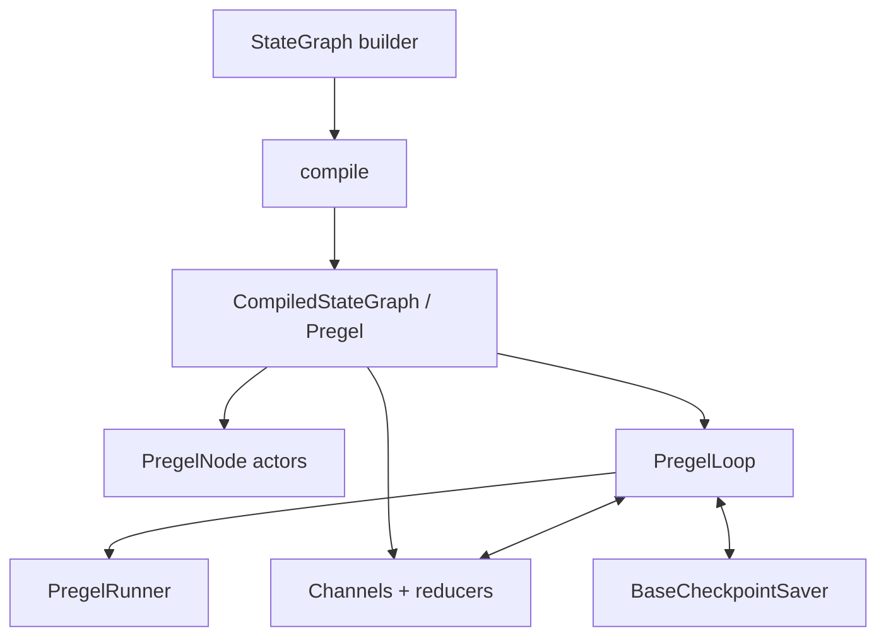

# LangGraph 源码解析

## 研究范围

- 上游仓库：<https://github.com/langchain-ai/langgraph>
- 本地源码：[code/langgraph](../../code/langgraph/)
- 源码版本：`30c4d58db86455128e42ddec96b1ba53c553ba22`
- 组件版本：`langgraph 1.2.9`、`langgraph-checkpoint 4.1.1`、`langgraph-prebuilt 1.1.0`
- 研究重点：`StateGraph`、Pregel 调度、Channel、Checkpoint、Interrupt 和预构建工具节点

## 一句话结论

LangGraph 不是把节点按连线依次调用的流程图工具：`StateGraph` 只是声明式构建器，编译后真正执行的是基于 Pregel/BSP 的 channel 驱动运行时；状态 reducer、superstep 屏障和 checkpoint 共同决定并发结果、恢复边界与副作用语义。

## 包结构

| 目录 | 职责 |
| --- | --- |
| [`libs/langgraph`](../../code/langgraph/libs/langgraph/) | 图构建器、Pregel 引擎、Channel、运行时和函数式 API |
| [`libs/checkpoint`](../../code/langgraph/libs/checkpoint/) | Checkpoint 公共协议与序列化 |
| [`libs/checkpoint-sqlite`](../../code/langgraph/libs/checkpoint-sqlite/) | SQLite 持久化实现 |
| [`libs/checkpoint-postgres`](../../code/langgraph/libs/checkpoint-postgres/) | PostgreSQL 持久化实现 |
| [`libs/prebuilt`](../../code/langgraph/libs/prebuilt/) | `ToolNode` 等常用 Agent 组件 |
| [`libs/sdk-py`](../../code/langgraph/libs/sdk-py/) / [`libs/sdk-js`](../../code/langgraph/libs/sdk-js/) | LangGraph 服务客户端 |
| [`libs/cli`](../../code/langgraph/libs/cli/) | 本地开发与部署 CLI |



## `StateGraph`：声明状态，不直接执行

[`StateGraph`](../../code/langgraph/libs/langgraph/langgraph/graph/state.py) 是 builder。节点通常接收完整状态并返回部分更新；状态字段可以用 reducer 注解定义旧值与新值的合并规则。

核心操作包括：

- `add_node`：注册计算节点；
- `add_edge`：添加固定依赖，多个起点会形成等待全部完成的屏障；
- `add_conditional_edges`：按节点输出或状态动态选路；
- `set_entry_point` / `set_finish_point`：设置入口和结束点；
- `compile`：校验图并生成 `CompiledStateGraph`。

`compile` 会把 schema 转成 channel，把节点、边和 branch 附着到 Pregel 运行时，并接入 checkpointer、store、interrupt、cache。编译之后的对象才具有 `invoke`、`stream` 等执行能力。

## 状态如何变成 Channel

State schema 的每个字段最终由 channel 管理。常见语义包括：

| Channel | 合并语义 |
| --- | --- |
| `LastValue` | 每轮只接受一个值并覆盖 |
| `BinaryOperatorAggregate` | 用 reducer 聚合多个更新 |
| `Topic` | 收集多个值，可配置去重和累积 |
| `EphemeralValue` | 当前步骤消费后即清除 |
| Barrier channels | 等待指定来源全部到达 |

消息状态常用 [`add_messages`](../../code/langgraph/libs/langgraph/langgraph/graph/message.py) reducer，它不是简单列表相加，还按 message ID 更新已有消息。

并行节点写同一字段时，reducer 就是正确性的核心。若 reducer 不满足所需的结合性、交换性，结果可能依赖任务完成次序；没有 reducer 的单值 channel 收到多个更新则可能报错。

## Pregel/BSP 执行模型

[`Pregel`](../../code/langgraph/libs/langgraph/langgraph/pregel/main.py) 把应用表示为 actor 与 channel。每个 superstep 分为：

```text
Plan
  找出订阅了“上一步发生变化的 channel”的节点
Execute
  并发运行这些节点；其写入对本步骤其他节点不可见
Update
  统一把 writes 应用到 channel
  保存 checkpoint
  再规划下一步
```

“本步骤写入不可见”是 BSP 屏障语义。它避免一个并行节点在同一轮偶然看到另一个节点的半成品状态，也解释了为何图边不是普通函数递归。

### 主循环与任务执行

[`PregelLoop.tick`](../../code/langgraph/libs/langgraph/langgraph/pregel/_loop.py) 负责：

1. 从 checkpoint、pending writes 和输入准备当前状态；
2. 计算下一批任务；
3. 检查 `interrupt_before`；
4. 将已完成任务的 writes 应用到 channel；
5. 生成并保存新 checkpoint；
6. 检查 `interrupt_after`。

[`PregelRunner`](../../code/langgraph/libs/langgraph/langgraph/pregel/_runner.py) 执行本轮任务、提交 writes、处理 retry 和错误，并为流式模式逐步让出事件。一个节点失败时，同一步尚未完成的任务可能被取消，但已经发生的外部副作用不会自动回滚。

## Checkpoint 是执行协议的一部分

[`BaseCheckpointSaver`](../../code/langgraph/libs/checkpoint/langgraph/checkpoint/base/__init__.py) 以 `thread_id` 为主要会话键，提供：

- 读取当前或指定 checkpoint；
- 列举历史 checkpoint；
- 保存 channel values、版本和元数据；
- 保存中间 pending writes；
- 删除一个 thread；
- 对应的异步接口。

Checkpoint 支持短期记忆、暂停恢复、时间旅行和故障恢复。它保存的不只是最终业务状态，还包括 channel 版本、任务和待提交写入，因此不能用“把 state JSON 存一下”完全替代。

生产环境需要关注：

- checkpointer 必须与同步/异步调用模式匹配；
- serializer 必须能安全处理状态类型；
- `thread_id` 应有租户隔离，不能直接信任外部输入；
- 数据保留、加密和删除策略属于应用职责。

## `Command`、`Send` 与 Interrupt

[`types.py`](../../code/langgraph/libs/langgraph/langgraph/types.py) 中的控制对象补足了普通边表达不了的行为：

- `Send(node, arg)`：动态产生一组目标任务，常用于 map-reduce；
- `Command(update=..., goto=...)`：同时更新状态并指定下一节点；
- `Command(resume=...)`：向已暂停的 interrupt 注入恢复值；
- `Command.PARENT`：从子图跳到父图。

`interrupt()` 第一次执行时抛出内部 `GraphInterrupt` 并由运行时保存状态；使用相同 `thread_id` 和 `Command(resume=...)` 恢复后，节点会从开头重新执行，而不是从函数调用的下一行继续。

这带来一个关键约束：interrupt 之前的副作用必须幂等，或拆到独立节点并在 checkpoint 边界后执行。否则恢复时可能重复发消息、扣款或写数据库。

## ToolNode 与 Agent 模板

[`ToolNode`](../../code/langgraph/libs/prebuilt/langgraph/prebuilt/tool_node.py) 解析 AI message 的 tool calls，按名称找到工具，同步或异步执行，并把结果转换成 `ToolMessage` 或 `Command`。它还承担输入格式、错误处理和工具注入等兼容逻辑。

[`create_react_agent`](../../code/langgraph/libs/prebuilt/langgraph/prebuilt/chat_agent_executor.py) 当前仍保留，但源码已明确标记弃用，建议使用 `langchain.agents.create_agent`。理解职责时可这样区分：

- LangGraph 保留低层图运行时与 `ToolNode`；
- LangChain 提供当前高层 Agent 工厂和 middleware；
- 旧 `langgraph.prebuilt.create_react_agent` 是迁移兼容入口，不宜作为新扩展中心。

## 流式输出

Pregel 运行时可以按不同 stream mode 暴露：

- 每一步完整 values；
- 节点产生的 updates；
- 模型 token/messages；
- 自定义 writer 输出；
- checkpoint、tasks 和 debug 事件。

流式是执行过程的观察窗口，不改变 superstep 的 channel 可见性。客户端取消订阅也不应被当成可靠的业务回滚机制。

## 限制与风险

- 图可循环并不代表会自动终止；需要递归上限和业务终止条件。
- 并发 reducer 错误会造成非确定性或更新冲突。
- retry 可能重放节点，外部工具和数据库写入必须设计幂等键。
- interrupt 恢复会重启节点，不能把它理解为语言级 continuation。
- checkpoint 提高可恢复性，但也把 prompt、工具结果和业务状态带入持久化合规范围。
- 子图、父图 `Command` 和共享 state schema 很强大，也更容易形成隐式耦合。

## 推荐阅读顺序

1. [`StateGraph`](../../code/langgraph/libs/langgraph/langgraph/graph/state.py)：从 schema、node、edge 到 compile。
2. [`Pregel`](../../code/langgraph/libs/langgraph/langgraph/pregel/main.py)：理解 actor/channel 与 stream/invoke。
3. [`PregelLoop`](../../code/langgraph/libs/langgraph/langgraph/pregel/_loop.py) 和 [`PregelRunner`](../../code/langgraph/libs/langgraph/langgraph/pregel/_runner.py)。
4. [`BaseCheckpointSaver`](../../code/langgraph/libs/checkpoint/langgraph/checkpoint/base/__init__.py)。
5. [`Command`、`Send`、`interrupt`](../../code/langgraph/libs/langgraph/langgraph/types.py)。
6. [`ToolNode`](../../code/langgraph/libs/prebuilt/langgraph/prebuilt/tool_node.py)。
7. 回看 [LangChain `create_agent`](../langchain/README.md)，观察高层 Agent 如何组装这些能力。
