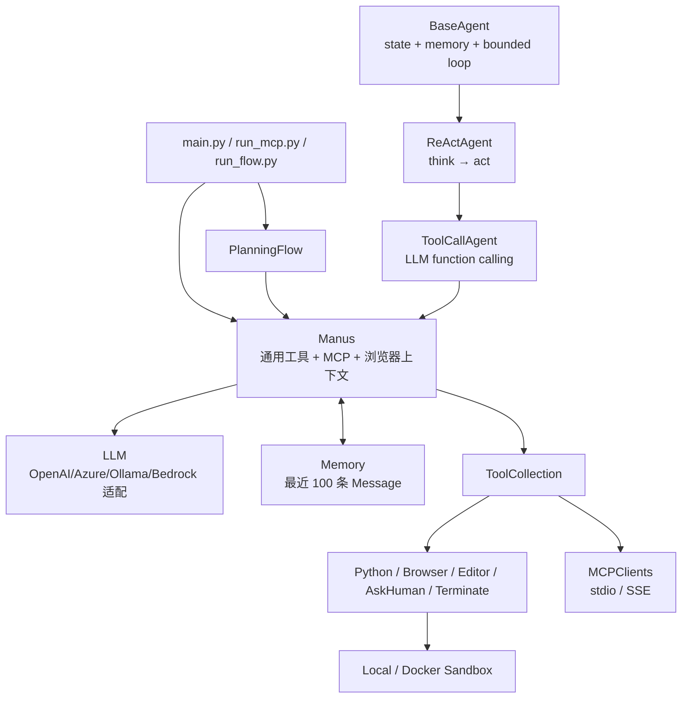

# OpenManus 架构与通用 Agent 执行主链

## 1. 研究范围和版本

- 上游仓库：`https://github.com/FoundationAgents/OpenManus`
- 本地源码：[code/openmanus](../../code/openmanus/)
- 分支：`main`
- 源码提交：`52a13f2a57d8c7f6737eefb02ccf569594d44273`
- 提交日期：2026-01-04
- 研究重点：默认 `Manus`、ReAct/Tool Call 循环、工具系统、Planning Flow、
  Sandbox 和 MCP

本文以本地源码为准。README 将 `run_flow.py` 对应的多 Agent 模式明确标注为
“不稳定”；本文会说明其已有实现，但不把它视为稳定能力。

## 2. 一句话认识 OpenManus

OpenManus 是一个以 Pydantic 模型组织状态、以 OpenAI 风格 Function Calling 驱动工具的
Python Agent 框架。默认执行链可以压缩为：

```text
用户请求
  → Manus.run()
  → BaseAgent 的有界 step 循环
  → ReActAgent.think() / act()
  → LLM.ask_tool()
  → ToolCollection 顺序执行 tool calls
  → tool observation 写回 Memory
  → 下一轮模型调用
  → terminate 工具结束
```

它的特点不是复杂的事件系统，而是核心继承链短、Agent 与 Tool 抽象直观，同时在外围提供
浏览器、文件编辑、Python、MCP、Docker Sandbox 和实验性 Planning Flow。

## 3. 整体架构



核心边界如下：

| 层 | 关键源码 | 职责 |
| --- | --- | --- |
| 默认入口 | [`main.py`](../../code/openmanus/main.py) | 创建 `Manus`、接收 prompt、运行和清理 |
| 生命周期 | [`agent/base.py`](../../code/openmanus/app/agent/base.py) | 状态转换、Memory、最大步数和卡死检测 |
| ReAct 模板 | [`agent/react.py`](../../code/openmanus/app/agent/react.py) | 把一步固定为 `think()` 后接 `act()` |
| Tool Call 循环 | [`agent/toolcall.py`](../../code/openmanus/app/agent/toolcall.py) | 请求模型、解析工具调用、执行并写回 observation |
| 默认 Agent | [`agent/manus.py`](../../code/openmanus/app/agent/manus.py) | 装配通用工具、浏览器上下文和 MCP 工具 |
| 消息模型 | [`schema.py`](../../code/openmanus/app/schema.py) | `Message`、`ToolCall`、`Memory`、`AgentState` |
| 工具抽象 | [`tool/base.py`](../../code/openmanus/app/tool/base.py) | 工具 schema、统一执行接口和 `ToolResult` |
| 工具目录 | [`tool/tool_collection.py`](../../code/openmanus/app/tool/tool_collection.py) | 名称索引、schema 导出和 dispatch |
| 规划流 | [`flow/planning.py`](../../code/openmanus/app/flow/planning.py) | 生成计划、选择 Agent、逐步执行和汇总 |
| MCP | [`tool/mcp.py`](../../code/openmanus/app/tool/mcp.py) | 连接 MCP Server 并生成本地代理工具 |
| Sandbox | [`sandbox`](../../code/openmanus/app/sandbox/) | 本地/Docker 命令和文件执行边界 |

## 4. Agent 继承链

### 4.1 `BaseAgent`：有界状态循环

[`BaseAgent`](../../code/openmanus/app/agent/base.py) 保存：

- `llm`：模型客户端；
- `memory`：线性消息历史；
- `state`：`IDLE / RUNNING / FINISHED / ERROR`；
- `max_steps` 和 `current_step`：循环预算；
- system prompt、next-step prompt 和卡死检测阈值。

`run(request)` 先要求 Agent 处于 `IDLE`，再把请求追加为 user message，并进入
`state_context(RUNNING)`：

```text
while current_step < max_steps and state != FINISHED
  → current_step += 1
  → await step()
  → 检查重复 assistant content
  → 保存本步文本结果
```

`state_context` 在异常时短暂设置 `ERROR`，但 `finally` 总会恢复进入前的状态。因此
`FINISHED` 是循环内部的退出信号，`run()` 返回后 Agent 通常重新表现为 `IDLE`。

卡死检测只比较 assistant message 的 `content` 是否重复，不比较 tool calls 或工具结果。
触发后也不终止，而是把“更换策略”的提示前置到 `next_step_prompt`。

### 4.2 `ReActAgent`：固定一步的模板

[`ReActAgent`](../../code/openmanus/app/agent/react.py) 只定义两个抽象动作：

```text
think() → bool
act()   → str
```

`step()` 在 `think()` 返回 `True` 时执行 `act()`。这种继承结构让状态循环和具体模型协议
解耦，但它并没有显式保存独立的 `Thought` 或 `Action` 对象；实际思考仍表现为 assistant
message 和 tool calls。

### 4.3 `ToolCallAgent`：模型—工具循环

[`ToolCallAgent`](../../code/openmanus/app/agent/toolcall.py) 实现 ReAct 的两半：

1. `think()` 把 `next_step_prompt` 作为新的 user message 加入历史；
2. 调用 `llm.ask_tool()`，传入 system message、完整 Memory、工具 schema 和
   `tool_choice`；
3. 将模型回复保存为普通 assistant message，或带 `tool_calls` 的 assistant message；
4. `act()` 按模型给出的顺序逐个执行工具；
5. 每个结果转为带 `tool_call_id` 的 tool message，再进入下一轮。

一次模型回复可以包含多个工具调用，但实现使用普通 `for` 循环顺序执行，不做并发调度。
这降低了带副作用工具之间的竞态，也意味着互不相关的只读工具不会自动并行。

## 5. 默认 `Manus` 的启动和工具装配

默认入口 [`main.py`](../../code/openmanus/main.py) 使用异步工厂
`Manus.create()`，而不是直接构造：

```text
Manus.create()
  → Manus()
  → initialize_mcp_servers()
  → 标记 _initialized
  → agent.run(prompt)
  → cleanup()
```

[`Manus`](../../code/openmanus/app/agent/manus.py) 默认暴露五类工具：

| 工具 | 用途 |
| --- | --- |
| `PythonExecute` | 执行 Python 片段 |
| `BrowserUseTool` | 通过 `browser-use` 操作浏览器 |
| `StrReplaceEditor` | 查看、新建和基于字符串替换文件 |
| `AskHuman` | 请求用户补充信息 |
| `Terminate` | 显式结束 Agent |

配置的 MCP Server 连接成功后，其远程工具会动态加入同一个 `ToolCollection`。因此模型
不需要区分本地和远程工具，两者都使用 OpenAI function schema。

`Manus.think()` 还会检查最近三条消息中是否出现浏览器工具调用。如果浏览器正在使用，
它通过 `BrowserContextHelper` 把当前页面状态写入临时 next-step prompt，模型调用结束后
再恢复原提示。这是一种局部上下文注入，不会永久改写 Agent 配置。

## 6. Tool Call 的完整状态流

### 6.1 思考阶段

`ToolCallAgent.think()` 的主要状态变化是：

```text
Memory 追加 next_step_prompt
  → LLM.ask_tool(messages, system_msgs, tools, tool_choice)
  → response.content + response.tool_calls
  → Memory 追加 assistant message
  → 返回是否需要 act()
```

三种 `tool_choice` 的语义不同：

- `NONE`：忽略模型意外给出的工具调用，只保留文本；
- `AUTO`：有工具就执行；没有工具但有文本时，`act()` 返回该文本；
- `REQUIRED`：没有工具也进入 `act()`，随后抛出 `TOOL_CALL_REQUIRED`。

模型 token 超限且异常被重试包装器放在 `__cause__` 中时，Agent 会追加说明消息并设置
`FINISHED`。其他 Provider 异常继续向外抛出。

### 6.2 执行阶段

每个 tool call 由 `execute_tool()` 处理：

```text
检查工具名
  → JSON 解析 arguments
  → ToolCollection.execute(name, args)
  → BaseTool.__call__()
  → 具体工具 execute()
  → ToolResult
  → 特殊工具状态处理
  → observation 字符串
  → Memory 追加 tool message
```

未知工具、参数 JSON 错误和运行异常都会转换为 observation，让模型下一轮自行修正。
`ToolCollection` 只专门捕获 `ToolError`；其他异常由 `execute_tool()` 的外层捕获。

`Manus.max_observe` 为 10000，裁剪发生在工具已经完整执行并格式化为字符串之后。裁剪后的
文本进入 Memory，超出部分没有另行持久化。

### 6.3 结束条件

`Terminate` 被放入 `special_tool_names`。执行成功后 `_handle_special_tool()` 将状态设为
`FINISHED`，外层循环在完成当前批次工具后退出。

由于同一 assistant message 中的工具调用按顺序全部执行，如果模型在 `Terminate` 后还给出
其他 tool call，当前实现不会立即跳出 `for` 循环，后续工具仍可能执行。使用或扩展时应把
`Terminate` 视为最好单独发出的终止调用，而不是强制执行屏障。

## 7. Memory 和上下文管理

[`Memory`](../../code/openmanus/app/schema.py) 是简单的 `List[Message]`，最多保留 100 条：

- 超限时直接保留最后 100 条；
- 没有摘要、token 预算或 tool-call 配对感知；
- system prompt 通常不在 Memory 中，而是在每次 `ask_tool()` 时单独传入；
- next-step prompt 每轮都会作为 user message加入 Memory。

这意味着长任务可能在裁剪时丢失早期 user/assistant/tool 语义，甚至破坏较早的
assistant tool call 与 tool result 对应关系。源码当前没有持久化会话或恢复机制，
Memory 的生命周期就是 Python 对象生命周期。

## 8. Planning Flow：Agent 外层的任务编排

实验入口 [`run_flow.py`](../../code/openmanus/run_flow.py) 创建一个或多个 Agent，再通过
[`FlowFactory`](../../code/openmanus/app/flow/flow_factory.py) 构造
[`PlanningFlow`](../../code/openmanus/app/flow/planning.py)：

```text
用户任务
  → Flow 自己的 LLM 调用 PlanningTool.create
  → 生成带 [agent_name] 标记的步骤
  → 选择第一个未完成步骤
  → 根据标记选择 executor
  → executor.run(当前计划 + 当前步骤)
  → 标记 completed
  → 下一步骤
  → Flow 的 LLM 生成最终总结
```

计划存储在 `PlanningTool.plans` 内存字典中，步骤状态包括：

```text
not_started → in_progress → completed
                         ↘ blocked
```

如果模型未调用 `planning` 工具，Flow 会回退到固定的三步计划：
“Analyze request / Execute task / Verify results”。

当前 Agent 选择机制不是能力路由器，而是解析步骤文本中的 `[AGENT_NAME]`；没有标记或
标记无法匹配时，使用 `executor_keys` 中第一个 Agent。多 Agent 能力因此高度依赖规划
模型是否准确生成约定标签。

## 9. MCP 扩展

[`MCPClients`](../../code/openmanus/app/tool/mcp.py) 同时是连接管理器和
`ToolCollection`：

1. 用 `stdio_client` 或 `sse_client` 建立传输；
2. 创建 `ClientSession` 并执行 `initialize()`；
3. 调用 `list_tools()`；
4. 为每个远程工具创建 `MCPClientTool`；
5. 将名称改写为 `mcp_<server_id>_<original_name>`，清洗并限制为 64 字符；
6. 模型调用代理工具时，再通过 `session.call_tool()` 转发给原始工具。

独立的 [`MCPAgent`](../../code/openmanus/app/agent/mcp.py) 还会每五步重新读取工具列表，
记录新增、删除和 schema 变化。默认 `Manus` 会在启动时加载 MCP 工具，但没有使用这套
每五步动态刷新逻辑。

需要注意，`MCPClients.sessions` 和 `exit_stacks` 在源码中声明为类属性字典，而不是实例
字段。多个 `MCPClients` 实例可能共享连接引用；在多 Agent 或测试隔离场景中需要重点验证。

## 10. Sandbox 边界

Sandbox 实现在 [`app/sandbox`](../../code/openmanus/app/sandbox/)：

- `BaseSandboxClient` 定义命令、文件和目录操作；
- `LocalSandboxClient` 直接操作本地执行环境；
- `DockerSandbox` 和 `AsyncDockerizedTerminal` 管理容器与长期终端；
- Sandbox Tool 将浏览器、Shell、文件能力包装为模型工具。

默认 `Manus` 使用的是普通 `PythonExecute`、`StrReplaceEditor` 和浏览器工具，并不会因为
仓库存在 Sandbox 模块就自动进入 Docker。是否使用 Sandbox 由配置和具体 Agent/Tool
装配决定，不能把默认运行理解为已隔离。

现有自动化测试也主要集中于
[`tests/sandbox`](../../code/openmanus/tests/sandbox/)，没有看到覆盖默认 Agent Loop、
Planning Flow 或 MCP 生命周期的同级测试套件。

## 11. 限制、风险和待验证点

### 11.1 `current_step` 不是每次运行都重置

`BaseAgent.run()` 只在达到 `max_steps` 时把 `current_step` 重置为 0；通过 `Terminate`
提前结束时不会重置。复用同一 Agent 实例执行下一任务时，步数预算可能从上一次继续累计。
Planning Flow 恰好会跨计划步骤复用 Agent，因此这是需要运行验证的行为。

### 11.2 Planning Flow 可能把失败当完成

`_execute_step()` 只要 `agent.run()` 没有抛异常，就调用 `_mark_step_completed()`。
Agent 返回错误文本、达到最大步数或工具观察失败，并不会自动让步骤进入 `blocked`。

此外，`BaseAgent.state_context` 会在 `run()` 返回前恢复旧状态，因此 Flow 在
`executor.run()` 之后检查 `executor.state == FINISHED` 通常观察不到内部的终止状态。

### 11.3 工具和任务安全依赖 Prompt

核心 `ToolCollection` 没有统一的 allow/deny、人工审批或副作用等级。`AskHuman` 是普通工具，
而不是所有高风险工具前的强制门。部署到真实环境时，需要在 Tool 或执行器外增加权限层。

### 11.4 Memory 是按消息条数硬裁剪

100 条上限不考虑 token、消息组或任务阶段，也不生成摘要。长任务的上下文一致性需要额外
设计。

### 11.5 部分实现仍带实验痕迹

- README 明确把多 Agent Flow 标为不稳定；
- Sandbox 文件工具存在 `create_with_context not implemented`；
- `BaseTool` 中保留了整段旧实现注释；
- 默认 Agent、MCP 和 Planning Flow 缺少与 Sandbox 同等规模的自动化测试。

## 12. 推荐阅读顺序

1. [`main.py`](../../code/openmanus/main.py)：先看默认对象如何创建和清理。
2. [`agent/base.py`](../../code/openmanus/app/agent/base.py)：理解状态和有界循环。
3. [`agent/react.py`](../../code/openmanus/app/agent/react.py)：理解一步为何拆成 think/act。
4. [`agent/toolcall.py`](../../code/openmanus/app/agent/toolcall.py)：走通模型—工具主链。
5. [`agent/manus.py`](../../code/openmanus/app/agent/manus.py)：查看默认工具和 MCP 注入。
6. [`tool/base.py`](../../code/openmanus/app/tool/base.py) 与
   [`tool/tool_collection.py`](../../code/openmanus/app/tool/tool_collection.py)：理解扩展点。
7. [`flow/planning.py`](../../code/openmanus/app/flow/planning.py)：最后研究外层规划和多 Agent。
8. [`tool/mcp.py`](../../code/openmanus/app/tool/mcp.py) 与
   [`sandbox`](../../code/openmanus/app/sandbox/)：按需要深入外部能力边界。

