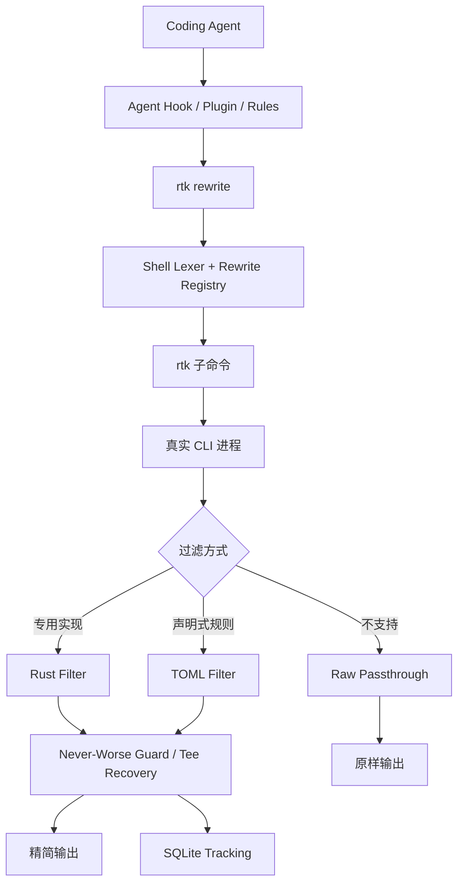

# RTK 源码分析

> 研究版本：`develop@ba7a9ce0d92a46f2458b82b1fcdd000f887f651a`
>
> 提交时间：2026-08-17
>
> 研究范围：CLI 路由、命令改写、输出过滤、Hook 集成、失败回退、TOML 过滤器、统计分析与安全边界。

## 1. 项目定位与核心结论

RTK（Rust Token Killer）是一个面向 Coding Agent 的命令行代理。它位于 Agent 与真实 CLI 工具之间，调用原始命令、压缩其输出，再把更短的结果交给模型。项目目标不是减少命令执行时间，也不是替代模型 tokenizer，而是减少进入 LLM 上下文的终端噪声。

官方入口见 [`README_zh.md`](../../code/rtk/README_zh.md)，端到端技术说明见 [`docs/contributing/TECHNICAL.md`](../../code/rtk/docs/contributing/TECHNICAL.md)。

它解决的典型问题包括：

| 原始命令 | RTK 的处理方向 |
|---|---|
| `git status` | 按状态分组，限制文件列表长度 |
| `git diff` | 移除冗余头部，保留关键变更 |
| `cargo test`、`pytest`、`go test` | 折叠成功用例，突出失败和诊断 |
| `grep`、`rg` | 按文件聚合，截断长行和过量结果 |
| `ruff`、`eslint`、`tsc` | 按文件或规则组织错误 |
| `docker logs`、`kubectl logs` | 去重重复日志，保留异常上下文 |
| `cat`、`head`、`tail` | 改写为带结构过滤和行数限制的读取 |

因此，更准确的理解是：

```text
RTK = Command Rewrite + CLI Proxy + Lossy Output Codec + Recovery Path
```

README 中“最高减少 90%”指 Bash 输出量，不等于 API 账单减少 90%。模型总成本还包括系统提示、会话历史、工具定义和模型输出；RTK 只影响其中的终端输入部分。

## 2. 总体架构



源码主要分为以下部分：

| 路径 | 职责 |
|---|---|
| [`src/main.rs`](../../code/rtk/src/main.rs) | Clap 命令定义、参数解析、完整性检查与总路由 |
| [`src/cmds`](../../code/rtk/src/cmds) | Git、Rust、JS、Python、Go、JVM、PHP、Ruby、云平台和系统命令过滤器 |
| [`src/core`](../../code/rtk/src/core) | 子进程执行、流式过滤、配置、截断、tee、SQLite 跟踪与遥测 |
| [`src/discover`](../../code/rtk/src/discover) | Shell lexer、命令分类、改写规则和历史命令发现 |
| [`src/hooks`](../../code/rtk/src/hooks) | Agent Hook 安装、权限判断、完整性校验和信任管理 |
| [`src/parser`](../../code/rtk/src/parser) | 结构化解析、降级和统一格式化抽象 |
| [`src/analytics`](../../code/rtk/src/analytics) | `gain`、`cc-economics`、`session` 等只读统计视图 |
| [`src/learn`](../../code/rtk/src/learn) | 从失败后修正的历史命令中提取 CLI 纠错规则 |
| [`src/filters`](../../code/rtk/src/filters) | 编译进二进制的声明式 TOML 过滤规则 |

项目文档把 `core` 定义为不依赖上层模块的基础层，见 [`src/core/README.md`](../../code/rtk/src/core/README.md)。但当前 [`core/toml_filter.rs`](../../code/rtk/src/core/toml_filter.rs) 会调用 `hooks::trust` 校验自定义过滤器，因此“core 是纯叶子依赖”的边界在现有源码中并未完全成立。

## 3. 启动与命令路由

入口函数位于 [`src/main.rs`](../../code/rtk/src/main.rs)：

```text
main()
  → Unix 下恢复 SIGPIPE 默认行为
  → run_cli()
      → telemetry::maybe_ping()
      → Cli::try_parse_from()
      → hook_check::maybe_warn()
      → integrity::runtime_check()
      → match Commands
      → 对应 cmds 模块
  → std::process::exit(code)
```

几个关键行为：

1. Unix 下把 `SIGPIPE` 恢复为默认处理，避免 `rtk git log | head` 因下游提前关闭而 panic。
2. `Cli::try_parse_from()` 成功后进入专用 Rust 命令路由。
3. operational command 执行前会校验已安装 Hook 的 SHA-256 完整性；`init`、`gain`、`verify` 等元命令跳过。
4. 各过滤模块返回真实子进程退出码，最终由 `main()` 原样退出。
5. Clap 无法识别命令时不立即报错，而是进入 TOML 匹配或通用透传路径。

`main.rs` 同时承担大量命令枚举与路由，当前超过 3,600 行，是清晰但高度集中的调度中心。增加新命令通常需要同时修改命令定义、路由分支和 operational-command 白名单。

## 4. Hook 与命令改写链

### 4.1 Agent 集成方式

根目录 [`hooks/README.md`](../../code/rtk/hooks/README.md) 描述了不同宿主的接入协议。它们并非都具有相同能力：

- Claude Code、Cursor、Gemini CLI、VS Code Copilot 等可以通过 Hook 返回修改后的命令。
- OpenCode、Pi、Hermes 通过插件或扩展在执行前修改参数。
- Codex、Cline、Windsurf 主要依靠 `AGENTS.md` 或 rules 文件指导模型主动使用 RTK，属于 prompt-level 集成。
- GitHub Copilot CLI 若不能直接修改输入，会返回拒绝和替代命令，让 Agent 重试。

安装逻辑集中在 [`src/hooks/init.rs`](../../code/rtk/src/hooks/init.rs)。它负责写入 Hook、备份并修改 Agent 配置、生成说明文件，以及卸载和重复执行时的幂等处理。该文件超过 8,000 行，体现了多宿主协议适配的复杂度。

### 4.2 Rewrite 调用链

Hook 本身保持较薄，主要负责读取宿主 JSON、调用 RTK 和返回宿主要求的 JSON。真正的改写规则集中在 Rust：

```text
Agent Hook
  → rtk rewrite "cargo fmt --all && cargo test 2>&1 | tail -20"
  → hooks::rewrite_cmd::run()
  → discover::registry::rewrite_command()
  → discover::lexer::tokenize()
  → rewrite_compound()
  → rewrite_segment()
  → classify_command()
  → rules::RULES
  → "rtk cargo fmt --all && rtk cargo test 2>&1 | tail -20"
```

相关实现：

- [`src/hooks/rewrite_cmd.rs`](../../code/rtk/src/hooks/rewrite_cmd.rs)：Hook 与 registry 之间的薄桥接层。
- [`src/discover/lexer.rs`](../../code/rtk/src/discover/lexer.rs)：单遍 Shell lexer，识别引号、转义、重定向、操作符和管道。
- [`src/discover/registry.rs`](../../code/rtk/src/discover/registry.rs)：复合命令拆分、分类、guard 和改写。
- [`src/discover/rules.rs`](../../code/rtk/src/discover/rules.rs)：`RtkRule` 静态规则表。

源码没有用简单的 `split_whitespace()` 拆命令，因为下面的内容语义不同：

```bash
git commit -m "fix && update"
cargo test 2>&1 && git status
rg "a|b" src | head
```

lexer 使用带字节偏移的 token 保留原始命令结构。`&&`、`||` 和 `;` 两侧可以独立改写；普通管道只允许标记为 `pipeline_final_safe` 的末级命令改写；`|&` 等更难保证语义的场景倾向于保守透传。

### 4.3 改写保护条件

registry 中包含多项语义保护：

- 已经以 `rtk` 开头时不重复包装。
- `RTK_DISABLED=1` 可以对单次命令禁用改写。
- `cat` 带写重定向，或带与 `rtk read` 不等价的参数时不改写。
- `gh --json`、`--jq`、`--template` 等结构化输出模式不改写，避免破坏机器可读结果。
- heredoc、复杂算术表达式和不透明 Shell group 等场景保守处理。
- 用户可通过 `hooks.exclude_commands` 排除特定命令或子命令。

这说明 RTK 的主要原则不是“尽量多改写”，而是在能够保持命令语义时才改写。

## 5. 命令执行与过滤

### 5.1 统一执行骨架

[`src/core/runner.rs`](../../code/rtk/src/core/runner.rs) 定义 `RunMode`：

| 模式 | 用途 |
|---|---|
| `Filtered` | 捕获完整输出后调用普通过滤函数 |
| `FilteredWithExit` | 过滤函数同时感知退出码 |
| `Streamed` | 边读取边过滤，适合长时间构建和测试 |
| `Passthrough` | stdin/stdout/stderr 全部直接继承 |

`RunOptions` 决定是否保存 tee、是否只过滤 stdout、失败时是否跳过过滤、是否继承 stdin 等。

[`src/core/stream.rs`](../../code/rtk/src/core/stream.rs) 提供三层流式抽象：

- `StreamFilter`：接收每一行，并在进程结束时补充摘要。
- `BlockHandler`：识别错误块及其延续行。
- `LineHandler`：逐行观察和过滤。

项目没有引入 async runtime，而是使用标准库进程、pipe、线程和 channel 同时消费 stdout/stderr。原始捕获内容有 10 MiB 上限，避免异常命令无限占用内存。

### 5.2 专用 Rust Filter

复杂工具通常需要主动请求结构化输出，再解析成稳定数据模型。例如测试工具可能注入 JSON reporter，Git、Cargo、AWS、Docker 等则使用各自的文本或 JSON 解析器。

专用模块的共同流程为：

```text
构造 std::process::Command
  → TimedExecution::start()
  → 执行并捕获/流式读取
  → 解析原始输出
  → 分组、去重、截断、格式化
  → never_worse()
  → tee_and_hint()
  → Tracker::record()
  → 返回原始 exit code
```

### 5.3 三级 Parser 降级

[`src/parser/mod.rs`](../../code/rtk/src/parser/mod.rs) 定义 `OutputParser` 和 `ParseResult<T>`：

```text
Tier 1: Full(T)              完整结构化解析
Tier 2: Degraded(T, warns)   部分解析，同时报告降级原因
Tier 3: Passthrough(raw)     截断后的原始输出
```

`TokenFormatter` 再根据格式模式输出 compact、verbose 或 ultra 形式。这个设计避免解析器因上游 CLI 输出格式改变而静默产生错误结论。

但统一 parser 仍处于迁移阶段。[`src/parser/README.md`](../../code/rtk/src/parser/README.md) 明确把 Vitest、Playwright、pnpm、ESLint、TSC、GitHub CLI 等列为待迁移项目。因此当前不同命令模块的解析和降级一致性仍有差异。

## 6. TOML 过滤器与未知命令回退

当 Clap 不能把输入解析为专用 RTK 命令时，[`run_fallback()`](../../code/rtk/src/main.rs) 会按以下顺序处理：

```text
未知 rtk 子命令
  → 如果是拼错的 RTK 元命令：显示 Clap 错误
  → 查找匹配的 TOML Filter
      → 匹配：捕获输出并执行过滤 pipeline
      → 不匹配：直接运行原始命令并透传 stdio
```

[`src/core/toml_filter.rs`](../../code/rtk/src/core/toml_filter.rs) 的过滤顺序固定为：

1. `strip_ansi`
2. `replace`
3. `match_output`
4. `strip_lines_matching` 或 `keep_lines_matching`
5. `truncate_lines_at`
6. `head_lines` 或 `tail_lines`
7. `max_lines`
8. `on_empty`

内置 TOML 文件由 [`build.rs`](../../code/rtk/build.rs) 按文件名排序、合并、校验并编译进单个 Rust 二进制。当前研究版本包含 63 个 TOML 文件。

过滤器查找顺序是项目配置、用户配置、内置规则，首个匹配项生效。外部过滤文件需要经过 [`src/hooks/trust.rs`](../../code/rtk/src/hooks/trust.rs) 的内容哈希信任检查；文件发生变化后，旧信任不会继续生效。这避免克隆仓库后自动执行其中未经确认的输出规则。

## 7. 输出可靠性与恢复路径

输出压缩不可避免地有损，因此 RTK 增加了多层恢复机制。

### 7.1 Never-Worse Guard

[`src/core/guard.rs`](../../code/rtk/src/core/guard.rs) 比较过滤前后的估算 token 数。如果过滤结果更长，就输出原始结果。它保证 RTK 至少不会因为摘要格式本身消耗更多上下文。

### 7.2 Tee Recovery

[`src/core/tee.rs`](../../code/rtk/src/core/tee.rs) 可在命令失败或结果被截断时保存完整原始输出，并返回类似下面的提示：

```text
[full output: ~/.local/share/rtk/tee/...]
```

对于可计算偏移的列表截断，提示可以直接给出 `tail -n +N`，让 Agent 从第一个隐藏项继续读取。若发生有损截断但无法生成恢复文件，TOML 路径会退回完整原始输出，而不是只留下不可恢复的省略标记。

### 7.3 退出码与失败语义

子进程退出码会一直传递到 RTK 自身。Unix 信号退出转换为 `128 + signal`。因此 `rtk cargo test` 仍可作为 CI 或复合 Shell 条件的一部分，不会把失败压缩成成功。

Hook 的约定则略有不同：Hook 自身发生解析错误时应当 fail-open，让宿主执行未改写的原命令，避免因为优化层故障阻断工作。不同 Agent 的权限协议并不完全一致，详见 [`src/hooks/README.md`](../../code/rtk/src/hooks/README.md) 和 [`src/hooks/permissions.rs`](../../code/rtk/src/hooks/permissions.rs)。

## 8. 跟踪、发现与纠错学习

### 8.1 本地跟踪

[`src/core/tracking.rs`](../../code/rtk/src/core/tracking.rs) 使用 SQLite 保存：

- 原始命令和 RTK 命令；
- 项目路径；
- 估算的输入、输出和节省 token；
- 节省比例与执行耗时；
- 解析失败及 fallback 是否成功。

token 数不是模型 tokenizer 的精确结果，而是 `ceil(text.len() / 4)`。Rust 的 `str::len()` 计算 UTF-8 字节数，因此对中文等多字节文本的绝对估算误差会更明显。比例通常比绝对 token 数更有参考意义。

`rtk gain` 从数据库生成汇总、每日历史和图表；analytics 层按设计只读数据库，记录动作仍由 `core::tracking` 完成。

### 8.2 Discover

[`src/discover/provider.rs`](../../code/rtk/src/discover/provider.rs) 从 Agent session 文件提取命令，`rtk discover` 再复用在线 Hook 使用的同一套 lexer 和 registry，识别本可改写但没有使用 RTK 的命令。

这种复用很重要：实时改写与离线收益分析不会分别维护两套支持列表。当前 `SessionProvider` 的实际实现以 Claude Code 为主，其他 Agent 的历史发现能力不能仅根据 Hook 支持情况推断。

### 8.3 Learn

[`src/learn/detector.rs`](../../code/rtk/src/learn/detector.rs) 查找“命令失败后，Agent 用相似命令成功”的序列，并分类为未知参数、命令不存在、语法错误、路径错误、缺少参数或权限错误等。`rtk learn` 可以把多次出现的修正关系整理成规则，减少 Agent 重复犯同一类 CLI 错误。

这部分与输出压缩不是同一职责，但复用了 session provider，使 RTK 从纯代理逐步扩展为命令使用分析工具。

## 9. 扩展机制与设计模式

### 9.1 添加改写规则

在 [`src/discover/rules.rs`](../../code/rtk/src/discover/rules.rs) 增加 `RtkRule`，描述：

- 匹配正则；
- 对应 RTK 命令；
- 可替换的命令前缀；
- 是否可作为 pipeline final stage；
- 分类与预估节省比例；
- 子命令覆盖。

registry 使用静态规则集中编译匹配，Hook 与 discover 共同消费。

### 9.2 添加专用命令过滤器

适合需要 JSON、状态机、跨行错误块或复杂参数兼容的工具。通常需要：

1. 在对应 `src/cmds/{ecosystem}/` 中实现执行与过滤逻辑；
2. 尽量复用 `core::runner`、stream、tee 和 tracking；
3. 在 `main.rs` 增加 Clap 命令与路由；
4. 在 rewrite rules 中加入原命令映射；
5. 覆盖成功、失败、格式变化和退出码测试。

### 9.3 添加 TOML Filter

适合规则稳定、主要由行删除和截断组成的命令。TOML 支持内联测试，构建脚本会验证整体语法和重复名称。它的优点是开发快，限制是难以表达结构化、状态相关或流式逻辑。

### 9.4 添加 Agent 宿主

需要同时考虑安装路径、宿主事件 JSON、是否允许修改命令、权限决策协议、配置备份、卸载和完整性校验。Agent 集成不是简单增加一个模板，也是当前代码复杂度增长最快的部分之一。

## 10. 安全与隐私边界

RTK 会执行命令、修改 Agent 配置并读取完整终端输出，因此安全边界比普通格式化工具更敏感。

源码中可确认的防护包括：

- 使用 `std::process::Command` 直接传递程序和参数，避免为了代理命令普遍引入额外 Shell 求值。
- Hook 改写对重定向、结构化输出、环境前缀和复杂 Shell 语法使用保守 guard。
- Hook 文件具有 SHA-256 完整性基线，运行 operational command 时检查。
- 自定义 TOML Filter 以内容哈希建立信任，内容变化后需要重新确认。
- 初始化时使用原子写入和 `.bak` 备份，并提供 ask/auto/skip 三种 patch 模式。
- 遥测默认关闭，需要显式同意，见 [`docs/TELEMETRY.md`](../../code/rtk/docs/TELEMETRY.md)。

仍需注意：

- 本地 tracking 默认开启，会记录命令名称和项目路径。
- tee 文件可能包含原始构建日志、环境信息或其他敏感输出。
- Hook 权限模型受宿主协议限制；某些 Agent 没有等价的 ask/deny 表达能力。
- RTK 优化输出，不负责判断原命令是否具有破坏性；被改写命令仍具有与原命令相同的副作用。

## 11. 限制、风险与源码成熟度

1. **节省指标是近似值。** `len / 4` 不是 tokenizer，且只衡量命令输出，不应直接映射为账单节省。
2. **过滤是有损的。** tee 和 passthrough 降低了风险，但不能保证 Agent 永远不需要读取完整输出。
3. **宿主能力不一致。** prompt-level 集成依赖模型遵循说明，透明度弱于真正的执行前 Hook。
4. **Agent 内置工具绕过 Shell Hook。** Claude Code 等宿主的 Read、Grep、Glob 工具不会自动进入 RTK。
5. **上游 CLI 输出变化会影响解析。** 三级降级可以避免静默错误，却可能暂时退化为更长的原始输出。
6. **统一 parser 尚未迁移完成。** 不同命令模块仍混用专用解析和旧式过滤函数。
7. **调度与宿主安装代码较集中。** `main.rs` 和 `hooks/init.rs` 体积较大，新功能需要警惕继续扩大中心模块。
8. **源码与文档可能短期不同步。** `develop` 分支变化频繁，Agent 数量、命令数量和版本信息应以具体 commit 为准。
9. **部分文档明确记录未完成项。** 例如 parser observability、若干 parser migration，以及部分宿主的权限或异常输入行为，不能当作已经交付。

本地静态统计显示，当前版本的 `src/` 与 `tests/` 合计约 8.7 万行 Rust，包含约 2,700 个 `#[test]` 标记、63 个内置 TOML 文件和约 90 条 `RtkRule` 定义。这些数字表明项目测试投入较多，但只是源码规模统计，不代表本次已实际执行全部测试。

项目使用 Apache License 2.0，见 [`LICENSE`](../../code/rtk/LICENSE)。Rust 工具链最低版本在 [`Cargo.toml`](../../code/rtk/Cargo.toml) 中声明为 1.91。

## 12. 推荐阅读顺序

1. [`README_zh.md`](../../code/rtk/README_zh.md)：建立产品定位和命令范围。
2. [`docs/contributing/TECHNICAL.md`](../../code/rtk/docs/contributing/TECHNICAL.md)：掌握端到端流程。
3. [`src/main.rs`](../../code/rtk/src/main.rs)：看 Clap 定义、fallback 与总路由。
4. [`src/discover/lexer.rs`](../../code/rtk/src/discover/lexer.rs)：理解 Shell token 化边界。
5. [`src/discover/registry.rs`](../../code/rtk/src/discover/registry.rs)：跟踪复合命令如何被安全改写。
6. [`src/discover/rules.rs`](../../code/rtk/src/discover/rules.rs)：了解支持范围与扩展入口。
7. [`src/core/runner.rs`](../../code/rtk/src/core/runner.rs) 和 [`src/core/stream.rs`](../../code/rtk/src/core/stream.rs)：理解执行与流式过滤骨架。
8. 选择一个熟悉的生态模块，例如 [`src/cmds/rust/cargo_cmd.rs`](../../code/rtk/src/cmds/rust/cargo_cmd.rs) 或 [`src/cmds/python/pytest_cmd.rs`](../../code/rtk/src/cmds/python/pytest_cmd.rs)，验证通用骨架如何落地。
9. [`src/core/toml_filter.rs`](../../code/rtk/src/core/toml_filter.rs)：理解声明式过滤与 fallback。
10. [`src/core/tracking.rs`](../../code/rtk/src/core/tracking.rs) 和 [`src/core/tee.rs`](../../code/rtk/src/core/tee.rs)：理解统计和可恢复性。
11. [`hooks/README.md`](../../code/rtk/hooks/README.md) 与 [`src/hooks/init.rs`](../../code/rtk/src/hooks/init.rs)：最后进入多 Agent 集成细节。

## 13. 总体评价

RTK 的工程价值不只在“把输出变短”，而在于围绕有损压缩补齐了命令语义保护、退出码传播、解析降级、完整输出恢复、Hook 完整性和收益统计。它把 Coding Agent 经常遇到的终端噪声问题实现成一个可独立部署的基础设施层。

项目最适合命令调用频繁、测试和构建输出较长、上下文成本敏感的 Agent 工作流。若工作流主要使用宿主内置文件工具、命令输出本来很短，或下游程序依赖逐字机器可读输出，则应显式调用原始命令或使用排除配置，而不应默认假设所有命令都适合压缩。
