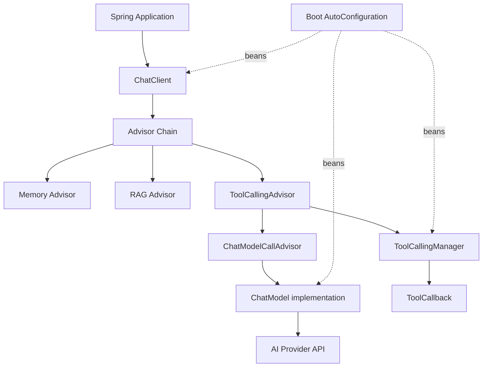

# Spring AI 源码解析

## 研究范围

- 上游仓库：<https://github.com/spring-projects/spring-ai>
- 本地源码：[code/spring-ai](../../code/spring-ai/)
- 原始研究版本：`aa17d5c0b07d43415c88035304c73dc7a9c5c33b`
- 2026-08-24 增量复核版本：`fd3fd6ec700340b90c3d516be57c6e6c87dd7df1`
- Maven 版本：`2.0.2-SNAPSHOT`（复核区间包含 2.0.1 正式发布）
- 研究重点：模型抽象、`ChatClient`、Advisor 链、工具调用、Chat Memory、RAG、MCP 和 Boot 自动配置

本文研究的是 `main` 分支快照。仓库 README 指出当前 2.x 面向 Spring Boot 4.x；需要 Boot 3.5.x 的应用应核对 1.1.x 分支，不能直接照搬本文中的 2.x 工具调用实现。

## 一句话结论

Spring AI 的核心定位是 Spring 应用中的 AI 集成框架，而不是 LangGraph 式的持久化 Agent 调度器：底层 `Model` 接口统一供应商，上层 `ChatClient` 用 Advisor 链组合记忆、RAG、工具循环和观测，Spring Boot 自动配置再把实现装配为 Bean。

本轮架构不变，但运行边界更明确：`DefaultToolCallingManager` 的工具解析 fallback 变为可配置，MCP Streamable HTTP transport 增加 `maxSessions` 与 `sessionIdleTimeout`，Transformer 资源缓存会校验 resolve 后路径仍位于 cache 目录。实现见 [`DefaultToolCallingManager.java`](../../code/spring-ai/spring-ai-model/src/main/java/org/springframework/ai/model/tool/DefaultToolCallingManager.java)、[`WebFluxStreamableServerTransportProvider.java`](../../code/spring-ai/mcp/transport/mcp-spring-webflux/src/main/java/org/springframework/ai/mcp/server/webflux/transport/WebFluxStreamableServerTransportProvider.java) 和 [`ResourceCacheService.java`](../../code/spring-ai/models/spring-ai-transformers/src/main/java/org/springframework/ai/transformers/ResourceCacheService.java)。

## 模块分层

| 模块 | 职责 |
| --- | --- |
| [`spring-ai-model`](../../code/spring-ai/spring-ai-model/) | `Model`、消息、Prompt、工具、Chat Memory 等公共协议 |
| [`spring-ai-client-chat`](../../code/spring-ai/spring-ai-client-chat/) | `ChatClient`、Advisor 链、模型终止 Advisor |
| [`models`](../../code/spring-ai/models/) | OpenAI、Anthropic、Ollama 等模型实现 |
| [`spring-ai-vector-store`](../../code/spring-ai/spring-ai-vector-store/) / [`vector-stores`](../../code/spring-ai/vector-stores/) | VectorStore 协议及各数据库实现 |
| [`spring-ai-rag`](../../code/spring-ai/spring-ai-rag/) | 模块化 RAG 流程 |
| [`advisors`](../../code/spring-ai/advisors/) | Memory、VectorStore 等可插拔 Advisor |
| [`mcp`](../../code/spring-ai/mcp/) | MCP client/server 与注解、集成支持 |
| [`auto-configurations`](../../code/spring-ai/auto-configurations/) / [`starters`](../../code/spring-ai/starters/) | Boot 条件装配和 starter |



## 模型抽象

最底层的 [`Model<TReq, TRes>`](../../code/spring-ai/spring-ai-model/src/main/java/org/springframework/ai/model/Model.java) 只有从请求到响应的 `call` 约定。聊天模型在此基础上形成：

- [`ChatModel`](../../code/spring-ai/spring-ai-model/src/main/java/org/springframework/ai/chat/model/ChatModel.java)：`Prompt → ChatResponse`；
- [`StreamingChatModel`](../../code/spring-ai/spring-ai-model/src/main/java/org/springframework/ai/chat/model/StreamingChatModel.java)：`Prompt → Flux<ChatResponse>`；
- `EmbeddingModel`、`ImageModel`、`AudioTranscriptionModel` 等其他模型类型。

供应商模块负责把公共 `Prompt`、`ChatOptions` 和消息映射到具体 SDK。公共接口提供可移植性，但 provider-specific options、原生 structured output、缓存和流事件仍可能要求具体实现。

## `ChatClient`：面向应用的 Fluent API

[`ChatClient`](../../code/spring-ai/spring-ai-client-chat/src/main/java/org/springframework/ai/chat/client/ChatClient.java) 提供类似 `WebClient` 的调用表面：设置 system/user 文本、模板变量、媒体、options、advisors、tools 后，选择 `call()` 或 `stream()`。

[`DefaultChatClient`](../../code/spring-ai/spring-ai-client-chat/src/main/java/org/springframework/ai/chat/client/DefaultChatClient.java) 的关键流程是：

```text
prompt()
  → 合并默认配置和本次请求
  → buildAdvisorChain()
  → 自动注册并校验 ToolCallingAdvisor
  → 在链底加入 ChatModelCallAdvisor / ChatModelStreamAdvisor
  → 建立 Micrometer Observation
  → advisorChain.nextCall / nextStream
  → ChatModel
```

`ChatModelCallAdvisor` 和 `ChatModelStreamAdvisor` 是链底终点，真正调用模型。其他 Advisor 可以在请求向下时补充消息和上下文，在响应向上时解析、记录或转换结果。

## Advisor 链的执行语义

[`DefaultAroundAdvisorChain`](../../code/spring-ai/spring-ai-client-chat/src/main/java/org/springframework/ai/chat/client/advisor/DefaultAroundAdvisorChain.java) 按 order 排列 Advisor，分别维护 call 与 stream 游标。Advisor 调用 `nextCall` 或 `nextStream` 才会继续向下。

典型用途包括：

- 注入对话记忆；
- 安全过滤、日志、重试或缓存；
- 检索文档并扩展 prompt；
- 结构化输出校验；
- 工具调用循环；
- 观测和指标。

顺序不仅决定“谁先执行”，也决定谁能看到工具循环的每一轮。修改 Advisor order 前，应把请求方向和响应方向同时画出来验证。

## Spring AI 2.x 的工具调用链

这是与旧版本和许多其他框架差异最大的部分。

### 两个独立职责

[`DefaultToolCallingManager`](../../code/spring-ai/spring-ai-model/src/main/java/org/springframework/ai/model/tool/DefaultToolCallingManager.java) 负责一次工具执行：

1. 从 `Prompt` 解析本轮可用 `ToolCallback`；
2. 按模型返回的 tool call 名称查找 callback；
3. 校验参数并执行；
4. 收集 tool response message；
5. 返回新的会话历史及 `returnDirect` 标志。

[`ToolCallingAdvisor`](../../code/spring-ai/spring-ai-client-chat/src/main/java/org/springframework/ai/chat/client/advisor/ToolCallingAdvisor.java) 负责循环：

```text
调用后续 Advisor / ChatModel
  → 响应是否包含 tool calls？
      ├─ 否：返回最终响应
      └─ 是：ToolCallingManager.executeToolCalls
              → returnDirect？直接返回
              → 否：把调用和结果加入 instructions
                    → 再调用复制后的 Advisor 链
```

流式路径先聚合当前轮响应，确认完整 tool call 后在线程友好的 scheduler 上执行阻塞工具，再递归订阅下一轮，同时累计各轮 usage。

### 自动注册

`DefaultChatClient.buildAdvisorChain()` 默认自动注册 `ToolCallingAdvisor`，并用 `ToolAdvisor` 标记保证链中只有一个工具循环控制者。即使静态请求暂时没有工具，也会保留该 Advisor，以支持其他 Advisor 在运行时动态注入工具。

直接调用 `ChatModel` 时不会获得 `ChatClient` 的自动工具循环。应用若绕过 `ChatClient`，需要显式驱动 `ToolCallingManager` 并把工具结果追加到下一轮 Prompt。

## Chat Memory 不是完整聊天记录

[`ChatMemory`](../../code/spring-ai/spring-ai-model/src/main/java/org/springframework/ai/chat/memory/ChatMemory.java) 的职责是选择本轮模型需要的上下文；[`ChatMemoryRepository`](../../code/spring-ai/spring-ai-model/src/main/java/org/springframework/ai/chat/memory/ChatMemoryRepository.java) 只负责存取消息。它们不等同于不可变的审计聊天历史。

默认 [`MessageWindowChatMemory`](../../code/spring-ai/spring-ai-model/src/main/java/org/springframework/ai/chat/memory/MessageWindowChatMemory.java)：

- 默认最多保留 20 条消息；
- 超出窗口时按完整 conversation turn 淘汰；
- 尽量保留 system message；
- 默认使用内存 repository。

[`MessageChatMemoryAdvisor`](../../code/spring-ai/spring-ai-client-chat/src/main/java/org/springframework/ai/chat/client/advisor/MessageChatMemoryAdvisor.java) 把选出的历史放入 Prompt，并在响应后写回。每次调用必须提供明确的 `ChatMemory.CONVERSATION_ID`，否则不同用户或会话可能串线。

当前升级说明明确记录了限制：部分 ChatMemory repository 不支持 tool-call messages；社区 `spring-ai-session` 计划在 Spring AI 2.1 替代 `ChatMemory`。这是尚未完成的后续计划，不能当成当前 2.0.1 已实现能力。参见 [`upgrade-notes.adoc`](../../code/spring-ai/spring-ai-docs/src/main/antora/modules/ROOT/pages/upgrade-notes.adoc)。

## RAG：Advisor 背后的模块化管线

简单场景可以使用 [`QuestionAnswerAdvisor`](../../code/spring-ai/advisors/spring-ai-vector-store-advisor/src/main/java/org/springframework/ai/chat/client/advisor/vectorstore/QuestionAnswerAdvisor.java)，它查询 `VectorStore` 后把文档上下文加入用户问题。

更完整的 [`RetrievalAugmentationAdvisor`](../../code/spring-ai/spring-ai-rag/src/main/java/org/springframework/ai/rag/advisor/RetrievalAugmentationAdvisor.java) 把 RAG 拆为可替换阶段：

```text
原始 Query
  → QueryTransformer
  → QueryExpander（可选，一变多）
  → DocumentRetriever
  → DocumentJoiner
  → DocumentPostProcessor（可选，过滤/重排）
  → QueryAugmenter
  → ChatModel
```

关键协议分别位于：

- [`QueryTransformer`](../../code/spring-ai/spring-ai-rag/src/main/java/org/springframework/ai/rag/preretrieval/query/transformation/QueryTransformer.java)；
- [`DocumentRetriever`](../../code/spring-ai/spring-ai-rag/src/main/java/org/springframework/ai/rag/retrieval/search/DocumentRetriever.java)；
- [`DocumentJoiner`](../../code/spring-ai/spring-ai-rag/src/main/java/org/springframework/ai/rag/retrieval/join/DocumentJoiner.java)；
- [`DocumentPostProcessor`](../../code/spring-ai/spring-ai-rag/src/main/java/org/springframework/ai/rag/postretrieval/document/DocumentPostProcessor.java)。

[`VectorStore`](../../code/spring-ai/spring-ai-vector-store/src/main/java/org/springframework/ai/vectorstore/VectorStore.java) 只是 `DocumentRetriever` 的一种实现来源。模块化 RAG 因此不限定必须使用向量检索，也能接全文搜索或组合检索。

## Boot 自动配置与 MCP

`auto-configurations` 根据 classpath、properties 和已有 Bean 条件创建 provider client、`ChatModel`、`EmbeddingModel`、`ToolCallingManager`、VectorStore 等；`starters` 负责聚合用户依赖。

这延续了 Spring Boot 的“约定默认值 + Bean 覆盖”模式。排查行为时应同时检查：

1. starter 带入了哪些模块；
2. 对应 `@AutoConfiguration` 的条件；
3. properties 绑定结果；
4. 用户是否已经声明同类型 Bean 导致默认装配退让。

[`mcp`](../../code/spring-ai/mcp/) 模块把 MCP client/server 能力接入 Spring 生命周期，并可把远端 MCP tools 适配为 Spring AI 的工具回调。MCP 解决协议互操作，不自动提供工具授权、租户隔离或副作用幂等。

## 与 LangChain / LangGraph 的边界

| 项目 | 主要抽象中心 | 适合场景 |
| --- | --- | --- |
| LangChain | Runnable、模型/工具协议、高层 Agent 工厂 | Python 中快速组合模型、工具和 Agent |
| LangGraph | StateGraph、Channel、Pregel、Checkpoint | 有状态、可暂停恢复的复杂 Agent 工作流 |
| Spring AI | Spring Bean、ChatClient、Advisor、自动配置 | 把模型、RAG、工具和 MCP 接入 Spring 应用 |

Spring AI 的 Advisor 工具循环能实现常见 agentic pattern，但源码中没有与 LangGraph Pregel/checkpoint 等价的通用耐久图运行时。需要长事务、人工审批、故障后精确恢复时，应额外引入工作流/状态机并明确持久化边界。

## 限制与风险

- 当前源码是 `2.0.1-SNAPSHOT`，接口和文档仍可能在发布前变化。
- 2.x 与 1.1.x 面向不同 Spring Boot 主版本，升级不是只改依赖号。
- Advisor 顺序会改变记忆、RAG、工具循环的可见范围。
- ToolCallback 能执行任意应用代码，schema 校验不等于授权和安全审查。
- 默认 memory 是窗口上下文，不是可靠审计记录；repository 对 tool messages 的能力也不一致。
- 公共模型接口无法抹平所有供应商能力和 token/stream 语义。
- Reactive 流中的工具仍可能是阻塞调用，需要关注 scheduler、context 传播、取消和超时。

## 推荐阅读顺序

1. [`Model`](../../code/spring-ai/spring-ai-model/src/main/java/org/springframework/ai/model/Model.java) 与 [`ChatModel`](../../code/spring-ai/spring-ai-model/src/main/java/org/springframework/ai/chat/model/ChatModel.java)。
2. [`ChatClient`](../../code/spring-ai/spring-ai-client-chat/src/main/java/org/springframework/ai/chat/client/ChatClient.java) 与 [`DefaultChatClient`](../../code/spring-ai/spring-ai-client-chat/src/main/java/org/springframework/ai/chat/client/DefaultChatClient.java)。
3. [`DefaultAroundAdvisorChain`](../../code/spring-ai/spring-ai-client-chat/src/main/java/org/springframework/ai/chat/client/advisor/DefaultAroundAdvisorChain.java)。
4. [`ToolCallingAdvisor`](../../code/spring-ai/spring-ai-client-chat/src/main/java/org/springframework/ai/chat/client/advisor/ToolCallingAdvisor.java) 和 [`DefaultToolCallingManager`](../../code/spring-ai/spring-ai-model/src/main/java/org/springframework/ai/model/tool/DefaultToolCallingManager.java)。
5. `ChatMemory`、`MessageWindowChatMemory` 与 `MessageChatMemoryAdvisor`。
6. `RetrievalAugmentationAdvisor` 及其阶段接口。
7. 选择一个 provider 的 auto-configuration，沿 Bean 创建追到具体 `ChatModel`。
