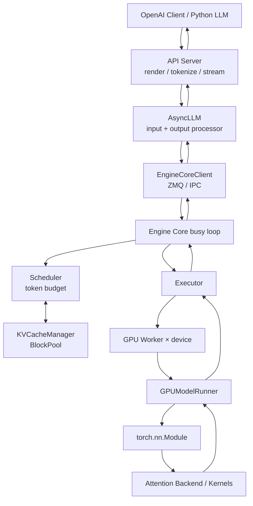

# vLLM 源码详细解析

## 研究范围

- 上游仓库：<https://github.com/vllm-project/vllm>
- 本地源码：[code/vllm](../../code/vllm/)
- 源码版本：`26d725c334429dd86b3d1a9271fbb5e16e03c9ef`
- 分支状态：`main` 开发快照，源码回退版本标记为 `dev`
- 研究重点：V1 请求链、多进程架构、统一调度、连续批处理、KV Cache、Prefix Caching、Model Runner、Attention Backend 和分布式执行

本文只把本提交中已经存在的实现写成确定事实。V0 已被仓库文档标记为完全弃用，因此以下主线统一从 `vllm/v1` 阅读；历史设计文档和实验性 Model Runner V2 会单独标注。

## 一句话结论

vLLM 的核心不是 OpenAI 兼容 HTTP 层，也不只是一个 PagedAttention kernel，而是一条围绕“每步 token 预算”设计的推理流水线：前端异步接收和渲染请求，独立 Engine Core 持续把不同阶段的请求拼成动态批次，KV Cache Manager 按物理块分配上下文存储，Worker/Model Runner 再把调度结果变成紧凑 GPU 张量并执行模型、采样和回传。

## 总体架构



核心边界如下：

| 层 | 主要职责 | 关键源码 |
| --- | --- | --- |
| 离线入口 | Python 批量推理和结果排序 | [`entrypoints/llm.py`](../../code/vllm/vllm/entrypoints/llm.py) |
| 在线协议层 | OpenAI 请求校验、模板渲染、流响应和 tool/reasoning 解析 | [`chat_completion/serving.py`](../../code/vllm/vllm/entrypoints/openai/chat_completion/serving.py) |
| 异步引擎层 | 输入处理、每请求输出队列、断连取消、反分词 | [`async_llm.py`](../../code/vllm/vllm/v1/engine/async_llm.py) |
| Engine Core | 调度、模型执行协调、输出更新和运行循环 | [`core.py`](../../code/vllm/vllm/v1/engine/core.py) |
| Scheduler | 运行队列、等待队列、token/encoder 预算和抢占 | [`scheduler.py`](../../code/vllm/vllm/v1/core/sched/scheduler.py) |
| KV Cache | cache hit、slot 分配、释放和 block hash | [`kv_cache_manager.py`](../../code/vllm/vllm/v1/core/kv_cache_manager.py) |
| Executor/Worker | 单卡、多进程或 Ray 调用，设备和缓存初始化 | [`executor`](../../code/vllm/vllm/v1/executor/) / [`gpu_worker.py`](../../code/vllm/vllm/v1/worker/gpu_worker.py) |
| Model Runner | batch 状态、输入张量、forward、logits、采样和 CUDA Graph | [`gpu_model_runner.py`](../../code/vllm/vllm/v1/worker/gpu_model_runner.py) |

## 两种入口最终汇合到同一 Engine Core

### 离线 `LLM`

[`LLM`](../../code/vllm/vllm/entrypoints/llm.py) 面向同进程离线推理。`generate()` 校验并添加一组请求，然后反复调用同步 `LLMEngine.step()`，直至所有请求完成，最后按原输入顺序返回。

它适合批处理和脚本，但“离线”不代表没有连续批处理：多个请求仍进入相同 Scheduler，只是调用者用同步循环等待全部结果。

### 在线 OpenAI 兼容服务

[`OpenAIServingChat.create_chat_completion`](../../code/vllm/vllm/entrypoints/openai/chat_completion/serving.py) 的主链是：

```text
ChatCompletionRequest
  → renderer 应用 chat template、处理多模态并得到 token IDs
  → 计算 max_tokens、SamplingParams、LoRA 和 DP rank
  → AsyncLLM.generate(...)
  → stream：逐个 RequestOutput 转成 SSE chunk
  → non-stream：聚合后构造 ChatCompletionResponse
```

tool calling、reasoning parser 和 structured output 在入口层把协议字段映射为渲染/约束/解析配置；底层模型仍处理 token。

### `AsyncLLM`

[`AsyncLLM.add_request`](../../code/vllm/vllm/v1/engine/async_llm.py) 做两件分离的事：

1. 在 API 进程的 `OutputProcessor` 注册 request 和 `RequestOutputCollector`；
2. 通过 `EngineCoreClient` 把 `EngineCoreRequest` 发送给独立 Engine Core。

后台 `output_handler` 持续从 Core 取批量输出，完成反分词、停止条件和输出对象更新，再推入每请求队列。`generate()` 本身只是消费该队列并 `yield`；客户端断开或 generator 被回收时会发送 abort。

这让单个慢客户端不会直接控制 GPU 主循环，但输出队列、网络背压和取消传播仍需监控。

## V1 多进程拓扑

仓库的 [`arch_overview.md`](../../code/vllm/docs/design/arch_overview.md) 描述了当前服务进程：

- API Server：HTTP、tokenization、多模态加载和响应流；
- Engine Core：每个 data-parallel rank 一个，运行 Scheduler 和 KV Cache Manager；
- GPU Worker：通常每个 GPU 一个，加载权重并执行 forward；
- DP Coordinator：`DP > 1` 时负责 DP 负载与同步。

进程数近似为：

```text
API server count + DP + (DP × PP × TP) + [DP > 1 时的 coordinator]
```

例如 `TP=4, DP=1` 的 4 卡部署通常是 1 个 API Server、1 个 Engine Core 和 4 个 Worker，共 6 个进程。

API Server 与 Engine Core 之间使用 ZMQ/IPC。Core 再通过 [`UniProcExecutor`](../../code/vllm/vllm/v1/executor/uniproc_executor.py)、[`MultiprocExecutor`](../../code/vllm/vllm/v1/executor/multiproc_executor.py) 或 Ray Executor 管理 Worker。

### 并行维度

| 并行方式 | 切分对象 | 主要效果 |
| --- | --- | --- |
| Tensor Parallel | 单层权重和算子 | 多卡共同执行一个模型层 |
| Pipeline Parallel | 模型层 | 不同 stage 流水执行 |
| Data Parallel | 完整模型副本和请求 | 提高总吞吐，可按 rank 路由 |
| Expert Parallel | MoE experts | 分散 expert 权重与通信 |
| Decode Context Parallel | decode 上下文 | 为长上下文 decode 分摊 attention |

这些配置不仅改变 Worker 数，也改变 collective、batch 对齐、KV Cache 布局和每 rank 可用显存，不能只按“总显存够用”估算。

## 启动阶段：先加载模型，再测出能留多少 KV Cache

[`EngineCore`](../../code/vllm/vllm/v1/engine/core.py) 初始化时大致执行：

```text
创建 Executor / Worker
  → Worker 初始化设备和分布式环境
  → ModelRunner.load_model()
  → 各 Worker 上报 KVCacheSpec
  → profile run 测量非 KV 峰值和 CUDA Graph 占用
  → 由 gpu_memory_utilization 等配置计算可用 KV bytes
  → 生成统一 KVCacheConfig
  → Worker.initialize_from_config()
  → 分配 KV tensors、绑定 attention layer、warmup/capture
```

[`GPUWorker.determine_available_memory`](../../code/vllm/vllm/v1/worker/gpu_worker.py) 通过 dummy/profile forward 计算非 KV 占用，而不是用“启动前 free memory × 比例”直接分配全部缓存。模型权重、激活峰值、非 Torch 内存和 CUDA Graph 都会挤占 KV 容量。

因此以下参数相互制约：

- `gpu_memory_utilization`；
- `max_model_len`；
- `max_num_seqs` / `max_num_batched_tokens`；
- KV dtype 与 block size；
- CUDA Graph capture sizes；
- TP/PP/DP 布局；
- multimodal encoder cache 和 speculative decoding。

## Engine Core 的单步闭环

[`EngineCore.step`](../../code/vllm/vllm/v1/engine/core.py) 是最重要的窄腰：

```text
Scheduler.schedule()
  → Executor.execute_model(scheduler_output, non_block=True)
  → 准备 grammar bitmask
  → 等待 ModelRunner 输出
  → 必要时单独 sample_tokens()
  → 处理执行期间到达的 abort
  → Scheduler.update_from_output()
  → 形成 EngineCoreOutputs
```

`EngineCoreProc` 在独立进程的 busy loop 中不断执行这一步，并收发新增、取消、缓存管理和 profiling 请求。这里没有“一个 HTTP 请求对应一次 model.forward”的关系；一次 forward 可以混合许多请求，而一个请求通常跨越许多 step。

## Scheduler：不再硬分 prefill 和 decode

[`Scheduler.schedule`](../../code/vllm/vllm/v1/core/sched/scheduler.py) 的源码注释明确说明：V1 Scheduler 没有独立的 prefill phase 和 decode phase。每个请求只关心：

```text
还欠的计算量 =
  prompt tokens
  + 已生成 tokens
  + speculative tokens
  + output placeholders
  - num_computed_tokens
```

Scheduler 在每一步给请求分配 token budget，使 `num_computed_tokens` 追上当前目标。这一个模型同时覆盖：

- 普通 decode；
- chunked prefill；
- prefix cache hit 后的剩余 prefill；
- speculative decoding；
- 部分结构化输出和未来跳跃式解码。

### 一次调度的顺序

1. 在总 `max_num_batched_tokens` 内先处理 `running` 请求；
2. 为每个请求计算本步 `num_new_tokens`；
3. 检查模型长度、encoder budget、长 prefill 分块和 speculative tokens；
4. 请求 KV Cache Manager 分配新 slots；
5. KV 不足时抢占低优先级请求并释放其块；
6. 再从 `waiting` / `skipped_waiting` 接纳新请求；
7. 查 prefix cache hit，分配剩余 blocks；
8. 生成 `SchedulerOutput` 给所有 Worker。

默认可使用 FCFS，也可使用 priority policy。源码在无法调度某个请求时有时会继续检查后面的请求，因此资源约束下的实际顺序不一定是绝对 FIFO。

### 连续批处理的本质

传统静态 batch 要等整批结束；vLLM 每个 step 都重新调度：

```text
step N:   A decode + B decode + C prefill chunk
step N+1: A 完成，D 加入 + B decode + C remaining prefill
step N+2: B decode + C decode + D prefill chunk
```

完成的请求立即离开，空出的 batch token 和 KV blocks 可被等待请求使用。这就是 continuous batching，粒度是调度 step，不是请求批次。

## KV Cache：为什么必须分页

自回归 attention 每生成一个 token 都要读取此前 token 的 key/value。若为每条请求预留一块最大连续显存，会产生严重内部碎片，并难以在请求增删时复用空间。

vLLM 把逻辑 token 序列映射到固定大小的物理 KV blocks。每个请求保存 block table，attention backend 根据逻辑位置查物理 block ID。请求增长时追加块，结束或抢占时归还块，不要求上下文在物理内存连续。

这与操作系统虚拟内存“页表”思想相似，但这里的 page/block、tensor layout 和 attention kernel 都是推理运行时自己的结构。

## `KVCacheManager` 与 `BlockPool`

[`KVCacheManager`](../../code/vllm/vllm/v1/core/kv_cache_manager.py) 是 Scheduler 的接口，负责：

- 查找已计算 prefix blocks；
- 给新请求或运行请求 `allocate_slots`；
- 记录每请求 block table；
- 在 token block 填满后加入 cache；
- 请求结束或抢占时 `free`；
- 协调 full/sliding-window/Mamba 等 cache group。

[`BlockPool`](../../code/vllm/vllm/v1/core/block_pool.py) 在启动时预创建全部 `KVCacheBlock`，维护：

- `free_block_queue`：同时承担空闲分配顺序和可驱逐 cached block 的 LRU 顺序；
- `cached_block_hash_to_block`：block hash 到物理块；
- `ref_cnt`：当前有多少请求引用该块；
- immutable `block_id` 和可重置 `block_hash`。

预创建对象和块内双向链表让中间删除、touch、头部驱逐保持 O(1)，避免高频调度中反复创建 Python 对象。

### KV 不足与抢占

`allocate_slots` 返回 `None` 表示没有足够块。Scheduler 会把低优先级 running request 抢占，释放其 blocks，再把它放回 waiting。V1 不依赖旧式 GPU↔CPU KV swapping；恢复请求时可以利用仍在 prefix cache 的完整块，否则重新计算。

抢占保证服务能前进，但会增加 recompute 和尾延迟。高并发下吞吐、TTFT 和 TPOT 的平衡本质上受 token budget 与 KV 容量共同约束。

## Automatic Prefix Caching

[`prefix_caching.md`](../../code/vllm/docs/design/prefix_caching.md) 和实现展示了 hash-based prefix cache。一个完整 block 的 hash 包含：

```text
parent block hash
+ 当前 block 的 token IDs
+ LoRA ID / 多模态输入 hash / cache salt 等额外维度
```

请求到来时：

1. 对 prompt 的完整 blocks 逐块计算 hash；
2. `get_computed_blocks` 找到从头连续命中的 blocks；
3. touch 命中块、增加引用并从 free queue 暂时移除；
4. 只对未命中的 token 分配和执行 prefill；
5. 新 block 填满后也可加入 cache；
6. 请求释放后，引用归零的 cached blocks 回到 LRU 队列，必要时从队头驱逐。

只有完整 block 会缓存，所以即使两个 prompt 共享若干 token，不足一个 block 的尾部也必须重算。Prefix caching 只省 prompt prefill 计算，不会加速后续新 token decode，也不改变模型输出。

多租户环境应使用 `cache_salt` 隔离复用域。仅依赖共享 hash cache 可能通过首 token 延迟暴露“某前缀是否已被计算”的侧信道。

## Hybrid KV Cache

混合模型可能同时有 full attention、sliding-window attention、local attention 或 Mamba state，不同层对历史 token 的保留要求不同。

当前 [`hybrid_kv_cache_manager.md`](../../code/vllm/docs/design/hybrid_kv_cache_manager.md) 描述的实现把层按 cache spec 分组，并要求不同 `KVCacheGroup` 具有统一物理 page size：

- `KVCacheManager` 对 Scheduler 提供统一接口；
- `KVCacheCoordinator` 协调多个 group；
- `SingleTypeKVCacheManager` 实现某种 attention 的分配与 cache hit；
- 多 group prefix hit 要取各层类型都能使用的交集。

该文档明确标注功能仍处早期阶段；Mamba prefix caching、复杂 group 组合和 padding 策略存在未完成或启发式部分，不能当作固定 ABI。

## Worker 与 Model Runner

[`GPUWorker`](../../code/vllm/vllm/v1/worker/gpu_worker.py) 拥有设备上下文、distributed rank、KV tensors 和一个 Model Runner。Worker 是 Executor 的远程调用单元。

[`GPUModelRunner`](../../code/vllm/vllm/v1/worker/gpu_model_runner.py) 把 `SchedulerOutput` 落成 GPU 工作：

```text
更新 persistent input batch
  → 增删/重排请求和 block table
  → 准备 token IDs、positions、slot mapping、attention metadata
  → H2D copy 与可选 async overlap
  → 选择 eager / piecewise / full CUDA Graph
  → model.forward
  → 选取需要采样位置的 hidden states
  → compute_logits
  → sampler / rejection sampler
  → 复制必要 token 和 logprobs 回 CPU
  → 更新 runner 内的请求状态
```

Runner 预分配大量 CPU/GPU buffer，并维护 persistent batch，目的是减少 Python 分配、动态 shape 处理和 CPU→GPU 同步。异步调度还可以让下一步不等待所有 sampled token 回到 CPU，但这增加了 runner 与 scheduler 状态对齐的复杂度。

[`model_runner_v2.md`](../../code/vllm/docs/design/model_runner_v2.md) 描述的是新的 Model Runner V2 设计；源码中也存在独立实现路径。它仍属于演进中的优化方向，阅读时不要把 V2 文档细节反推成默认 Runner 的全部行为。

## 模型加载与扩展

[`ModelRegistry`](../../code/vllm/vllm/model_executor/models/registry.py) 根据 Hugging Face `architectures` 解析 vLLM model class，并支持延迟导入和 out-of-tree 注册。[`model_loader`](../../code/vllm/vllm/model_executor/model_loader/__init__.py) 再选择 safetensors、dummy、tensorizer 等 loader。

所有内置模型统一接收：

```python
def __init__(self, *, vllm_config: VllmConfig, prefix: str = ""):
    ...
```

TP 切分与量化尽量在初始化每层权重时发生，而不是先在每张卡构造完整模型再切分。这对超大模型至关重要。

常见扩展点包括：

- Model Registry / model loader；
- platform plugin 和 Worker；
- [`AttentionBackend`](../../code/vllm/vllm/v1/attention/backends/)；
- tokenizer、IO processor、LoRA resolver；
- logits processor 与 structured output backend。

[`attention_backends.md`](../../code/vllm/docs/design/attention_backends.md) 说明后端会根据硬件、dtype、head size、KV dtype、block size 和 attention type 校验后按优先级选择。当前实现可能使用 FlashAttention、FlashInfer、FlashMLA、Triton 或平台特定后端，并非所有请求都进入最早论文中的单一 PagedAttention CUDA kernel。

## PagedAttention：概念仍重要，旧 kernel 文档已过时

[`paged_attention.md`](../../code/vllm/docs/design/paged_attention.md) 开头明确警告：它是基于原始论文的历史文档，已经不能描述今天所有实际代码。

仍然值得保留的概念是：

- KV cache 由固定 token 数的 blocks 组成；
- block table 将逻辑上下文映射到非连续物理块；
- attention kernel 根据物理 block number 和 offset 读取 K/V；
- layout、向量化和 coalesced memory access 决定性能。

不应继续推断的结论是“vLLM 只有自研 `attention_kernels.cu` 这一条后端”。实际后端由 registry 和平台能力动态选择。

## 性能机制如何协同

| 机制 | 主要节省 | 主要代价/约束 |
| --- | --- | --- |
| Continuous batching | GPU 空洞与等待时间 | 调度和状态维护更复杂 |
| Chunked prefill | 长 prompt 独占 step 的时间 | TTFT 与吞吐需调参 |
| Paged KV cache | 显存碎片和预留浪费 | block table 与 kernel 复杂度 |
| Prefix caching | 重复 prompt 的 prefill | 只命中完整块，需要缓存隔离 |
| CUDA Graph | kernel launch/CPU overhead | capture 显存和 shape 覆盖 |
| Speculative decoding | 每个目标模型 step 的产出 token | draft 模型和 rejection 验证成本 |
| Quantization | 权重/KV 显存与带宽 | 精度、kernel 和硬件兼容性 |
| TP/PP/DP/EP | 单卡容量或集群吞吐 | collective、跨机带宽和负载均衡 |

不存在对所有模型和负载都最优的单一开关。短请求、高并发、长上下文、多模态和离线吞吐测试需要分别测量 TTFT、TPOT、请求吞吐、token 吞吐、显存与尾延迟。

## 正确性、安全与运维边界

- vLLM 是推理服务，不替应用完成身份认证、租户配额、tool 权限或 prompt 安全。
- OpenAI 兼容不等于行为完全相同；V1 的 logprobs 默认语义、已移除功能和 structured output backend 范围需要单独核对。
- Prefix cache 在共享租户间有时延侧信道风险，应配置 salt 和隔离策略。
- 多模态 URL、chat template、自定义 model code 和 plugin 都扩大了供应链与输入攻击面。
- 客户端断开会触发 abort，但已经执行的 GPU step 不会被“事务回滚”。
- 多进程启动方式受 CUDA 初始化和 `spawn`/`fork` 限制；作为 Python 库使用时要遵守 `__main__` guard 等要求。
- Engine Core busy loop、API tokenizer/media 线程和 GPU Worker 都需要 CPU 资源，不能只监控 GPU utilization。
- 开发快照变化快，历史文档可能带旧路径；结论应以当前源码和文档警告为准。

## 一条在线请求的完整阅读链

```text
OpenAIServingChat.create_chat_completion
  → render_chat_request
  → AsyncLLM.generate / add_request
  → EngineCoreClient.add_request_async
  → EngineCore.add_request
  → Scheduler.add_request
  → EngineCore.step
      → Scheduler.schedule
          → KVCacheManager.get_computed_blocks
          → KVCacheManager.allocate_slots
      → Executor.execute_model
          → GPUWorker.execute_model
          → GPUModelRunner.execute_model / sample_tokens
      → Scheduler.update_from_output
  → AsyncLLM.output_handler
  → OutputProcessor / detokenizer
  → SSE 或完整 OpenAI response
```

## 推荐阅读顺序

1. [`arch_overview.md`](../../code/vllm/docs/design/arch_overview.md)：先建立进程和入口全景。
2. [`OpenAIServingChat`](../../code/vllm/vllm/entrypoints/openai/chat_completion/serving.py) 与 [`AsyncLLM`](../../code/vllm/vllm/v1/engine/async_llm.py)。
3. [`EngineCore.step`](../../code/vllm/vllm/v1/engine/core.py)：抓住 schedule/execute/update 闭环。
4. [`Scheduler.schedule`](../../code/vllm/vllm/v1/core/sched/scheduler.py)：逐段跟踪 running、waiting、budget 和 preemption。
5. [`KVCacheManager`](../../code/vllm/vllm/v1/core/kv_cache_manager.py)、[`BlockPool`](../../code/vllm/vllm/v1/core/block_pool.py) 与 [`prefix_caching.md`](../../code/vllm/docs/design/prefix_caching.md)。
6. [`GPUWorker`](../../code/vllm/vllm/v1/worker/gpu_worker.py) 和 [`GPUModelRunner`](../../code/vllm/vllm/v1/worker/gpu_model_runner.py)。
7. [`ModelRegistry`](../../code/vllm/vllm/model_executor/models/registry.py) 和一个具体模型实现。
8. 最后按当前硬件追踪实际 `AttentionBackend`，不要只停留在历史 PagedAttention 文档。
