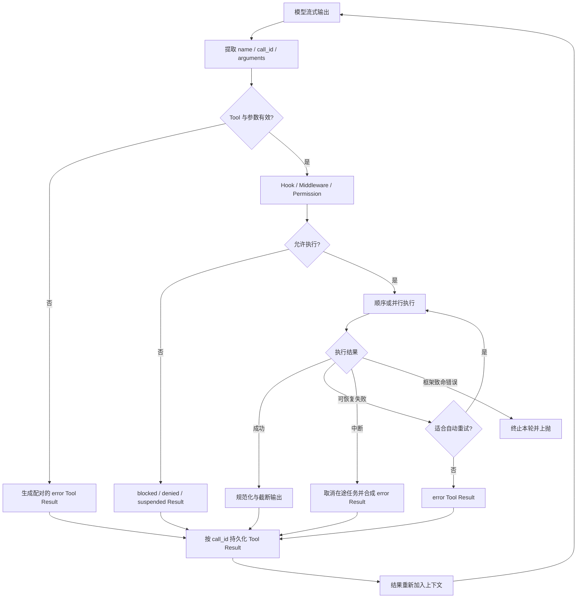

# Agent Tool 调用与错误处理横向总结

## 1. 研究范围

本文比较本仓库中 12 组有代表性的 Agent/Coding Agent 实现，关注三个问题：

1. 模型生成的 Tool Call 如何被解析、校验和调度；
2. Tool Result 如何与原始调用配对并重新送回模型；
3. 参数错误、权限拒绝、超时、取消、业务失败和框架异常分别怎样处理。

研究基于 2026-08-28 的本地源码快照，版本如下：

| 项目 | 本地提交 | 主要定位 |
| --- | --- | --- |
| Codex | `339751715c64` | 强权限边界、沙箱执行和提权重试 |
| OpenCode | `03521003fafd` | 流式 Tool Part 状态机和会话恢复 |
| pi | `4af9d21d3b4d` | 轻量 Agent Loop 与扩展 Hook |
| Kimi Code | `dceb3fd634aa` | Tool 结果配对、协议修复和取消收敛 |
| mini-swe-agent | `25941c89cfbc` | 最小化 Shell Agent Loop |
| Trae Agent | `e839e559ac61` | Tool Registry、名称兼容和并行执行 |
| OpenManus | `3309bf4e416f` | Python ToolCallAgent 与统一观察文本 |
| AgentScope Java | `c2d43f86e668` | Reactor 异步执行、超时和结果状态 |
| Spring AI | `fd3fd6ec7003` | 模型无关的 ToolCallback 管理层 |
| Spring AI Alibaba | `c65a3eb5f57c` | 图节点、拦截器、并行取消和状态更新 |
| LangChain / LangGraph | `c4c57d35bfab` / `f09cfe8ffc1e` | Middleware 与图运行时组合 |
| Hermes Agent | `dc50f020905d` | 多层中间件、并发执行和完备超时收敛 |

这些项目并不完全处于同一抽象层：Spring AI、LangChain 更像框架，Codex、OpenCode、Kimi Code、Hermes 是完整产品，mini-swe-agent 则有意保持极简。本文比较的是它们共同拥有的 **Tool Runtime**，不是产品功能多少。

## 2. 先给结论

成熟实现并不是“Tool 报错就重试”，而是先把错误分层：

- **模型能够修正的错误**：未知 Tool、JSON/Schema 参数错误、命令非零退出、业务条件不满足。转换为带原 `call_id` 的失败结果，让模型在下一轮改参数或换方案。
- **策略和权限错误**：审批拒绝、沙箱禁止、Guardrail 拦截。保持为独立状态，通常不应伪装成普通执行异常；只有策略允许时才发起审批或改变沙箱后重试。
- **瞬态基础设施错误**：网络抖动、服务过载、可确认尚未产生副作用的超时。由框架或中间件做有限次数、带退避的重试。
- **取消和中断**：属于控制流，不是可重试异常。应停止新调用、尽力取消在途调用，并为已经发出的 Tool Call 补齐失败结果。
- **框架不变量被破坏**：不兼容 Payload、内部状态非法、无法持久化关键状态。应上抛并终止当前运行，不能把所有内部异常原样交给模型。

最重要的共同不变量是：

> 每一个已经记录或发送给 Provider 的 Tool Call，最终都必须有且只有一个同 `call_id` 的 Tool Result；即使执行被拒绝、超时、取消或进程中断，也要完成这次协议结算。

Kimi Code 对这条规则实现得最显式；OpenCode、pi、LangGraph 和 Hermes 也都在各自的事件/消息层维持同样的配对关系。

## 3. 一条完整的 Tool 调用链



这条链可以拆为七个职责：解析、查找、参数校验、授权、执行、结果规范化、协议结算。很多“Tool 报错后 Agent 卡住”的根因不在 Tool 本身，而是最后两步没有完成。

## 4. 错误分类与推荐动作

| 错误类别 | 典型例子 | 是否交给模型 | 是否自动重试 | 关键要求 |
| --- | --- | --- | --- | --- |
| 协议/解析 | JSON 不合法、Schema 不匹配、未知 Tool | 是 | 否 | 保留 `call_id`，返回可操作的错误信息 |
| 业务失败 | 文件不存在、命令返回非零、查询无结果 | 是 | 通常否 | 作为 Observation，而不是让 Agent Loop 崩溃 |
| 权限/策略 | 审批拒绝、路径越界、Guardrail 拦截 | 是，但要标注 denied/blocked | 仅策略允许时 | 不能偷偷绕过权限；提权是新决策 |
| 瞬态基础设施 | 连接重置、429/5xx、暂时不可用 | 可在重试耗尽后交给模型 | 是，有限退避 | 过滤异常类型，记录次数和等待时间 |
| 超时 | Tool 无响应、子进程卡住 | 是 | 视幂等性而定 | 发取消信号；注意线程/进程可能仍在运行 |
| 用户取消/图中断 | `/stop`、AbortSignal、GraphInterrupt | 通常不作为普通错误恢复 | 否 | 传播控制流并结算已打开的 Tool Call |
| 内部错误 | Payload 类型不匹配、状态机非法 | 否 | 否 | 上抛、停止运行、保留诊断信息 |

### 4.1 为什么不能对所有异常统一重试

同一个“超时”可能意味着两种完全不同的事实：

- 请求根本没有到达服务端，重试通常安全；
- 请求已经完成写入，只是响应丢失，重试可能重复扣款、重复发消息或重复修改文件。

因此重试至少要同时满足：异常被判定为瞬态、调用具备幂等性或幂等键、前一次执行状态可以判定。源码中 LangChain 和 AgentScope Java 提供了异常过滤器，但“这个 Tool 是否具备副作用”仍需业务侧补充；框架无法仅凭异常类型自动知道。

## 5. 各框架实现

### 5.1 Codex：审批、沙箱和提权重试是一条独立控制链

核心路径是：

```text
ResponseItem
  -> ToolRouter.build_tool_call
  -> ToolRegistry.dispatch_any_with_terminal_outcome
  -> CoreToolRuntime / ToolHandler
  -> ToolOrchestrator.run
  -> approval -> sandbox attempt -> optional escalated attempt
  -> ToolOutput.to_response_item
```

[`ToolRouter`](../../code/codex/codex-rs/core/src/tools/router.rs) 从 `FunctionCall`、`CustomToolCall` 等响应项建立统一 `ToolCall`；[`ToolRegistry`](../../code/codex/codex-rs/core/src/tools/registry.rs) 查找运行时并检查 Payload 类型；需要执行外部动作的 Tool 再进入 [`ToolOrchestrator`](../../code/codex/codex-rs/core/src/tools/orchestrator.rs)。

错误边界很清晰：

- 未知 Tool、参数反序列化失败、PreToolUse Hook 拒绝会成为 `FunctionCallError::RespondToModel`，允许模型修正。
- 已注册 Tool 收到不兼容的 `ToolPayload` 被视为 `FunctionCallError::Fatal`，因为这是框架内部不变量错误。
- [`ToolOrchestrator`](../../code/codex/codex-rs/core/src/tools/orchestrator.rs) 只对特定的 `SandboxErr::Denied` 考虑第二次执行；是否询问用户、是否允许无沙箱执行、网络策略是否允许，都在重试前重新判定。
- 普通命令非零退出是 Tool 输出，不等于调度器异常；调用方仍能获得 stdout、stderr、退出码并决定下一步。

Codex 的关键设计不是“更会重试”，而是把 **审批决定、沙箱失败和业务失败拆成不同通道**，避免业务错误触发无意义提权。

### 5.2 OpenCode：Tool Part 是持久化状态机

OpenCode 将一次调用存为 Tool Part，状态大致经历 `pending -> running -> completed/error`。流事件在 [`processor.ts`](../../code/opencode/packages/opencode/src/session/processor.ts) 中处理：

- `tool-call` 建立/更新运行态；
- `tool-result` 完成调用；
- `tool-error` 写入失败态；
- `provider-error` 才抛到外层并进入 Provider 重试策略。

这意味着 Tool 执行失败和模型 Provider 失败不共用同一个重试器。[`SessionRetry`](../../code/opencode/packages/opencode/src/session/retry.ts) 处理的是模型请求侧错误，而不是盲目重放 Tool。

取消时，[`processor.ts`](../../code/opencode/packages/opencode/src/session/processor.ts) 会把仍未完成的 Tool Part 统一写成 `status: "error"`，并加 `metadata.interrupted = true`。下一轮 [`prompt.ts`](../../code/opencode/packages/opencode/src/session/prompt.ts) 会忽略这种清理产生的孤儿调用，避免自动重放可能已经产生副作用的动作。

这一实现适合需要恢复和审计的长会话：失败不是一段临时字符串，而是会话日志中可查询的状态。

### 5.3 pi：所有可预期失败都归一成 `ToolResultMessage`

[`agent-loop.ts`](../../code/pi/packages/agent/src/agent-loop.ts) 的流程是：提取 Tool Call，按配置选择顺序/并行执行，最后为每个调用生成 `ToolResultMessage`。

它在一个文件内处理了多种失败：

- Tool 不存在；
- 参数准备或 Schema 校验异常；
- `beforeToolCall` 主动阻止；
- AbortSignal 已取消；
- `tool.execute` 抛异常；
- `afterToolCall` 抛异常；
- 模型因输出长度截断而留下可能不完整的 Tool 参数。

这些情况都会调用 `createErrorToolResult`，以原 `toolCall.id` 生成 `isError: true` 的结果。尤其是输出截断时，pi **不会执行看似仍能解析的残缺参数**，而是为每个调用返回错误并要求模型重新发出完整调用。这是很重要的 Fail-Closed 行为。

pi 默认不在 Agent Loop 内重试任意 Tool 异常；扩展可通过 `beforeToolCall` / `afterToolCall` 做策略，但结果配对仍由核心循环统一负责。

### 5.4 Kimi Code：把“结果配对”做成显式不变量

Kimi Code 的核心实现在 [`tool-call.ts`](../../code/kimi-code/packages/agent-core/src/loop/tool-call.ts)：

```text
preflightToolCall
  -> prepareToolCall
  -> authorize hook
  -> runRunnableToolCall
  -> finalizePendingToolResult
  -> tool.result event
```

它覆盖的失败面非常完整：

- 未知 Tool、参数校验失败直接建立 `isError: true` 结果；
- `resolveExecution`、授权 Hook、真实执行、结果 Finalize Hook 抛错都会被归一；
- Tool 返回 `undefined`、Primitive 或缺少合法 `output` 字段时，`coerceToolResult` 会生成失败结果；
- AbortSignal 触发后，如果 Tool 忽略取消信号，`raceExecuteWithGraceTimeout` 会在宽限时间后合成结果，使当前轮能够结束；
- 会话恢复和异常收尾时，[`context/index.ts`](../../code/kimi-code/packages/agent-core/src/agent/context/index.ts) 会为未关闭调用补 `tool.result`，并丢弃孤立或重复结果。

Provider 若因 `tool_use/tool_result` 配对、空文本或角色顺序拒绝请求，[`turn-step.ts`](../../code/kimi-code/packages/agent-core/src/loop/turn-step.ts) 还会用严格投影重建一次合规消息；修复后仍失败才上抛。

Kimi Code 的启示是：Tool Runtime 不只负责“调用函数”，还应是 **Provider 协议完整性的守门人**。

### 5.5 mini-swe-agent：把 Shell 错误直接变成 Observation

mini-swe-agent 的 Tool 面非常窄：模型动作最终交给 Environment 执行。以 [`local.py`](../../code/mini-swe-agent/src/minisweagent/environments/local.py) 为例：

- 命令正常结束时返回 `output`、`returncode`、空 `exception_info`；
- 子进程创建、超时等异常被捕获，返回 `returncode: -1`、`exception_info` 和异常类型；
- 非零退出码仍是普通结构化结果，模型从下一轮提示中的 Observation 判断如何修复。

[`default.py`](../../code/mini-swe-agent/src/minisweagent/agents/default.py) 则把 `Submitted`、`LimitsExceeded`、`UserInterruption` 等 `InterruptAgentFlow` 作为控制流消息处理；真正未捕获异常会记录退出信息后重新抛出。

它展示了最小可行原则：即使没有复杂 Tool Registry，也应区分“命令执行失败”和“Agent Runtime 自身坏掉”。

### 5.6 Trae Agent：名称兼容和异常封装集中在 ToolExecutor

[`tools/base.py`](../../code/trae-agent/trae_agent/tools/base.py) 中的 `ToolExecutor` 先将 Tool 名转为小写并去掉下划线，再查表执行。这可以容忍模型在 `foo_bar` / `FooBar` 间的轻微漂移。

执行结果统一为 `ToolResult`：

- 未找到 Tool：`success=False` 并列出可用 Tool；
- Tool 主动返回错误码：映射为失败结果；
- Tool 抛任意异常：捕获后写入 `error`，保留 `call_id` 和事件 `id`；
- 批量调用可以选择 `parallel_tool_call` 或 `sequential_tool_call`。

名称归一化能减少无谓错误，但也要注意冲突：两个仅大小写或下划线不同的 Tool 会映射到同一 Key。注册阶段应增加冲突检测，不能依赖字典最后写入者。

### 5.7 OpenManus：Agent 层兜底为模型可读文本

[`ToolCollection`](../../code/openmanus/app/tool/tool_collection.py) 对未知 Tool 和显式 `ToolError` 返回 `ToolFailure`；[`ToolCallAgent.execute_tool`](../../code/openmanus/app/agent/toolcall.py) 再处理命令格式、JSON 解析和其他未捕获异常，统一返回 `Error: ...` 文本。

随后 `act()` 无论成功失败都会用原 `command.id` 生成 Tool Message 并写入 Memory，因此一般 Tool 失败不会击穿 Agent Loop。

这个方案简单有效，但失败状态主要编码在文本里，类型信息弱于 OpenCode、Kimi Code 或 AgentScope Java。上层 Flow 若只检查“函数是否抛异常”，可能把包含错误文本的步骤误判成已完成；扩展时应优先读取结构化 `ToolResult`，而不是解析字符串前缀。

### 5.8 AgentScope Java：结构化状态、超时和 Reactor 重试

[`ToolExecutor`](../../code/agentscope-java/agentscope-core/src/main/java/io/agentscope/core/tool/ToolExecutor.java) 统一负责 Tool 查找、Group 可用性、Schema 校验、调用、顺序/并行、调度、超时和重试。

错误被表示为 `ToolResultBlock`：

- 未知、未授权、参数错误 -> `ToolResultBlock.error`；
- External/Schema-only Tool -> `ToolResultBlock.suspended`；
- 执行异常或返回空 Mono -> `ToolResultBlock.error`；
- 超时和基础设施异常在最外层也会转成带 ID/Name 的失败结果。

`ExecutionConfig` 可配置 `maxAttempts`、Backoff 和 `Predicate<Throwable> retryOn`。不过要注意实际算子顺序：Tool 自身异常已可能在 `executeCore()` 内被 `onErrorResume` 转成普通错误结果，`retryWhen` 主要重试仍以异常信号向外传播的基础设施失败。业务方不能假设所有 `ToolResultBlock.error` 都会自动重试。

源码还明确警告：Reactor 取消前一次尝试后，它仍可能在后台消耗资源。这再次说明超时重试并不天然提供 Exactly-Once。

### 5.9 Spring AI：默认把 ToolExecutionException 的消息送回模型

[`DefaultToolCallingManager`](../../code/spring-ai/spring-ai-model/src/main/java/org/springframework/ai/model/tool/DefaultToolCallingManager.java) 从 `AssistantMessage.ToolCall` 解析调用，在请求声明的 `ToolCallback` 中解析 Tool，执行后构建 `ToolResponseMessage` 并追加到会话历史。

它的默认错误语义需要特别区分：

- `ToolExecutionException` 交给 [`DefaultToolExecutionExceptionProcessor`](../../code/spring-ai/spring-ai-model/src/main/java/org/springframework/ai/tool/execution/DefaultToolExecutionExceptionProcessor.java)；默认 `alwaysThrow=false`，把异常消息作为 Tool Response 返回模型。
- 可配置 `alwaysThrow=true` 或异常白名单，让特定 RuntimeException 重新抛出。
- 未找到 `ToolCallback` 当前直接抛 `IllegalStateException`，并不会自动生成未知 Tool 的失败响应。
- Tool 调用次数有单 Tool 和总量上限；达到上限可抛出带部分执行历史的异常，或按配置返回错误响应。

Spring AI 提供的是策略注入点，而不是内置通用 Tool 重试。若要重试，应在 Tool 实现或外层 Retry 组件中按幂等性配置。

### 5.10 Spring AI Alibaba：ToolNode 负责并行、取消、状态隔离和拦截器

[`AgentToolNode`](../../code/spring-ai-alibaba/spring-ai-alibaba-agent-framework/src/main/java/com/alibaba/cloud/ai/graph/agent/node/AgentToolNode.java) 在 Spring AI ToolCallback 之上增加了图节点语义：

- 未解析到 Tool 时返回 `ToolCallResponse(status="error")`；
- 同步与异步 Tool 分流，异步 Tool 有超时和可选协作式 CancellationToken；
- 并行批次用固定位置的响应数组保持模型原始调用顺序；
- 超时会丢弃该 Tool 尚未合并的状态更新，避免失败调用污染图状态；
- 部分 Tool Response 可以再次进入节点，只执行尚未结算的调用；
- `ToolExecutionException` 可复用 Spring AI 的 Processor，其他异常转为 Error Response。

[`ToolRetryInterceptor`](../../code/spring-ai-alibaba/spring-ai-alibaba-agent-framework/src/main/java/com/alibaba/cloud/ai/graph/agent/interceptor/toolretry/ToolRetryInterceptor.java) 支持异常过滤、次数和指数退避。但拦截器重试的是 **抛出的异常**；如果内层已经把失败转成 `ToolCallResponse.error`，它不会仅凭错误状态自动重试。拦截器顺序也决定鉴权、缓存和重试各包在哪一层。

这套实现最有价值的地方是状态隔离：失败/超时 Tool 的局部写入不会覆盖已经成功的其他 Tool 结果。

### 5.11 LangChain / LangGraph：ToolNode 负责结果，Middleware 负责策略

LangGraph [`ToolNode`](../../code/langgraph/libs/prebuilt/langgraph/prebuilt/tool_node.py) 是 Tool 执行的基础层：

- 参数校验错误包装为 `ToolInvocationError`；
- `handle_tool_errors` 可设为布尔值、异常类型、异常类型元组或格式化函数；
- 被选择处理的异常转为 `ToolMessage(status="error")`；
- 未选择的异常继续上抛；
- `GraphBubbleUp`/`GraphInterrupt` 始终传播，不会被误转成普通 Tool 错误。

LangChain 在其上用 Middleware 提供组合策略：

- [`ToolErrorMiddleware`](../../code/langchain/libs/langchain_v1/langchain/agents/middleware/tool_error.py) 只转换用户明确选择的异常；Handler 返回 `None` 就继续上抛，并提示不要把包含敏感信息的原异常直接暴露给模型。
- [`ToolRetryMiddleware`](../../code/langchain/libs/langchain_v1/langchain/agents/middleware/tool_retry.py) 可按 Tool、异常类型/谓词配置退避重试；耗尽后可返回错误 `ToolMessage`、自定义文案或重新抛出。
- 两者组合时，Retry 应位于更内层并在耗尽后抛出，让 Error Middleware 决定最终如何脱敏和返回模型。

在图运行时里，节点重试会重新执行整个节点，但不会回滚已经发生的外部副作用；`interrupt()` 恢复时也从节点开头重跑。因此中断前或可重试节点中的写操作必须幂等，或拆到单独节点并使用幂等键。

### 5.12 Hermes Agent：中间件链外再加并发与超时收敛

Hermes 的 Tool 执行主要集中在 [`tool_executor.py`](../../code/hermes-agent/agent/tool_executor.py)。单次调用依次经过 Relay 改写、请求 Middleware、PreTool Hook、Guardrail、真实 Dispatch、PostTool 事件；内部用 `dispatched` 和锁阻止中间件重复调用执行回调。

它针对长时间和并发 Tool 做了较重的工程处理：

- 审批提示串行化，避免并发交互互相覆盖；真正的人类等待时间从 Tool Deadline 中扣除；
- 顺序 Tool 也放入 Worker，并周期检查用户中断；
- 在途 Tool 有 Activity Heartbeat，防止外层会话 Watchdog 把正常长任务误判为卡死；
- 超时、用户中断、非法参数、线程没有返回结果都会生成明确的终态事件；
- Worker 超时后可能仍在后台运行，因此后续成功结果会被抑制，不能覆盖已经结算的 timeout/cancelled 状态；
- 并发结果最终按原调用位置收集，单个 Tool 异常被转成错误文本，不让整个批次丢失其他结果。

Hermes 展示了一个常被忽略的问题：**“向模型返回超时”不等于执行已经停止**。如果底层调用不协作取消，框架必须同时防止迟到结果覆盖状态，并避免立即重放有副作用的动作。

## 6. 横向对比

| 项目 | 普通 Tool 失败 | 自动重试位置 | 中断处理 | 最突出的设计 |
| --- | --- | --- | --- | --- |
| Codex | `RespondToModel` 或结构化命令输出 | 仅特定沙箱拒绝走提权再执行 | CancellationToken + 审批/沙箱状态 | 权限与业务失败分层 |
| OpenCode | Tool Part `status=error` | Provider 层，不自动重放 Tool | 标记 `interrupted` 并忽略孤儿 | 可恢复的持久化状态机 |
| pi | `ToolResultMessage(isError)` | 核心 Loop 不通用重试 | 为 Abort 生成配对结果 | 小而完备的结果归一 |
| Kimi Code | `ExecutableToolResult(isError)` | Provider 有限重试；Tool 默认不盲重试 | Grace Timeout + 补齐未结算结果 | 强制 Tool Call/Result 配对 |
| mini-swe-agent | Observation 中的退出码/异常字段 | 模型下一轮自行修正 | `InterruptAgentFlow` | 最小化错误分层 |
| Trae Agent | `ToolResult(success=False)` | 无通用 Tool 重试 | 上层任务取消 | 名称兼容与集中封装 |
| OpenManus | `ToolFailure` / `Error:` 文本 | 无通用 Tool 重试 | Agent 清理资源 | 简单 Agent 层兜底 |
| AgentScope Java | `ToolResultBlock.error` | Reactor `retryWhen` | Timeout/Shutdown Guard | 结构化状态与执行基础设施 |
| Spring AI | Tool Response 或抛异常 | 交给外层配置 | 上层负责 | 可配置 Exception Processor |
| Spring AI Alibaba | `ToolCallResponse.error` | ToolRetryInterceptor | CancellationToken + 状态丢弃 | 并行状态隔离 |
| LangChain/LangGraph | `ToolMessage(status=error)` 或上抛 | ToolRetryMiddleware / 图节点策略 | GraphBubbleUp 始终传播 | 错误策略可组合 |
| Hermes | 错误结果 + 终态事件 | API 与 Tool Deadline 分层 | Worker 取消、迟到结果抑制 | 长任务和并发收敛 |

## 7. Tool 报错时应该怎样处理

### 7.1 推荐决策树

```text
Tool 报错
├─ 调用尚未执行？
│  ├─ 未知名称 / 参数非法 -> 返回 error Tool Result，让模型修正
│  └─ 权限拒绝 -> 返回 denied/blocked；需要时请求用户批准
├─ 已开始执行？
│  ├─ 明确无副作用且错误瞬态 -> 有限次数 + 退避 + 抖动重试
│  ├─ 有副作用但有幂等键 -> 查询前次状态后决定重试
│  ├─ 是否执行成功不确定 -> 不盲重试，返回 uncertain 给模型/用户
│  └─ 业务失败 -> 返回结构化 Observation，不重启整个 Agent
├─ 用户取消或图中断？
│  └─ 停止派发、取消在途任务、补齐已打开的 Tool Result
└─ 框架内部不变量损坏？
   └─ 上抛并终止本轮，记录完整诊断，不泄漏敏感信息给模型
```

### 7.2 一个实用的失败结果结构

不同 Provider 的消息格式不同，但框架内部至少应保留：

```json
{
  "tool_call_id": "call_123",
  "tool_name": "write_file",
  "status": "error",
  "category": "validation | denied | timeout | cancelled | business | internal",
  "message": "模型或用户可理解的简短说明",
  "retryable": false,
  "execution_state": "not_started | started | uncertain | completed",
  "metadata": {
    "attempt": 1,
    "exit_code": 2,
    "duration_ms": 1530
  }
}
```

`execution_state` 很关键：它告诉重试器前一次是否可能已经产生副作用。模型可见内容应经过裁剪和脱敏，原异常堆栈只进入日志/Trace。

### 7.3 自动重试的最小安全条件

只有同时满足以下条件，才建议框架自动重试 Tool：

1. 错误类型在明确 Allowlist 中，而不是 `catch Exception -> retry`；
2. 有最大次数、总时间预算、指数退避和抖动；
3. Tool 是只读/幂等的，或请求带稳定幂等键；
4. 中断、审批拒绝和参数错误不在重试集合中；
5. 每次尝试有独立 Trace，但对模型最终只结算一个 Tool Result；
6. 超时后能确认前一尝试已停止，或能够抑制它的迟到结果；
7. 重试耗尽后的错误仍会回填原 `call_id`。

## 8. 推荐的 Tool Runtime 设计

综合这些实现，一个稳健的 Tool Runtime 可以遵循以下原则：

1. **Call ID 从解析到持久化不变**：所有 Hook、重试尝试和 Provider 转换都围绕同一逻辑调用 ID。
2. **Exactly-once settlement，不承诺 exactly-once execution**：框架能保证只生成一个最终 Result，但外部系统是否重复执行需要幂等协议保证。
3. **错误是数据，控制流不是错误**：业务失败变成 Result；取消、审批、图中断保留独立信号。
4. **重试只有一个 Owner**：Tool、Middleware、HTTP Client、Agent Loop 不能同时各重试三次，否则次数会乘法膨胀。
5. **先授权再并发**：并发审批要序列化交互；并发执行则保持结果顺序和每 Tool 的状态隔离。
6. **结果必须有上限**：大输出要截断、外存或摘要，但保留错误类别、退出码和定位线索。
7. **取消是协作式的**：传递 Abort/CancellationToken，同时为不响应取消的实现设置 Grace Timeout。
8. **迟到结果不能改写终态**：timeout/cancelled 一旦结算，后台 Worker 后续完成只能记录诊断。
9. **可观测性按 Attempt 和 Logical Call 分层**：记录解析、等待审批、排队、执行、重试、结果压缩各阶段耗时。
10. **Fail Closed**：截断参数、路径越权、未知执行状态时不猜测、不执行，向模型说明如何重新发起。

## 9. 阅读建议

如果按复杂度逐步阅读，建议顺序是：

1. [`mini-swe-agent LocalEnvironment`](../../code/mini-swe-agent/src/minisweagent/environments/local.py)：理解业务失败如何成为 Observation；
2. [`pi agent-loop`](../../code/pi/packages/agent/src/agent-loop.ts)：理解 Tool Call/Result 的最小完整闭环；
3. [`LangGraph ToolNode`](../../code/langgraph/libs/prebuilt/langgraph/prebuilt/tool_node.py)：理解可配置异常边界；
4. [`Kimi Code tool-call`](../../code/kimi-code/packages/agent-core/src/loop/tool-call.ts)：理解协议配对和防御性结果归一；
5. [`Codex ToolOrchestrator`](../../code/codex/codex-rs/core/src/tools/orchestrator.rs)：理解审批、沙箱和提权重试；
6. [`Hermes tool_executor`](../../code/hermes-agent/agent/tool_executor.py)：理解长任务、并发、超时和迟到结果。

## 10. 限制

- 结论来自上述本地提交的静态源码阅读，没有对 12 个上游项目执行完整集成测试。
- 各 Provider 对 Tool 消息的字段和严格程度不同；本文使用的是框架内部统一概念，不能直接当作某个 Provider 的 Wire Schema。
- Tool 的幂等性、外部事务和补偿能力属于业务契约，源码框架只能提供 Hook、重试器和状态字段，无法自动推断。
- Better Harness、Sub2API、vLLM 等项目分别偏评测、协议网关或推理服务，不作为完整 Agent Tool Loop 纳入本次横向表格。
